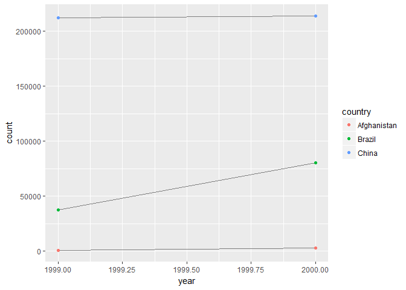

# R-club-June-14
Min-Yao  
2017年6月13日  

# 12 Tidy data

## 12.1 Introduction

### 12.1.1 Prerequisites


```r
library(tidyverse)
```

```
## Warning: package 'tidyverse' was built under R version 3.3.3
```

```
## Loading tidyverse: ggplot2
## Loading tidyverse: tibble
## Loading tidyverse: tidyr
## Loading tidyverse: readr
## Loading tidyverse: purrr
## Loading tidyverse: dplyr
```

```
## Warning: package 'purrr' was built under R version 3.3.3
```

```
## Conflicts with tidy packages ----------------------------------------------
```

```
## filter(): dplyr, stats
## lag():    dplyr, stats
```

```r
library(ggplot2)
```


## 12.2 Tidy data


```r
table1
```

```
## # A tibble: 6 × 4
##       country  year  cases population
##         <chr> <int>  <int>      <int>
## 1 Afghanistan  1999    745   19987071
## 2 Afghanistan  2000   2666   20595360
## 3      Brazil  1999  37737  172006362
## 4      Brazil  2000  80488  174504898
## 5       China  1999 212258 1272915272
## 6       China  2000 213766 1280428583
```

```r
table2
```

```
## # A tibble: 12 × 4
##        country  year       type      count
##          <chr> <int>      <chr>      <int>
## 1  Afghanistan  1999      cases        745
## 2  Afghanistan  1999 population   19987071
## 3  Afghanistan  2000      cases       2666
## 4  Afghanistan  2000 population   20595360
## 5       Brazil  1999      cases      37737
## 6       Brazil  1999 population  172006362
## 7       Brazil  2000      cases      80488
## 8       Brazil  2000 population  174504898
## 9        China  1999      cases     212258
## 10       China  1999 population 1272915272
## 11       China  2000      cases     213766
## 12       China  2000 population 1280428583
```

```r
table3
```

```
## # A tibble: 6 × 3
##       country  year              rate
## *       <chr> <int>             <chr>
## 1 Afghanistan  1999      745/19987071
## 2 Afghanistan  2000     2666/20595360
## 3      Brazil  1999   37737/172006362
## 4      Brazil  2000   80488/174504898
## 5       China  1999 212258/1272915272
## 6       China  2000 213766/1280428583
```

```r
table4a
```

```
## # A tibble: 3 × 3
##       country `1999` `2000`
## *       <chr>  <int>  <int>
## 1 Afghanistan    745   2666
## 2      Brazil  37737  80488
## 3       China 212258 213766
```

```r
table4b
```

```
## # A tibble: 3 × 3
##       country     `1999`     `2000`
## *       <chr>      <int>      <int>
## 1 Afghanistan   19987071   20595360
## 2      Brazil  172006362  174504898
## 3       China 1272915272 1280428583
```

```r
table1 %>% 
  mutate(rate = cases / population * 10000)
```

```
## # A tibble: 6 × 5
##       country  year  cases population     rate
##         <chr> <int>  <int>      <int>    <dbl>
## 1 Afghanistan  1999    745   19987071 0.372741
## 2 Afghanistan  2000   2666   20595360 1.294466
## 3      Brazil  1999  37737  172006362 2.193930
## 4      Brazil  2000  80488  174504898 4.612363
## 5       China  1999 212258 1272915272 1.667495
## 6       China  2000 213766 1280428583 1.669488
```

```r
table1 %>% 
  count(year, wt = cases)
```

```
## # A tibble: 2 × 2
##    year      n
##   <int>  <int>
## 1  1999 250740
## 2  2000 296920
```

```r
ggplot(table1, aes(year, cases)) + 
  geom_line(aes(group = country), colour = "grey50") + 
  geom_point(aes(colour = country))
```

<!-- -->

### 12.2.1 Exercises

1.Using prose, describe how the variables and observations are organised in each of the sample tables.

> Table 1: each variable is in a column. Each observation have its own row.

> Table 2: type is nested in year and country

> Table 3: rate column is calculated from 2 variable (cases / population)

> Table 4: Spread across two tibbles, table4a is cases and table4b is population data.


2.Compute the rate for table2, and table4a + table4b. You will need to perform four operations:

Extract the number of TB cases per country per year.
Extract the matching population per country per year.
Divide cases by population, and multiply by 10000.
Store back in the appropriate place.


```r
#T2
T2cases <- table2 %>%
  group_by(country, year) %>%
   filter(type == "cases")
T2cases
```

```
## Source: local data frame [6 x 4]
## Groups: country, year [6]
## 
##       country  year  type  count
##         <chr> <int> <chr>  <int>
## 1 Afghanistan  1999 cases    745
## 2 Afghanistan  2000 cases   2666
## 3      Brazil  1999 cases  37737
## 4      Brazil  2000 cases  80488
## 5       China  1999 cases 212258
## 6       China  2000 cases 213766
```

```r
T2population <- table2 %>%
  group_by(country, year) %>%
   filter(type == "population")
T2population
```

```
## Source: local data frame [6 x 4]
## Groups: country, year [6]
## 
##       country  year       type      count
##         <chr> <int>      <chr>      <int>
## 1 Afghanistan  1999 population   19987071
## 2 Afghanistan  2000 population   20595360
## 3      Brazil  1999 population  172006362
## 4      Brazil  2000 population  174504898
## 5       China  1999 population 1272915272
## 6       China  2000 population 1280428583
```

```r
newT2 <- bind_cols(T2cases[, c(1:2,4)], T2population[, 4])
newT2
```

```
## Source: local data frame [6 x 4]
## Groups: country, year [6]
## 
##       country  year  count      count
##         <chr> <int>  <int>      <int>
## 1 Afghanistan  1999    745   19987071
## 2 Afghanistan  2000   2666   20595360
## 3      Brazil  1999  37737  172006362
## 4      Brazil  2000  80488  174504898
## 5       China  1999 212258 1272915272
## 6       China  2000 213766 1280428583
```

```r
colnames(newT2)[3:4] <- c("cases", "population")
newT2
```

```
## Source: local data frame [6 x 4]
## Groups: country, year [6]
## 
##       country  year  cases population
##         <chr> <int>  <int>      <int>
## 1 Afghanistan  1999    745   19987071
## 2 Afghanistan  2000   2666   20595360
## 3      Brazil  1999  37737  172006362
## 4      Brazil  2000  80488  174504898
## 5       China  1999 212258 1272915272
## 6       China  2000 213766 1280428583
```

```r
finalT2 <- newT2 %>%
  mutate(rates = cases / population * 10000)
finalT2
```

```
## Source: local data frame [6 x 5]
## Groups: country, year [6]
## 
##       country  year  cases population    rates
##         <chr> <int>  <int>      <int>    <dbl>
## 1 Afghanistan  1999    745   19987071 0.372741
## 2 Afghanistan  2000   2666   20595360 1.294466
## 3      Brazil  1999  37737  172006362 2.193930
## 4      Brazil  2000  80488  174504898 4.612363
## 5       China  1999 212258 1272915272 1.667495
## 6       China  2000 213766 1280428583 1.669488
```

```r
#T4
newT4 <- bind_cols(table4a, table4b[, 2:3])
newT4
```

```
## # A tibble: 3 × 5
##       country `1999` `2000`     `1999`     `2000`
##         <chr>  <int>  <int>      <int>      <int>
## 1 Afghanistan    745   2666   19987071   20595360
## 2      Brazil  37737  80488  172006362  174504898
## 3       China 212258 213766 1272915272 1280428583
```

```r
colnames(newT4)[2:5] <- c("cases1999", "cases2000", "pop1999", "pop2000")
newT4
```

```
## # A tibble: 3 × 5
##       country cases1999 cases2000    pop1999    pop2000
##         <chr>     <int>     <int>      <int>      <int>
## 1 Afghanistan       745      2666   19987071   20595360
## 2      Brazil     37737     80488  172006362  174504898
## 3       China    212258    213766 1272915272 1280428583
```

```r
finalT4 <- newT4 %>%
  mutate( rate1999 = cases1999 / pop1999 * 10000,
          rate2000 = cases2000 / pop2000 * 10000)
finalT4
```

```
## # A tibble: 3 × 7
##       country cases1999 cases2000    pop1999    pop2000 rate1999 rate2000
##         <chr>     <int>     <int>      <int>      <int>    <dbl>    <dbl>
## 1 Afghanistan       745      2666   19987071   20595360 0.372741 1.294466
## 2      Brazil     37737     80488  172006362  174504898 2.193930 4.612363
## 3       China    212258    213766 1272915272 1280428583 1.667495 1.669488
```


Which representation is easiest to work with? Which is hardest? Why?

> T1 is easiest to work with. T2 is hardest to work with.

3.Recreate the plot showing change in cases over time using table2 instead of table1. What do you need to do first?


```r
#T1
ggplot(table1, aes(year, cases)) + 
  geom_line(aes(group = country), colour = "grey50") + 
  geom_point(aes(colour = country))
```

<!-- -->

```r
#T2
T2cases <- table2 %>%
  group_by(country, year) %>%
   filter(type == "cases")
T2cases
```

```
## Source: local data frame [6 x 4]
## Groups: country, year [6]
## 
##       country  year  type  count
##         <chr> <int> <chr>  <int>
## 1 Afghanistan  1999 cases    745
## 2 Afghanistan  2000 cases   2666
## 3      Brazil  1999 cases  37737
## 4      Brazil  2000 cases  80488
## 5       China  1999 cases 212258
## 6       China  2000 cases 213766
```

```r
ggplot(T2cases, aes(year, count)) + 
  geom_line(aes(group = country), colour = "grey50") + 
  geom_point(aes(colour = country))
```

<!-- -->

> I need to do filter first.

## 12.3 Spreading and gathering

### 12.3.1 Gathering


```r
table4a %>% 
  gather(`1999`, `2000`, key = "year", value = "cases")
```

```
## # A tibble: 6 × 3
##       country  year  cases
##         <chr> <chr>  <int>
## 1 Afghanistan  1999    745
## 2      Brazil  1999  37737
## 3       China  1999 212258
## 4 Afghanistan  2000   2666
## 5      Brazil  2000  80488
## 6       China  2000 213766
```

```r
table4b %>% 
  gather(`1999`, `2000`, key = "year", value = "population")
```

```
## # A tibble: 6 × 3
##       country  year population
##         <chr> <chr>      <int>
## 1 Afghanistan  1999   19987071
## 2      Brazil  1999  172006362
## 3       China  1999 1272915272
## 4 Afghanistan  2000   20595360
## 5      Brazil  2000  174504898
## 6       China  2000 1280428583
```

```r
tidy4a <- table4a %>% 
  gather(`1999`, `2000`, key = "year", value = "cases")
tidy4b <- table4b %>% 
  gather(`1999`, `2000`, key = "year", value = "population")
left_join(tidy4a, tidy4b)
```

```
## Joining, by = c("country", "year")
```

```
## # A tibble: 6 × 4
##       country  year  cases population
##         <chr> <chr>  <int>      <int>
## 1 Afghanistan  1999    745   19987071
## 2      Brazil  1999  37737  172006362
## 3       China  1999 212258 1272915272
## 4 Afghanistan  2000   2666   20595360
## 5      Brazil  2000  80488  174504898
## 6       China  2000 213766 1280428583
```

### 12.3.2 Spreading


```r
table2
```

```
## # A tibble: 12 × 4
##        country  year       type      count
##          <chr> <int>      <chr>      <int>
## 1  Afghanistan  1999      cases        745
## 2  Afghanistan  1999 population   19987071
## 3  Afghanistan  2000      cases       2666
## 4  Afghanistan  2000 population   20595360
## 5       Brazil  1999      cases      37737
## 6       Brazil  1999 population  172006362
## 7       Brazil  2000      cases      80488
## 8       Brazil  2000 population  174504898
## 9        China  1999      cases     212258
## 10       China  1999 population 1272915272
## 11       China  2000      cases     213766
## 12       China  2000 population 1280428583
```

```r
spread(table2, key = type, value = count)
```

```
## # A tibble: 6 × 4
##       country  year  cases population
## *       <chr> <int>  <int>      <int>
## 1 Afghanistan  1999    745   19987071
## 2 Afghanistan  2000   2666   20595360
## 3      Brazil  1999  37737  172006362
## 4      Brazil  2000  80488  174504898
## 5       China  1999 212258 1272915272
## 6       China  2000 213766 1280428583
```

### 12.3.3 Exercises

1.Why are gather() and spread() not perfectly symmetrical?
Carefully consider the following example:


```r
stocks <- tibble(
  year   = c(2015, 2015, 2016, 2016),
  half  = c(   1,    2,     1,    2),
  return = c(1.88, 0.59, 0.92, 0.17)
)
stocks
```

```
## # A tibble: 4 × 3
##    year  half return
##   <dbl> <dbl>  <dbl>
## 1  2015     1   1.88
## 2  2015     2   0.59
## 3  2016     1   0.92
## 4  2016     2   0.17
```

```r
stocks %>% 
  spread(year, return) %>% 
  gather("year", "return", `2015`:`2016`)
```

```
## # A tibble: 4 × 3
##    half  year return
##   <dbl> <chr>  <dbl>
## 1     1  2015   1.88
## 2     2  2015   0.59
## 3     1  2016   0.92
## 4     2  2016   0.17
```

(Hint: look at the variable types and think about column names.)

> column type information of `year` change from <dbl> to <chr>

Both spread() and gather() have a convert argument. What does it do?


```r
#?spread
#?gather
```

> spread {tidyr} convert	
If TRUE, type.convert with asis = TRUE will be run on each of the new columns. This is useful if the value column was a mix of variables that was coerced to a string. If the class of the value column was factor or date, note that will not be true of the new columns that are produced, which are coerced to character before type conversion.

> gather {tidyr} convert	
If TRUE will automatically run type.convert on the key column. This is useful if the column names are actually numeric, integer, or logical.


2. Why does this code fail?


```r
table4a
```

```
## # A tibble: 3 × 3
##       country `1999` `2000`
## *       <chr>  <int>  <int>
## 1 Afghanistan    745   2666
## 2      Brazil  37737  80488
## 3       China 212258 213766
```

```r
#table4a %>% 
#  gather(1999, 2000, key = "year", value = "cases")

#> Error in combine_vars(vars, ind_list): Position must be between 0 and n

table4a %>% 
  gather(`1999`, `2000`, key = "year", value = "cases")
```

```
## # A tibble: 6 × 3
##       country  year  cases
##         <chr> <chr>  <int>
## 1 Afghanistan  1999    745
## 2      Brazil  1999  37737
## 3       China  1999 212258
## 4 Afghanistan  2000   2666
## 5      Brazil  2000  80488
## 6       China  2000 213766
```

>  “1999” and “2000” are non-syntactic names (because they don’t start with a letter) so we have to surround them in backticks.

3. Why does spreading this tibble fail? How could you add a new column to fix the problem?


```r
people <- tribble(
  ~name,             ~key,    ~value,
  #-----------------|--------|------
  "Phillip Woods",   "age",       45,
  "Phillip Woods",   "height",   186,
  "Phillip Woods",   "age",       50,
  "Jessica Cordero", "age",       37,
  "Jessica Cordero", "height",   156
)
people
```

```
## # A tibble: 5 × 3
##              name    key value
##             <chr>  <chr> <dbl>
## 1   Phillip Woods    age    45
## 2   Phillip Woods height   186
## 3   Phillip Woods    age    50
## 4 Jessica Cordero    age    37
## 5 Jessica Cordero height   156
```

4. Tidy the simple tibble below. Do you need to spread or gather it? What are the variables?


```r
preg <- tribble(
  ~pregnant, ~male, ~female,
  "yes",     NA,    10,
  "no",      20,    12
)
```


## 12.4 Separating and uniting

### 12.4.1 Separate

### 12.4.2 Unite

### 12.4.3 Exercises

