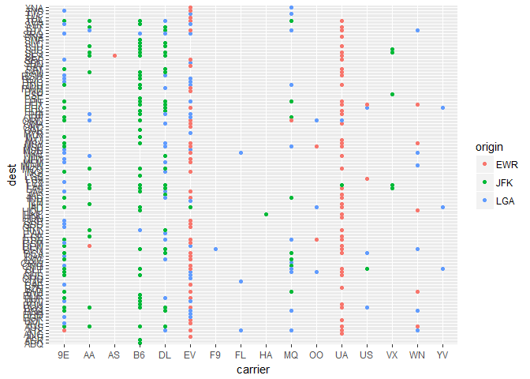

# R-club-June-21
Min-Yao  
2017年6月20日  


```r
library(tidyverse)
```

```
## Warning: package 'tidyverse' was built under R version 3.3.3
```

```
## Loading tidyverse: ggplot2
## Loading tidyverse: tibble
## Loading tidyverse: tidyr
## Loading tidyverse: readr
## Loading tidyverse: purrr
## Loading tidyverse: dplyr
```

```
## Warning: package 'tibble' was built under R version 3.3.3
```

```
## Warning: package 'tidyr' was built under R version 3.3.3
```

```
## Warning: package 'readr' was built under R version 3.3.3
```

```
## Warning: package 'purrr' was built under R version 3.3.3
```

```
## Warning: package 'dplyr' was built under R version 3.3.3
```

```
## Conflicts with tidy packages ----------------------------------------------
```

```
## filter(): dplyr, stats
## lag():    dplyr, stats
```


## 12.5 Missing values


```r
stocks <- tibble(
  year   = c(2015, 2015, 2015, 2015, 2016, 2016, 2016),
  qtr    = c(   1,    2,    3,    4,    2,    3,    4),
  return = c(1.88, 0.59, 0.35,   NA, 0.92, 0.17, 2.66)
)
stocks
```

```
## # A tibble: 7 x 3
##    year   qtr return
##   <dbl> <dbl>  <dbl>
## 1  2015     1   1.88
## 2  2015     2   0.59
## 3  2015     3   0.35
## 4  2015     4     NA
## 5  2016     2   0.92
## 6  2016     3   0.17
## 7  2016     4   2.66
```

```r
# make the implicit missing value explicit
stocks %>% 
  spread(year, return)
```

```
## # A tibble: 4 x 3
##     qtr `2015` `2016`
## * <dbl>  <dbl>  <dbl>
## 1     1   1.88     NA
## 2     2   0.59   0.92
## 3     3   0.35   0.17
## 4     4     NA   2.66
```

```r
# turn explicit missing values implicit
stocks %>% 
  spread(year, return) %>% 
  gather(year, return, `2015`:`2016`, na.rm = TRUE)
```

```
## # A tibble: 6 x 3
##     qtr  year return
## * <dbl> <chr>  <dbl>
## 1     1  2015   1.88
## 2     2  2015   0.59
## 3     3  2015   0.35
## 4     2  2016   0.92
## 5     3  2016   0.17
## 6     4  2016   2.66
```

```r
stocks %>% 
  complete(year, qtr)
```

```
## # A tibble: 8 x 3
##    year   qtr return
##   <dbl> <dbl>  <dbl>
## 1  2015     1   1.88
## 2  2015     2   0.59
## 3  2015     3   0.35
## 4  2015     4     NA
## 5  2016     1     NA
## 6  2016     2   0.92
## 7  2016     3   0.17
## 8  2016     4   2.66
```

```r
treatment <- tribble(
  ~ person,           ~ treatment, ~response,
  "Derrick Whitmore", 1,           7,
  NA,                 2,           10,
  NA,                 3,           9,
  "Katherine Burke",  1,           4
)
treatment
```

```
## # A tibble: 4 x 3
##             person treatment response
##              <chr>     <dbl>    <dbl>
## 1 Derrick Whitmore         1        7
## 2             <NA>         2       10
## 3             <NA>         3        9
## 4  Katherine Burke         1        4
```

```r
treatment %>% 
  fill(person)
```

```
## # A tibble: 4 x 3
##             person treatment response
##              <chr>     <dbl>    <dbl>
## 1 Derrick Whitmore         1        7
## 2 Derrick Whitmore         2       10
## 3 Derrick Whitmore         3        9
## 4  Katherine Burke         1        4
```


### 12.5.1 Exercises

1. Compare and contrast the fill arguments to spread() and complete().


```r
#?fill
#?spread
#?complete


# Spread and gather are complements
df <- data.frame(x = c("a", "b"), y = c(3, 4), z = c(5, 6))
df
```

```
##   x y z
## 1 a 3 5
## 2 b 4 6
```

```r
df %>% spread(x, y)
```

```
##   z  a  b
## 1 5  3 NA
## 2 6 NA  4
```

```r
df %>% spread(x, y) %>% gather(x, y, a:b, na.rm = TRUE)
```

```
##   z x y
## 1 5 a 3
## 4 6 b 4
```

> fill {tidyr}
Fills missing values in using the previous entry. This is useful in the common output format where values are not repeated, they're recorded each time they change.

> spread {tidyr}
Spread a key-value pair across multiple columns.

> complete {tidyr}
Turns implicit missing values into explicit missing values. This is a wrapper around expand(), left_join() and replace_na that's useful for completing missing combinations of data.

2. What does the direction argument to fill() do?


```r
#?fill
df <- data.frame(Month = 1:12, Year = c(2000, rep(NA, 10), 10))
df
```

```
##    Month Year
## 1      1 2000
## 2      2   NA
## 3      3   NA
## 4      4   NA
## 5      5   NA
## 6      6   NA
## 7      7   NA
## 8      8   NA
## 9      9   NA
## 10    10   NA
## 11    11   NA
## 12    12   10
```

```r
df %>% fill(Year)
```

```
##    Month Year
## 1      1 2000
## 2      2 2000
## 3      3 2000
## 4      4 2000
## 5      5 2000
## 6      6 2000
## 7      7 2000
## 8      8 2000
## 9      9 2000
## 10    10 2000
## 11    11 2000
## 12    12   10
```

```r
df %>% fill(Year, .direction = c("up"))
```

```
##    Month Year
## 1      1 2000
## 2      2   10
## 3      3   10
## 4      4   10
## 5      5   10
## 6      6   10
## 7      7   10
## 8      8   10
## 9      9   10
## 10    10   10
## 11    11   10
## 12    12   10
```

> fill {tidyr}
.direction	
Direction in which to fill missing values. Currently either "down" (the default) or "up".

## 12.6 Case Study


```r
who
```

```
## # A tibble: 7,240 x 60
##        country  iso2  iso3  year new_sp_m014 new_sp_m1524 new_sp_m2534
##          <chr> <chr> <chr> <int>       <int>        <int>        <int>
##  1 Afghanistan    AF   AFG  1980          NA           NA           NA
##  2 Afghanistan    AF   AFG  1981          NA           NA           NA
##  3 Afghanistan    AF   AFG  1982          NA           NA           NA
##  4 Afghanistan    AF   AFG  1983          NA           NA           NA
##  5 Afghanistan    AF   AFG  1984          NA           NA           NA
##  6 Afghanistan    AF   AFG  1985          NA           NA           NA
##  7 Afghanistan    AF   AFG  1986          NA           NA           NA
##  8 Afghanistan    AF   AFG  1987          NA           NA           NA
##  9 Afghanistan    AF   AFG  1988          NA           NA           NA
## 10 Afghanistan    AF   AFG  1989          NA           NA           NA
## # ... with 7,230 more rows, and 53 more variables: new_sp_m3544 <int>,
## #   new_sp_m4554 <int>, new_sp_m5564 <int>, new_sp_m65 <int>,
## #   new_sp_f014 <int>, new_sp_f1524 <int>, new_sp_f2534 <int>,
## #   new_sp_f3544 <int>, new_sp_f4554 <int>, new_sp_f5564 <int>,
## #   new_sp_f65 <int>, new_sn_m014 <int>, new_sn_m1524 <int>,
## #   new_sn_m2534 <int>, new_sn_m3544 <int>, new_sn_m4554 <int>,
## #   new_sn_m5564 <int>, new_sn_m65 <int>, new_sn_f014 <int>,
## #   new_sn_f1524 <int>, new_sn_f2534 <int>, new_sn_f3544 <int>,
## #   new_sn_f4554 <int>, new_sn_f5564 <int>, new_sn_f65 <int>,
## #   new_ep_m014 <int>, new_ep_m1524 <int>, new_ep_m2534 <int>,
## #   new_ep_m3544 <int>, new_ep_m4554 <int>, new_ep_m5564 <int>,
## #   new_ep_m65 <int>, new_ep_f014 <int>, new_ep_f1524 <int>,
## #   new_ep_f2534 <int>, new_ep_f3544 <int>, new_ep_f4554 <int>,
## #   new_ep_f5564 <int>, new_ep_f65 <int>, newrel_m014 <int>,
## #   newrel_m1524 <int>, newrel_m2534 <int>, newrel_m3544 <int>,
## #   newrel_m4554 <int>, newrel_m5564 <int>, newrel_m65 <int>,
## #   newrel_f014 <int>, newrel_f1524 <int>, newrel_f2534 <int>,
## #   newrel_f3544 <int>, newrel_f4554 <int>, newrel_f5564 <int>,
## #   newrel_f65 <int>
```

```r
who1 <- who %>% 
  gather(new_sp_m014:newrel_f65, key = "key", value = "cases", na.rm = TRUE)
who1
```

```
## # A tibble: 76,046 x 6
##        country  iso2  iso3  year         key cases
##  *       <chr> <chr> <chr> <int>       <chr> <int>
##  1 Afghanistan    AF   AFG  1997 new_sp_m014     0
##  2 Afghanistan    AF   AFG  1998 new_sp_m014    30
##  3 Afghanistan    AF   AFG  1999 new_sp_m014     8
##  4 Afghanistan    AF   AFG  2000 new_sp_m014    52
##  5 Afghanistan    AF   AFG  2001 new_sp_m014   129
##  6 Afghanistan    AF   AFG  2002 new_sp_m014    90
##  7 Afghanistan    AF   AFG  2003 new_sp_m014   127
##  8 Afghanistan    AF   AFG  2004 new_sp_m014   139
##  9 Afghanistan    AF   AFG  2005 new_sp_m014   151
## 10 Afghanistan    AF   AFG  2006 new_sp_m014   193
## # ... with 76,036 more rows
```

```r
who1 %>% 
  count(key)
```

```
## # A tibble: 56 x 2
##             key     n
##           <chr> <int>
##  1  new_ep_f014  1032
##  2 new_ep_f1524  1021
##  3 new_ep_f2534  1021
##  4 new_ep_f3544  1021
##  5 new_ep_f4554  1017
##  6 new_ep_f5564  1017
##  7   new_ep_f65  1014
##  8  new_ep_m014  1038
##  9 new_ep_m1524  1026
## 10 new_ep_m2534  1020
## # ... with 46 more rows
```

```r
who2 <- who1 %>% 
  mutate(key = stringr::str_replace(key, "newrel", "new_rel"))
```

```
## Warning: package 'bindrcpp' was built under R version 3.3.3
```

```r
who2
```

```
## # A tibble: 76,046 x 6
##        country  iso2  iso3  year         key cases
##          <chr> <chr> <chr> <int>       <chr> <int>
##  1 Afghanistan    AF   AFG  1997 new_sp_m014     0
##  2 Afghanistan    AF   AFG  1998 new_sp_m014    30
##  3 Afghanistan    AF   AFG  1999 new_sp_m014     8
##  4 Afghanistan    AF   AFG  2000 new_sp_m014    52
##  5 Afghanistan    AF   AFG  2001 new_sp_m014   129
##  6 Afghanistan    AF   AFG  2002 new_sp_m014    90
##  7 Afghanistan    AF   AFG  2003 new_sp_m014   127
##  8 Afghanistan    AF   AFG  2004 new_sp_m014   139
##  9 Afghanistan    AF   AFG  2005 new_sp_m014   151
## 10 Afghanistan    AF   AFG  2006 new_sp_m014   193
## # ... with 76,036 more rows
```

```r
who3 <- who2 %>% 
  separate(key, c("new", "type", "sexage"), sep = "_")
who3
```

```
## # A tibble: 76,046 x 8
##        country  iso2  iso3  year   new  type sexage cases
##  *       <chr> <chr> <chr> <int> <chr> <chr>  <chr> <int>
##  1 Afghanistan    AF   AFG  1997   new    sp   m014     0
##  2 Afghanistan    AF   AFG  1998   new    sp   m014    30
##  3 Afghanistan    AF   AFG  1999   new    sp   m014     8
##  4 Afghanistan    AF   AFG  2000   new    sp   m014    52
##  5 Afghanistan    AF   AFG  2001   new    sp   m014   129
##  6 Afghanistan    AF   AFG  2002   new    sp   m014    90
##  7 Afghanistan    AF   AFG  2003   new    sp   m014   127
##  8 Afghanistan    AF   AFG  2004   new    sp   m014   139
##  9 Afghanistan    AF   AFG  2005   new    sp   m014   151
## 10 Afghanistan    AF   AFG  2006   new    sp   m014   193
## # ... with 76,036 more rows
```

```r
who3 %>% 
  count(new)
```

```
## # A tibble: 1 x 2
##     new     n
##   <chr> <int>
## 1   new 76046
```

```r
who4 <- who3 %>% 
  select(-new, -iso2, -iso3)

who5 <- who4 %>% 
  separate(sexage, c("sex", "age"), sep = 1)
who5
```

```
## # A tibble: 76,046 x 6
##        country  year  type   sex   age cases
##  *       <chr> <int> <chr> <chr> <chr> <int>
##  1 Afghanistan  1997    sp     m   014     0
##  2 Afghanistan  1998    sp     m   014    30
##  3 Afghanistan  1999    sp     m   014     8
##  4 Afghanistan  2000    sp     m   014    52
##  5 Afghanistan  2001    sp     m   014   129
##  6 Afghanistan  2002    sp     m   014    90
##  7 Afghanistan  2003    sp     m   014   127
##  8 Afghanistan  2004    sp     m   014   139
##  9 Afghanistan  2005    sp     m   014   151
## 10 Afghanistan  2006    sp     m   014   193
## # ... with 76,036 more rows
```

```r
who.final <- who %>%
  gather(code, value, new_sp_m014:newrel_f65, na.rm = TRUE) %>% 
  mutate(code = stringr::str_replace(code, "newrel", "new_rel")) %>%
  separate(code, c("new", "var", "sexage")) %>% 
  select(-new, -iso2, -iso3) %>% 
  separate(sexage, c("sex", "age"), sep = 1)
who.final
```

```
## # A tibble: 76,046 x 6
##        country  year   var   sex   age value
##  *       <chr> <int> <chr> <chr> <chr> <int>
##  1 Afghanistan  1997    sp     m   014     0
##  2 Afghanistan  1998    sp     m   014    30
##  3 Afghanistan  1999    sp     m   014     8
##  4 Afghanistan  2000    sp     m   014    52
##  5 Afghanistan  2001    sp     m   014   129
##  6 Afghanistan  2002    sp     m   014    90
##  7 Afghanistan  2003    sp     m   014   127
##  8 Afghanistan  2004    sp     m   014   139
##  9 Afghanistan  2005    sp     m   014   151
## 10 Afghanistan  2006    sp     m   014   193
## # ... with 76,036 more rows
```


### 12.6.1 Exercises

1. In this case study I set na.rm = TRUE just to make it easier to check that we had the correct values. Is this reasonable? Think about how missing values are represented in this dataset. Are there implicit missing values? What’s the difference between an NA and zero?


```r
who.na <- who %>%
  gather(code, value, new_sp_m014:newrel_f65) %>% 
  mutate(code = stringr::str_replace(code, "newrel", "new_rel")) %>%
  separate(code, c("new", "var", "sexage")) %>% 
  select(-new, -iso2, -iso3) %>% 
  separate(sexage, c("sex", "age"), sep = 1)
who.na
```

```
## # A tibble: 405,440 x 6
##        country  year   var   sex   age value
##  *       <chr> <int> <chr> <chr> <chr> <int>
##  1 Afghanistan  1980    sp     m   014    NA
##  2 Afghanistan  1981    sp     m   014    NA
##  3 Afghanistan  1982    sp     m   014    NA
##  4 Afghanistan  1983    sp     m   014    NA
##  5 Afghanistan  1984    sp     m   014    NA
##  6 Afghanistan  1985    sp     m   014    NA
##  7 Afghanistan  1986    sp     m   014    NA
##  8 Afghanistan  1987    sp     m   014    NA
##  9 Afghanistan  1988    sp     m   014    NA
## 10 Afghanistan  1989    sp     m   014    NA
## # ... with 405,430 more rows
```

```r
summary(who.final)
```

```
##    country               year          var                sex           
##  Length:76046       Min.   :1980   Length:76046       Length:76046      
##  Class :character   1st Qu.:2003   Class :character   Class :character  
##  Mode  :character   Median :2007   Mode  :character   Mode  :character  
##                     Mean   :2006                                        
##                     3rd Qu.:2010                                        
##                     Max.   :2013                                        
##      age                value         
##  Length:76046       Min.   :     0.0  
##  Class :character   1st Qu.:     3.0  
##  Mode  :character   Median :    26.0  
##                     Mean   :   570.7  
##                     3rd Qu.:   184.0  
##                     Max.   :250051.0
```

```r
summary(who.na)
```

```
##    country               year          var                sex           
##  Length:405440      Min.   :1980   Length:405440      Length:405440     
##  Class :character   1st Qu.:1988   Class :character   Class :character  
##  Mode  :character   Median :1997   Mode  :character   Mode  :character  
##                     Mean   :1997                                        
##                     3rd Qu.:2005                                        
##                     Max.   :2013                                        
##                                                                         
##      age                value         
##  Length:405440      Min.   :     0.0  
##  Class :character   1st Qu.:     3.0  
##  Mode  :character   Median :    26.0  
##                     Mean   :   570.7  
##                     3rd Qu.:   184.0  
##                     Max.   :250051.0  
##                     NA's   :329394
```

```r
who.complete.na <- who.na %>% complete(country,year,var,sex,age)
summary(who.complete.na)
```

```
##    country               year          var                sex           
##  Length:416976      Min.   :1980   Length:416976      Length:416976     
##  Class :character   1st Qu.:1988   Class :character   Class :character  
##  Mode  :character   Median :1996   Mode  :character   Mode  :character  
##                     Mean   :1996                                        
##                     3rd Qu.:2005                                        
##                     Max.   :2013                                        
##                                                                         
##      age                value         
##  Length:416976      Min.   :     0.0  
##  Class :character   1st Qu.:     3.0  
##  Mode  :character   Median :    26.0  
##                     Mean   :   570.7  
##                     3rd Qu.:   184.0  
##                     Max.   :250051.0  
##                     NA's   :340930
```


2. What happens if you neglect the mutate() step? (mutate(key = stringr::str_replace(key, "newrel", "new_rel")))


```r
who.nomutate <- who %>%
  gather(code, value, new_sp_m014:newrel_f65, na.rm = TRUE) %>% 
  separate(code, c("new", "var", "sexage")) %>% 
  select(-new, -iso2, -iso3) %>% 
  separate(sexage, c("sex", "age"), sep = 1)
```

```
## Warning: Too few values at 2580 locations: 73467, 73468, 73469, 73470,
## 73471, 73472, 73473, 73474, 73475, 73476, 73477, 73478, 73479, 73480,
## 73481, 73482, 73483, 73484, 73485, 73486, ...
```

```r
summary(who.nomutate)
```

```
##    country               year          var                sex           
##  Length:76046       Min.   :1980   Length:76046       Length:76046      
##  Class :character   1st Qu.:2003   Class :character   Class :character  
##  Mode  :character   Median :2007   Mode  :character   Mode  :character  
##                     Mean   :2006                                        
##                     3rd Qu.:2010                                        
##                     Max.   :2013                                        
##      age                value         
##  Length:76046       Min.   :     0.0  
##  Class :character   1st Qu.:     3.0  
##  Mode  :character   Median :    26.0  
##                     Mean   :   570.7  
##                     3rd Qu.:   184.0  
##                     Max.   :250051.0
```

```r
who.nomutate[73460:73470,]
```

```
## # A tibble: 11 x 6
##        country  year   var   sex   age value
##          <chr> <int> <chr> <chr> <chr> <int>
##  1    Zimbabwe  2006    ep     f    65    92
##  2    Zimbabwe  2007    ep     f    65     9
##  3    Zimbabwe  2008    ep     f    65   104
##  4    Zimbabwe  2009    ep     f    65   138
##  5    Zimbabwe  2010    ep     f    65   146
##  6    Zimbabwe  2011    ep     f    65   129
##  7    Zimbabwe  2012    ep     f    65   143
##  8 Afghanistan  2013  m014  <NA>  <NA>  1705
##  9     Albania  2013  m014  <NA>  <NA>    14
## 10     Algeria  2013  m014  <NA>  <NA>    25
## 11     Andorra  2013  m014  <NA>  <NA>     0
```


3. I claimed that iso2 and iso3 were redundant with country. Confirm this claim.


```r
who %>% count(country)
```

```
## # A tibble: 219 x 2
##                country     n
##                  <chr> <int>
##  1         Afghanistan    34
##  2             Albania    34
##  3             Algeria    34
##  4      American Samoa    34
##  5             Andorra    34
##  6              Angola    34
##  7            Anguilla    34
##  8 Antigua and Barbuda    34
##  9           Argentina    34
## 10             Armenia    34
## # ... with 209 more rows
```

```r
who %>% count(iso2)
```

```
## # A tibble: 219 x 2
##     iso2     n
##    <chr> <int>
##  1    AD    34
##  2    AE    34
##  3    AF    34
##  4    AG    34
##  5    AI    34
##  6    AL    34
##  7    AM    34
##  8    AN    30
##  9    AO    34
## 10    AR    34
## # ... with 209 more rows
```

```r
who %>% count(iso3)
```

```
## # A tibble: 219 x 2
##     iso3     n
##    <chr> <int>
##  1   ABW    34
##  2   AFG    34
##  3   AGO    34
##  4   AIA    34
##  5   ALB    34
##  6   AND    34
##  7   ANT    30
##  8   ARE    34
##  9   ARG    34
## 10   ARM    34
## # ... with 209 more rows
```

```r
who %>% count(country,iso2,iso3)
```

```
## # A tibble: 219 x 4
##                country  iso2  iso3     n
##                  <chr> <chr> <chr> <int>
##  1         Afghanistan    AF   AFG    34
##  2             Albania    AL   ALB    34
##  3             Algeria    DZ   DZA    34
##  4      American Samoa    AS   ASM    34
##  5             Andorra    AD   AND    34
##  6              Angola    AO   AGO    34
##  7            Anguilla    AI   AIA    34
##  8 Antigua and Barbuda    AG   ATG    34
##  9           Argentina    AR   ARG    34
## 10             Armenia    AM   ARM    34
## # ... with 209 more rows
```


4. For each country, year, and sex compute the total number of cases of TB. Make an informative visualisation of the data.


```r
who.final <- who %>%
  gather(code, value, new_sp_m014:newrel_f65, na.rm = TRUE) %>% 
  mutate(code = stringr::str_replace(code, "newrel", "new_rel")) %>%
  separate(code, c("new", "var", "sexage")) %>% 
  select(-new, -iso2, -iso3) %>% 
  separate(sexage, c("sex", "age"), sep = 1)
who.final
```

```
## # A tibble: 76,046 x 6
##        country  year   var   sex   age value
##  *       <chr> <int> <chr> <chr> <chr> <int>
##  1 Afghanistan  1997    sp     m   014     0
##  2 Afghanistan  1998    sp     m   014    30
##  3 Afghanistan  1999    sp     m   014     8
##  4 Afghanistan  2000    sp     m   014    52
##  5 Afghanistan  2001    sp     m   014   129
##  6 Afghanistan  2002    sp     m   014    90
##  7 Afghanistan  2003    sp     m   014   127
##  8 Afghanistan  2004    sp     m   014   139
##  9 Afghanistan  2005    sp     m   014   151
## 10 Afghanistan  2006    sp     m   014   193
## # ... with 76,036 more rows
```

```r
summary.who.final<- who.final %>% 
  group_by(country, year, sex) %>%
  summarize(totalnumber=sum(value))
summary.who.final
```

```
## # A tibble: 6,921 x 4
## # Groups:   country, year [?]
##        country  year   sex totalnumber
##          <chr> <int> <chr>       <int>
##  1 Afghanistan  1997     f         102
##  2 Afghanistan  1997     m          26
##  3 Afghanistan  1998     f        1207
##  4 Afghanistan  1998     m         571
##  5 Afghanistan  1999     f         517
##  6 Afghanistan  1999     m         228
##  7 Afghanistan  2000     f        1751
##  8 Afghanistan  2000     m         915
##  9 Afghanistan  2001     f        3062
## 10 Afghanistan  2001     m        1577
## # ... with 6,911 more rows
```

```r
summary.who.final %>% ggplot() + 
  geom_point(aes(x=totalnumber, y=country, color=sex))
```

<!-- -->

```r
summary.who.final %>% ggplot() + 
  geom_point(aes(x=totalnumber, y=year, color=sex))
```

<!-- -->

```r
summary.who.final %>% ggplot() + 
  geom_point(aes(x=totalnumber, y=country, shape=sex, color=year))
```

<!-- -->


## 12.7 Non-tidy data

# 13 Relational data

## 13.1 Introduction

### 13.1.1 Prerequisites


```r
library(tidyverse)
library(nycflights13)
```

```
## Warning: package 'nycflights13' was built under R version 3.3.3
```


## 13.2 nycflights13


```r
airlines
```

```
## # A tibble: 16 x 2
##    carrier                        name
##      <chr>                       <chr>
##  1      9E           Endeavor Air Inc.
##  2      AA      American Airlines Inc.
##  3      AS        Alaska Airlines Inc.
##  4      B6             JetBlue Airways
##  5      DL        Delta Air Lines Inc.
##  6      EV    ExpressJet Airlines Inc.
##  7      F9      Frontier Airlines Inc.
##  8      FL AirTran Airways Corporation
##  9      HA      Hawaiian Airlines Inc.
## 10      MQ                   Envoy Air
## 11      OO       SkyWest Airlines Inc.
## 12      UA       United Air Lines Inc.
## 13      US             US Airways Inc.
## 14      VX              Virgin America
## 15      WN      Southwest Airlines Co.
## 16      YV          Mesa Airlines Inc.
```

```r
airports
```

```
## # A tibble: 1,458 x 8
##      faa                           name      lat        lon   alt    tz
##    <chr>                          <chr>    <dbl>      <dbl> <int> <dbl>
##  1   04G              Lansdowne Airport 41.13047  -80.61958  1044    -5
##  2   06A  Moton Field Municipal Airport 32.46057  -85.68003   264    -6
##  3   06C            Schaumburg Regional 41.98934  -88.10124   801    -6
##  4   06N                Randall Airport 41.43191  -74.39156   523    -5
##  5   09J          Jekyll Island Airport 31.07447  -81.42778    11    -5
##  6   0A9 Elizabethton Municipal Airport 36.37122  -82.17342  1593    -5
##  7   0G6        Williams County Airport 41.46731  -84.50678   730    -5
##  8   0G7  Finger Lakes Regional Airport 42.88356  -76.78123   492    -5
##  9   0P2   Shoestring Aviation Airfield 39.79482  -76.64719  1000    -5
## 10   0S9          Jefferson County Intl 48.05381 -122.81064   108    -8
## # ... with 1,448 more rows, and 2 more variables: dst <chr>, tzone <chr>
```

```r
planes
```

```
## # A tibble: 3,322 x 9
##    tailnum  year                    type     manufacturer     model
##      <chr> <int>                   <chr>            <chr>     <chr>
##  1  N10156  2004 Fixed wing multi engine          EMBRAER EMB-145XR
##  2  N102UW  1998 Fixed wing multi engine AIRBUS INDUSTRIE  A320-214
##  3  N103US  1999 Fixed wing multi engine AIRBUS INDUSTRIE  A320-214
##  4  N104UW  1999 Fixed wing multi engine AIRBUS INDUSTRIE  A320-214
##  5  N10575  2002 Fixed wing multi engine          EMBRAER EMB-145LR
##  6  N105UW  1999 Fixed wing multi engine AIRBUS INDUSTRIE  A320-214
##  7  N107US  1999 Fixed wing multi engine AIRBUS INDUSTRIE  A320-214
##  8  N108UW  1999 Fixed wing multi engine AIRBUS INDUSTRIE  A320-214
##  9  N109UW  1999 Fixed wing multi engine AIRBUS INDUSTRIE  A320-214
## 10  N110UW  1999 Fixed wing multi engine AIRBUS INDUSTRIE  A320-214
## # ... with 3,312 more rows, and 4 more variables: engines <int>,
## #   seats <int>, speed <int>, engine <chr>
```

```r
weather
```

```
## # A tibble: 26,130 x 15
##    origin  year month   day  hour  temp  dewp humid wind_dir wind_speed
##     <chr> <dbl> <dbl> <int> <int> <dbl> <dbl> <dbl>    <dbl>      <dbl>
##  1    EWR  2013     1     1     0 37.04 21.92 53.97      230   10.35702
##  2    EWR  2013     1     1     1 37.04 21.92 53.97      230   13.80936
##  3    EWR  2013     1     1     2 37.94 21.92 52.09      230   12.65858
##  4    EWR  2013     1     1     3 37.94 23.00 54.51      230   13.80936
##  5    EWR  2013     1     1     4 37.94 24.08 57.04      240   14.96014
##  6    EWR  2013     1     1     6 39.02 26.06 59.37      270   10.35702
##  7    EWR  2013     1     1     7 39.02 26.96 61.63      250    8.05546
##  8    EWR  2013     1     1     8 39.02 28.04 64.43      240   11.50780
##  9    EWR  2013     1     1     9 39.92 28.04 62.21      250   12.65858
## 10    EWR  2013     1     1    10 39.02 28.04 64.43      260   12.65858
## # ... with 26,120 more rows, and 5 more variables: wind_gust <dbl>,
## #   precip <dbl>, pressure <dbl>, visib <dbl>, time_hour <dttm>
```


### 13.2.1 Exercises

1.Imagine you wanted to draw (approximately) the route each plane flies from its origin to its destination. What variables would you need? What tables would you need to combine?

> I need `year:day`, `hour`, `origin`, `dest`, `tailnum`, `carrier`.

> I need to combine `planes`, `airlines`, `airports`, `weather`, which is `flights`.


```r
flights2 <- flights %>% 
  select(year:day, hour, origin, dest, tailnum, carrier)
flights2
```

```
## # A tibble: 336,776 x 8
##     year month   day  hour origin  dest tailnum carrier
##    <int> <int> <int> <dbl>  <chr> <chr>   <chr>   <chr>
##  1  2013     1     1     5    EWR   IAH  N14228      UA
##  2  2013     1     1     5    LGA   IAH  N24211      UA
##  3  2013     1     1     5    JFK   MIA  N619AA      AA
##  4  2013     1     1     5    JFK   BQN  N804JB      B6
##  5  2013     1     1     6    LGA   ATL  N668DN      DL
##  6  2013     1     1     5    EWR   ORD  N39463      UA
##  7  2013     1     1     6    EWR   FLL  N516JB      B6
##  8  2013     1     1     6    LGA   IAD  N829AS      EV
##  9  2013     1     1     6    JFK   MCO  N593JB      B6
## 10  2013     1     1     6    LGA   ORD  N3ALAA      AA
## # ... with 336,766 more rows
```

```r
flights2 %>% ggplot() + 
  geom_point(aes(x=carrier, y=dest, color=origin))
```

<!-- -->


2.I forgot to draw the relationship between weather and airports. What is the relationship and how should it appear in the diagram?

> `flights` connects to `airports` via the `origin` and `dest` variables.

> `flights` connects to `weather` via `origin` (the location), and `year`, `month`, `day` and `hour` (the time).

> `weather` connects to `airports` via `origin` (the location), identified by the `faa` airport code.


```r
summary(weather)
```

```
##     origin               year          month             day       
##  Length:26130       Min.   :2013   Min.   : 1.000   Min.   : 1.00  
##  Class :character   1st Qu.:2013   1st Qu.: 4.000   1st Qu.: 8.00  
##  Mode  :character   Median :2013   Median : 7.000   Median :16.00  
##                     Mean   :2013   Mean   : 6.506   Mean   :15.68  
##                     3rd Qu.:2013   3rd Qu.: 9.000   3rd Qu.:23.00  
##                     Max.   :2013   Max.   :12.000   Max.   :31.00  
##                                                                    
##       hour            temp             dewp           humid       
##  Min.   : 0.00   Min.   : 10.94   Min.   :-9.94   Min.   : 12.74  
##  1st Qu.: 6.00   1st Qu.: 39.92   1st Qu.:26.06   1st Qu.: 46.99  
##  Median :12.00   Median : 55.04   Median :42.08   Median : 61.66  
##  Mean   :11.52   Mean   : 55.20   Mean   :41.39   Mean   : 62.35  
##  3rd Qu.:18.00   3rd Qu.: 69.98   3rd Qu.:57.92   3rd Qu.: 78.62  
##  Max.   :23.00   Max.   :100.04   Max.   :78.08   Max.   :100.00  
##                  NA's   :1        NA's   :1       NA's   :1       
##     wind_dir       wind_speed         wind_gust            precip        
##  Min.   :  0.0   Min.   :   0.000   Min.   :   0.000   Min.   :0.000000  
##  1st Qu.:120.0   1st Qu.:   6.905   1st Qu.:   7.946   1st Qu.:0.000000  
##  Median :220.0   Median :   9.206   Median :  10.594   Median :0.000000  
##  Mean   :198.1   Mean   :  10.396   Mean   :  11.963   Mean   :0.002726  
##  3rd Qu.:290.0   3rd Qu.:  13.809   3rd Qu.:  15.892   3rd Qu.:0.000000  
##  Max.   :360.0   Max.   :1048.361   Max.   :1206.432   Max.   :1.180000  
##  NA's   :418     NA's   :3          NA's   :3                            
##     pressure          visib          time_hour                  
##  Min.   : 983.8   Min.   : 0.000   Min.   :2012-12-31 16:00:00  
##  1st Qu.:1012.9   1st Qu.:10.000   1st Qu.:2013-04-01 14:00:00  
##  Median :1017.6   Median :10.000   Median :2013-07-01 07:30:00  
##  Mean   :1017.9   Mean   : 9.205   Mean   :2013-07-01 12:07:20  
##  3rd Qu.:1023.0   3rd Qu.:10.000   3rd Qu.:2013-09-30 07:45:00  
##  Max.   :1042.1   Max.   :10.000   Max.   :2013-12-30 15:00:00  
##  NA's   :2730
```

```r
summary(airports)
```

```
##      faa                name                lat             lon         
##  Length:1458        Length:1458        Min.   :19.72   Min.   :-176.65  
##  Class :character   Class :character   1st Qu.:34.26   1st Qu.:-119.19  
##  Mode  :character   Mode  :character   Median :40.09   Median : -94.66  
##                                        Mean   :41.65   Mean   :-103.39  
##                                        3rd Qu.:45.07   3rd Qu.: -82.52  
##                                        Max.   :72.27   Max.   : 174.11  
##       alt                tz              dst               tzone          
##  Min.   : -54.00   Min.   :-10.000   Length:1458        Length:1458       
##  1st Qu.:  70.25   1st Qu.: -8.000   Class :character   Class :character  
##  Median : 473.00   Median : -6.000   Mode  :character   Mode  :character  
##  Mean   :1001.42   Mean   : -6.519                                        
##  3rd Qu.:1062.50   3rd Qu.: -5.000                                        
##  Max.   :9078.00   Max.   :  8.000
```


3.weather only contains information for the origin (NYC) airports. If it contained weather records for all airports in the USA, what additional relation would it define with flights?

> the dest of flights


```r
summary(weather)
```

```
##     origin               year          month             day       
##  Length:26130       Min.   :2013   Min.   : 1.000   Min.   : 1.00  
##  Class :character   1st Qu.:2013   1st Qu.: 4.000   1st Qu.: 8.00  
##  Mode  :character   Median :2013   Median : 7.000   Median :16.00  
##                     Mean   :2013   Mean   : 6.506   Mean   :15.68  
##                     3rd Qu.:2013   3rd Qu.: 9.000   3rd Qu.:23.00  
##                     Max.   :2013   Max.   :12.000   Max.   :31.00  
##                                                                    
##       hour            temp             dewp           humid       
##  Min.   : 0.00   Min.   : 10.94   Min.   :-9.94   Min.   : 12.74  
##  1st Qu.: 6.00   1st Qu.: 39.92   1st Qu.:26.06   1st Qu.: 46.99  
##  Median :12.00   Median : 55.04   Median :42.08   Median : 61.66  
##  Mean   :11.52   Mean   : 55.20   Mean   :41.39   Mean   : 62.35  
##  3rd Qu.:18.00   3rd Qu.: 69.98   3rd Qu.:57.92   3rd Qu.: 78.62  
##  Max.   :23.00   Max.   :100.04   Max.   :78.08   Max.   :100.00  
##                  NA's   :1        NA's   :1       NA's   :1       
##     wind_dir       wind_speed         wind_gust            precip        
##  Min.   :  0.0   Min.   :   0.000   Min.   :   0.000   Min.   :0.000000  
##  1st Qu.:120.0   1st Qu.:   6.905   1st Qu.:   7.946   1st Qu.:0.000000  
##  Median :220.0   Median :   9.206   Median :  10.594   Median :0.000000  
##  Mean   :198.1   Mean   :  10.396   Mean   :  11.963   Mean   :0.002726  
##  3rd Qu.:290.0   3rd Qu.:  13.809   3rd Qu.:  15.892   3rd Qu.:0.000000  
##  Max.   :360.0   Max.   :1048.361   Max.   :1206.432   Max.   :1.180000  
##  NA's   :418     NA's   :3          NA's   :3                            
##     pressure          visib          time_hour                  
##  Min.   : 983.8   Min.   : 0.000   Min.   :2012-12-31 16:00:00  
##  1st Qu.:1012.9   1st Qu.:10.000   1st Qu.:2013-04-01 14:00:00  
##  Median :1017.6   Median :10.000   Median :2013-07-01 07:30:00  
##  Mean   :1017.9   Mean   : 9.205   Mean   :2013-07-01 12:07:20  
##  3rd Qu.:1023.0   3rd Qu.:10.000   3rd Qu.:2013-09-30 07:45:00  
##  Max.   :1042.1   Max.   :10.000   Max.   :2013-12-30 15:00:00  
##  NA's   :2730
```

4.We know that some days of the year are “special”, and fewer people than usual fly on them. How might you represent that data as a data frame? What would be the primary keys of that table? How would it connect to the existing tables?

These special dates may be holiday, so I can make a new columns with year, month, day.


```r
summary(flights)
```

```
##       year          month             day           dep_time   
##  Min.   :2013   Min.   : 1.000   Min.   : 1.00   Min.   :   1  
##  1st Qu.:2013   1st Qu.: 4.000   1st Qu.: 8.00   1st Qu.: 907  
##  Median :2013   Median : 7.000   Median :16.00   Median :1401  
##  Mean   :2013   Mean   : 6.549   Mean   :15.71   Mean   :1349  
##  3rd Qu.:2013   3rd Qu.:10.000   3rd Qu.:23.00   3rd Qu.:1744  
##  Max.   :2013   Max.   :12.000   Max.   :31.00   Max.   :2400  
##                                                  NA's   :8255  
##  sched_dep_time   dep_delay          arr_time    sched_arr_time
##  Min.   : 106   Min.   : -43.00   Min.   :   1   Min.   :   1  
##  1st Qu.: 906   1st Qu.:  -5.00   1st Qu.:1104   1st Qu.:1124  
##  Median :1359   Median :  -2.00   Median :1535   Median :1556  
##  Mean   :1344   Mean   :  12.64   Mean   :1502   Mean   :1536  
##  3rd Qu.:1729   3rd Qu.:  11.00   3rd Qu.:1940   3rd Qu.:1945  
##  Max.   :2359   Max.   :1301.00   Max.   :2400   Max.   :2359  
##                 NA's   :8255      NA's   :8713                 
##    arr_delay          carrier              flight       tailnum         
##  Min.   : -86.000   Length:336776      Min.   :   1   Length:336776     
##  1st Qu.: -17.000   Class :character   1st Qu.: 553   Class :character  
##  Median :  -5.000   Mode  :character   Median :1496   Mode  :character  
##  Mean   :   6.895                      Mean   :1972                     
##  3rd Qu.:  14.000                      3rd Qu.:3465                     
##  Max.   :1272.000                      Max.   :8500                     
##  NA's   :9430                                                           
##     origin              dest              air_time        distance   
##  Length:336776      Length:336776      Min.   : 20.0   Min.   :  17  
##  Class :character   Class :character   1st Qu.: 82.0   1st Qu.: 502  
##  Mode  :character   Mode  :character   Median :129.0   Median : 872  
##                                        Mean   :150.7   Mean   :1040  
##                                        3rd Qu.:192.0   3rd Qu.:1389  
##                                        Max.   :695.0   Max.   :4983  
##                                        NA's   :9430                  
##       hour           minute        time_hour                  
##  Min.   : 1.00   Min.   : 0.00   Min.   :2013-01-01 05:00:00  
##  1st Qu.: 9.00   1st Qu.: 8.00   1st Qu.:2013-04-04 13:00:00  
##  Median :13.00   Median :29.00   Median :2013-07-03 10:00:00  
##  Mean   :13.18   Mean   :26.23   Mean   :2013-07-03 05:02:36  
##  3rd Qu.:17.00   3rd Qu.:44.00   3rd Qu.:2013-10-01 07:00:00  
##  Max.   :23.00   Max.   :59.00   Max.   :2013-12-31 23:00:00  
## 
```

