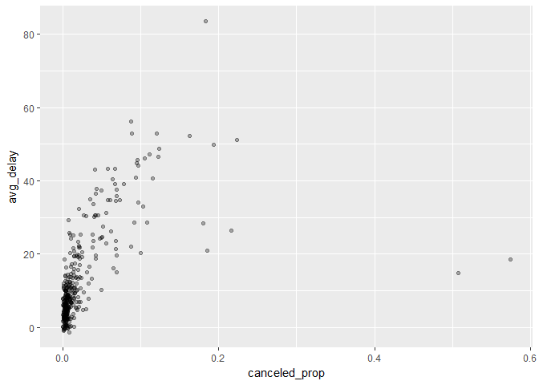
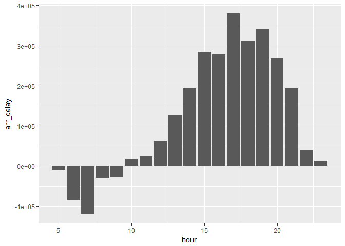
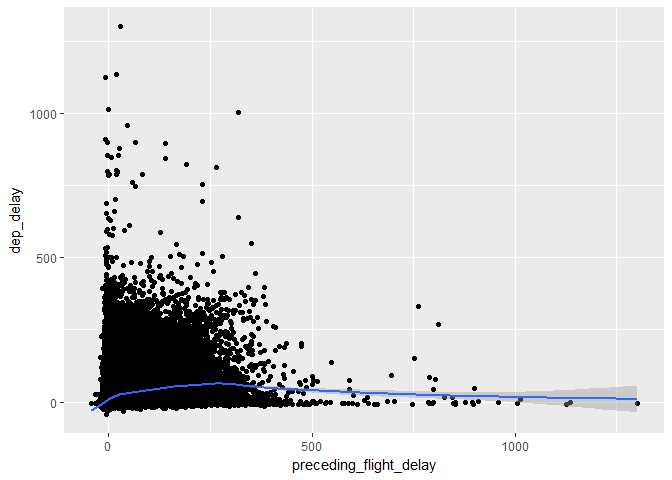

# Data transformation- continued
Min-Yao  
2017年5月14日  


```r
library(nycflights13)
```

```
## Warning: package 'nycflights13' was built under R version 3.3.3
```

```r
library(tidyverse)
```

```
## Warning: package 'tidyverse' was built under R version 3.3.3
```

```
## Loading tidyverse: ggplot2
## Loading tidyverse: tibble
## Loading tidyverse: tidyr
## Loading tidyverse: readr
## Loading tidyverse: purrr
## Loading tidyverse: dplyr
```

```
## Warning: package 'purrr' was built under R version 3.3.3
```

```
## Conflicts with tidy packages ----------------------------------------------
```

```
## filter(): dplyr, stats
## lag():    dplyr, stats
```

```r
library(Lahman)
```

```
## Warning: package 'Lahman' was built under R version 3.3.3
```

## 5.6 Grouped summaries with summarise()


```r
summarise(flights, delay = mean(dep_delay, na.rm = TRUE))
```

```
## # A tibble: 1 × 1
##      delay
##      <dbl>
## 1 12.63907
```

```r
by_day <- group_by(flights, year, month, day)
summarise(by_day, delay = mean(dep_delay, na.rm = TRUE))
```

```
## Source: local data frame [365 x 4]
## Groups: year, month [?]
## 
##     year month   day     delay
##    <int> <int> <int>     <dbl>
## 1   2013     1     1 11.548926
## 2   2013     1     2 13.858824
## 3   2013     1     3 10.987832
## 4   2013     1     4  8.951595
## 5   2013     1     5  5.732218
## 6   2013     1     6  7.148014
## 7   2013     1     7  5.417204
## 8   2013     1     8  2.553073
## 9   2013     1     9  2.276477
## 10  2013     1    10  2.844995
## # ... with 355 more rows
```

### 5.6.1 Combining multiple operations with the pipe


```r
by_dest <- group_by(flights, dest)
delay <- summarise(by_dest,
  count = n(),
  dist = mean(distance, na.rm = TRUE),
  delay = mean(arr_delay, na.rm = TRUE)
)
delay <- filter(delay, count > 20, dest != "HNL")

ggplot(data = delay, mapping = aes(x = dist, y = delay)) +
  geom_point(aes(size = count), alpha = 1/3) +
  geom_smooth(se = FALSE)
```

```
## `geom_smooth()` using method = 'loess'
```

<!-- -->


```r
delays <- flights %>% 
  group_by(dest) %>% 
  summarise(
    count = n(),
    dist = mean(distance, na.rm = TRUE),
    delay = mean(arr_delay, na.rm = TRUE)
  ) %>% 
  filter(count > 20, dest != "HNL")
```

### 5.6.2 Missing values


```r
flights %>% 
  group_by(year, month, day) %>% 
  summarise(mean = mean(dep_delay))
```

```
## Source: local data frame [365 x 4]
## Groups: year, month [?]
## 
##     year month   day  mean
##    <int> <int> <int> <dbl>
## 1   2013     1     1    NA
## 2   2013     1     2    NA
## 3   2013     1     3    NA
## 4   2013     1     4    NA
## 5   2013     1     5    NA
## 6   2013     1     6    NA
## 7   2013     1     7    NA
## 8   2013     1     8    NA
## 9   2013     1     9    NA
## 10  2013     1    10    NA
## # ... with 355 more rows
```

```r
flights %>% 
  group_by(year, month, day) %>% 
  summarise(mean = mean(dep_delay, na.rm = TRUE))
```

```
## Source: local data frame [365 x 4]
## Groups: year, month [?]
## 
##     year month   day      mean
##    <int> <int> <int>     <dbl>
## 1   2013     1     1 11.548926
## 2   2013     1     2 13.858824
## 3   2013     1     3 10.987832
## 4   2013     1     4  8.951595
## 5   2013     1     5  5.732218
## 6   2013     1     6  7.148014
## 7   2013     1     7  5.417204
## 8   2013     1     8  2.553073
## 9   2013     1     9  2.276477
## 10  2013     1    10  2.844995
## # ... with 355 more rows
```

```r
not_cancelled <- flights %>% 
  filter(!is.na(dep_delay), !is.na(arr_delay))

not_cancelled %>% 
  group_by(year, month, day) %>% 
  summarise(mean = mean(dep_delay))
```

```
## Source: local data frame [365 x 4]
## Groups: year, month [?]
## 
##     year month   day      mean
##    <int> <int> <int>     <dbl>
## 1   2013     1     1 11.435620
## 2   2013     1     2 13.677802
## 3   2013     1     3 10.907778
## 4   2013     1     4  8.965859
## 5   2013     1     5  5.732218
## 6   2013     1     6  7.145959
## 7   2013     1     7  5.417204
## 8   2013     1     8  2.558296
## 9   2013     1     9  2.301232
## 10  2013     1    10  2.844995
## # ... with 355 more rows
```

### 5.6.3 Counts


```r
delays <- not_cancelled %>% 
  group_by(tailnum) %>% 
  summarise(
    delay = mean(arr_delay)
  )

ggplot(data = delays, mapping = aes(x = delay)) + 
  geom_freqpoly(binwidth = 10)
```

<!-- -->


```r
delays <- not_cancelled %>% 
  group_by(tailnum) %>% 
  summarise(
    delay = mean(arr_delay, na.rm = TRUE),
    n = n()
  )

ggplot(data = delays, mapping = aes(x = n, y = delay)) + 
  geom_point(alpha = 1/10)
```

<!-- -->


```r
delays %>% 
  filter(n > 25) %>% 
  ggplot(mapping = aes(x = n, y = delay)) + 
    geom_point(alpha = 1/10)
```

<!-- -->


```r
batting <- as_tibble(Lahman::Batting)

batters <- batting %>% 
  group_by(playerID) %>% 
  summarise(
    ba = sum(H, na.rm = TRUE) / sum(AB, na.rm = TRUE),
    ab = sum(AB, na.rm = TRUE)
  )

batters %>% 
  filter(ab > 100) %>% 
  ggplot(mapping = aes(x = ab, y = ba)) +
    geom_point() + 
    geom_smooth(se = FALSE)
```

```
## `geom_smooth()` using method = 'gam'
```

<!-- -->

```r
batters %>% 
  arrange(desc(ba))
```

```
## # A tibble: 18,659 × 3
##     playerID    ba    ab
##        <chr> <dbl> <int>
## 1  abramge01     1     1
## 2  banisje01     1     1
## 3  bartocl01     1     1
## 4   bassdo01     1     1
## 5  birasst01     1     2
## 6  bruneju01     1     1
## 7  burnscb01     1     1
## 8  cammaer01     1     1
## 9   campsh01     1     1
## 10 crockcl01     1     1
## # ... with 18,649 more rows
```

### 5.6.4 Useful summary functions


```r
not_cancelled %>% 
  group_by(year, month, day) %>% 
  summarise(
    avg_delay1 = mean(arr_delay),
    avg_delay2 = mean(arr_delay[arr_delay > 0]) # the average positive delay
  )
```

```
## Source: local data frame [365 x 5]
## Groups: year, month [?]
## 
##     year month   day avg_delay1 avg_delay2
##    <int> <int> <int>      <dbl>      <dbl>
## 1   2013     1     1 12.6510229   32.48156
## 2   2013     1     2 12.6928879   32.02991
## 3   2013     1     3  5.7333333   27.66087
## 4   2013     1     4 -1.9328194   28.30976
## 5   2013     1     5 -1.5258020   22.55882
## 6   2013     1     6  4.2364294   24.37270
## 7   2013     1     7 -4.9473118   27.76132
## 8   2013     1     8 -3.2275785   20.78909
## 9   2013     1     9 -0.2642777   25.63415
## 10  2013     1    10 -5.8988159   27.34545
## # ... with 355 more rows
```


```r
not_cancelled %>% 
  group_by(dest) %>% 
  summarise(distance_sd = sd(distance)) %>% 
  arrange(desc(distance_sd))
```

```
## # A tibble: 104 × 2
##     dest distance_sd
##    <chr>       <dbl>
## 1    EGE   10.542765
## 2    SAN   10.350094
## 3    SFO   10.216017
## 4    HNL   10.004197
## 5    SEA    9.977993
## 6    LAS    9.907786
## 7    PDX    9.873299
## 8    PHX    9.862546
## 9    LAX    9.657195
## 10   IND    9.458066
## # ... with 94 more rows
```


```r
not_cancelled %>% 
  group_by(year, month, day) %>% 
  summarise(
    first = min(dep_time),
    last = max(dep_time)
  )
```

```
## Source: local data frame [365 x 5]
## Groups: year, month [?]
## 
##     year month   day first  last
##    <int> <int> <int> <int> <int>
## 1   2013     1     1   517  2356
## 2   2013     1     2    42  2354
## 3   2013     1     3    32  2349
## 4   2013     1     4    25  2358
## 5   2013     1     5    14  2357
## 6   2013     1     6    16  2355
## 7   2013     1     7    49  2359
## 8   2013     1     8   454  2351
## 9   2013     1     9     2  2252
## 10  2013     1    10     3  2320
## # ... with 355 more rows
```


```r
not_cancelled %>% 
  group_by(year, month, day) %>% 
  summarise(
    first_dep = first(dep_time), 
    last_dep = last(dep_time)
  )
```

```
## Source: local data frame [365 x 5]
## Groups: year, month [?]
## 
##     year month   day first_dep last_dep
##    <int> <int> <int>     <int>    <int>
## 1   2013     1     1       517     2356
## 2   2013     1     2        42     2354
## 3   2013     1     3        32     2349
## 4   2013     1     4        25     2358
## 5   2013     1     5        14     2357
## 6   2013     1     6        16     2355
## 7   2013     1     7        49     2359
## 8   2013     1     8       454     2351
## 9   2013     1     9         2     2252
## 10  2013     1    10         3     2320
## # ... with 355 more rows
```


```r
not_cancelled %>% 
  group_by(dest) %>% 
  summarise(carriers = n_distinct(carrier)) %>% 
  arrange(desc(carriers))
```

```
## # A tibble: 104 × 2
##     dest carriers
##    <chr>    <int>
## 1    ATL        7
## 2    BOS        7
## 3    CLT        7
## 4    ORD        7
## 5    TPA        7
## 6    AUS        6
## 7    DCA        6
## 8    DTW        6
## 9    IAD        6
## 10   MSP        6
## # ... with 94 more rows
```


```r
not_cancelled %>% 
  count(dest)
```

```
## # A tibble: 104 × 2
##     dest     n
##    <chr> <int>
## 1    ABQ   254
## 2    ACK   264
## 3    ALB   418
## 4    ANC     8
## 5    ATL 16837
## 6    AUS  2411
## 7    AVL   261
## 8    BDL   412
## 9    BGR   358
## 10   BHM   269
## # ... with 94 more rows
```

```r
not_cancelled %>%
  group_by(dest) %>%
  summarise(n=n())
```

```
## # A tibble: 104 × 2
##     dest     n
##    <chr> <int>
## 1    ABQ   254
## 2    ACK   264
## 3    ALB   418
## 4    ANC     8
## 5    ATL 16837
## 6    AUS  2411
## 7    AVL   261
## 8    BDL   412
## 9    BGR   358
## 10   BHM   269
## # ... with 94 more rows
```


```r
not_cancelled %>% 
  group_by(year, month, day) %>% 
  summarise(n_early = sum(dep_time < 500))
```

```
## Source: local data frame [365 x 4]
## Groups: year, month [?]
## 
##     year month   day n_early
##    <int> <int> <int>   <int>
## 1   2013     1     1       0
## 2   2013     1     2       3
## 3   2013     1     3       4
## 4   2013     1     4       3
## 5   2013     1     5       3
## 6   2013     1     6       2
## 7   2013     1     7       2
## 8   2013     1     8       1
## 9   2013     1     9       3
## 10  2013     1    10       3
## # ... with 355 more rows
```

```r
not_cancelled %>% 
  group_by(year, month, day) %>% 
  summarise(hour_perc = mean(arr_delay > 60))
```

```
## Source: local data frame [365 x 4]
## Groups: year, month [?]
## 
##     year month   day  hour_perc
##    <int> <int> <int>      <dbl>
## 1   2013     1     1 0.07220217
## 2   2013     1     2 0.08512931
## 3   2013     1     3 0.05666667
## 4   2013     1     4 0.03964758
## 5   2013     1     5 0.03486750
## 6   2013     1     6 0.04704463
## 7   2013     1     7 0.03333333
## 8   2013     1     8 0.02130045
## 9   2013     1     9 0.02015677
## 10  2013     1    10 0.01829925
## # ... with 355 more rows
```

### 5.6.5 Grouping by multiple variables


```r
daily <- group_by(flights, year, month, day)
(per_day   <- summarise(daily, flights = n()))
```

```
## Source: local data frame [365 x 4]
## Groups: year, month [?]
## 
##     year month   day flights
##    <int> <int> <int>   <int>
## 1   2013     1     1     842
## 2   2013     1     2     943
## 3   2013     1     3     914
## 4   2013     1     4     915
## 5   2013     1     5     720
## 6   2013     1     6     832
## 7   2013     1     7     933
## 8   2013     1     8     899
## 9   2013     1     9     902
## 10  2013     1    10     932
## # ... with 355 more rows
```

```r
(per_month <- summarise(per_day, flights = sum(flights)))
```

```
## Source: local data frame [12 x 3]
## Groups: year [?]
## 
##     year month flights
##    <int> <int>   <int>
## 1   2013     1   27004
## 2   2013     2   24951
## 3   2013     3   28834
## 4   2013     4   28330
## 5   2013     5   28796
## 6   2013     6   28243
## 7   2013     7   29425
## 8   2013     8   29327
## 9   2013     9   27574
## 10  2013    10   28889
## 11  2013    11   27268
## 12  2013    12   28135
```

```r
(per_year  <- summarise(per_month, flights = sum(flights)))
```

```
## # A tibble: 1 × 2
##    year flights
##   <int>   <int>
## 1  2013  336776
```

### 5.6.6 Ungrouping


```r
daily %>% 
  ungroup() %>%             # no longer grouped by date
  summarise(flights = n())  # all flights
```

```
## # A tibble: 1 × 1
##   flights
##     <int>
## 1  336776
```

### 5.6.7 Exercises

1.

```r
#1.1 A flight is 15 minutes early 50% of the time, and 15 minutes late 50% of the time
not_cancelled <- flights %>% 
  filter(!is.na(dep_delay), !is.na(arr_delay))

not_cancelled %>%
  group_by(flight) %>%
  summarize(early_15_min = mean(arr_delay <= -15), late_15_min = mean(arr_delay >= 15)) %>%
  filter(early_15_min == 0.5, late_15_min == 0.5)
```

```
## # A tibble: 21 × 3
##    flight early_15_min late_15_min
##     <int>        <dbl>       <dbl>
## 1     107          0.5         0.5
## 2    2072          0.5         0.5
## 3    2366          0.5         0.5
## 4    2500          0.5         0.5
## 5    2552          0.5         0.5
## 6    3495          0.5         0.5
## 7    3505          0.5         0.5
## 8    3518          0.5         0.5
## 9    3544          0.5         0.5
## 10   3651          0.5         0.5
## # ... with 11 more rows
```

```r
#1.2 A flight is always 10 minutes late.

not_cancelled %>%
  group_by(flight) %>%
  summarize(late_10_min = mean(arr_delay == 10)) %>% 
  filter(late_10_min == 1)
```

```
## # A tibble: 5 × 2
##   flight late_10_min
##    <int>       <dbl>
## 1   2254           1
## 2   3656           1
## 3   3785           1
## 4   3880           1
## 5   5854           1
```

```r
#1.3 A flight is 30 minutes early 50% of the time, and 30 minutes late 50% of the time.

not_cancelled %>%
  group_by(flight) %>%
  summarize(early_30_min = mean(arr_delay <= -30), late_30_min = mean(arr_delay >= 30)) %>%
  filter(early_30_min == 0.5, late_30_min == 0.5)
```

```
## # A tibble: 3 × 3
##   flight early_30_min late_30_min
##    <int>        <dbl>       <dbl>
## 1   3651          0.5         0.5
## 2   3916          0.5         0.5
## 3   3951          0.5         0.5
```

```r
#1.4 99% of the time a flight is on time. 1% of the time it’s 2 hours late.

not_cancelled %>%
  group_by(flight) %>%
  summarize(on_time = mean(arr_delay == 0), late_2_hr = mean(arr_delay >= 120)) %>%
  filter(on_time == 0.99, late_2_hr == 0.01)
```

```
## # A tibble: 0 × 3
## # ... with 3 variables: flight <int>, on_time <dbl>, late_2_hr <dbl>
```

2.Come up with another approach that will give you the same output as not_cancelled %>% count(dest) and not_cancelled %>% count(tailnum, wt = distance) (without using count()).

```r
not_cancelled %>% count(dest)
```

```
## # A tibble: 104 × 2
##     dest     n
##    <chr> <int>
## 1    ABQ   254
## 2    ACK   264
## 3    ALB   418
## 4    ANC     8
## 5    ATL 16837
## 6    AUS  2411
## 7    AVL   261
## 8    BDL   412
## 9    BGR   358
## 10   BHM   269
## # ... with 94 more rows
```

```r
not_cancelled %>%
  group_by(dest) %>%
  summarise(n=n())
```

```
## # A tibble: 104 × 2
##     dest     n
##    <chr> <int>
## 1    ABQ   254
## 2    ACK   264
## 3    ALB   418
## 4    ANC     8
## 5    ATL 16837
## 6    AUS  2411
## 7    AVL   261
## 8    BDL   412
## 9    BGR   358
## 10   BHM   269
## # ... with 94 more rows
```

```r
not_cancelled %>% count(tailnum, wt = distance)
```

```
## # A tibble: 4,037 × 2
##    tailnum      n
##      <chr>  <dbl>
## 1   D942DN   3418
## 2   N0EGMQ 239143
## 3   N10156 109664
## 4   N102UW  25722
## 5   N103US  24619
## 6   N104UW  24616
## 7   N10575 139903
## 8   N105UW  23618
## 9   N107US  21677
## 10  N108UW  32070
## # ... with 4,027 more rows
```

```r
not_cancelled %>%
  group_by(tailnum) %>%
  summarize(n = sum(distance))
```

```
## # A tibble: 4,037 × 2
##    tailnum      n
##      <chr>  <dbl>
## 1   D942DN   3418
## 2   N0EGMQ 239143
## 3   N10156 109664
## 4   N102UW  25722
## 5   N103US  24619
## 6   N104UW  24616
## 7   N10575 139903
## 8   N105UW  23618
## 9   N107US  21677
## 10  N108UW  32070
## # ... with 4,027 more rows
```

3. Our definition of cancelled flights (is.na(dep_delay) | is.na(arr_delay) ) is slightly suboptimal. Why? Which is the most important column?

> For cancelled flights, dep_delay is the most important column.
If there is a flight accident, we only have dep_delay but no arr_delay.

4. Look at the number of cancelled flights per day. Is there a pattern? Is the proportion of cancelled flights related to the average delay?


```r
flights %>%
  group_by(year, month, day) %>%
  summarize(canceled_prop = mean(is.na(dep_delay)),
            avg_delay = mean(dep_delay, na.rm = TRUE)) %>%
  arrange(desc(avg_delay)) %>%
  ggplot(mapping = aes(x = canceled_prop, y = avg_delay)) +
  geom_point(alpha = 0.3)
```

<!-- -->

5. Which carrier has the worst delays? Challenge: can you disentangle the effects of bad airports vs. bad carriers? Why/why not? (Hint: think about flights %>% group_by(carrier, dest) %>% summarise(n()))


```r
not_cancelled %>%
  group_by(carrier, dest) %>%
  summarize(mean_delay = mean(arr_delay))%>%
  arrange(desc(mean_delay))
```

```
## Source: local data frame [312 x 3]
## Groups: carrier [16]
## 
##    carrier  dest mean_delay
##      <chr> <chr>      <dbl>
## 1       UA   STL  110.00000
## 2       OO   ORD  107.00000
## 3       OO   DTW   68.50000
## 4       UA   RDU   56.00000
## 5       EV   CAE   42.80583
## 6       EV   TYS   41.15016
## 7       EV   PBI   40.66667
## 8       EV   TUL   33.65986
## 9       EV   OKC   30.61905
## 10      UA   JAC   29.89474
## # ... with 302 more rows
```

```r
not_cancelled %>%
  group_by(carrier) %>%
  summarize(mean_delay = mean(arr_delay)) %>%
  arrange(desc(mean_delay))
```

```
## # A tibble: 16 × 2
##    carrier mean_delay
##      <chr>      <dbl>
## 1       F9 21.9207048
## 2       FL 20.1159055
## 3       EV 15.7964311
## 4       YV 15.5569853
## 5       OO 11.9310345
## 6       MQ 10.7747334
## 7       WN  9.6491199
## 8       B6  9.4579733
## 9       9E  7.3796692
## 10      UA  3.5580111
## 11      US  2.1295951
## 12      VX  1.7644644
## 13      DL  1.6443409
## 14      AA  0.3642909
## 15      HA -6.9152047
## 16      AS -9.9308886
```

```r
not_cancelled %>%
  group_by(dest) %>%
  summarize(mean_delay = mean(arr_delay)) %>%
  arrange(desc(mean_delay))
```

```
## # A tibble: 104 × 2
##     dest mean_delay
##    <chr>      <dbl>
## 1    CAE   41.76415
## 2    TUL   33.65986
## 3    OKC   30.61905
## 4    JAC   28.09524
## 5    TYS   24.06920
## 6    MSN   20.19604
## 7    RIC   20.11125
## 8    CAK   19.69834
## 9    DSM   19.00574
## 10   GRR   18.18956
## # ... with 94 more rows
```


6. What does the sort argument to count() do. When might you use it?


```r
?count()
```

```
## starting httpd help server ...
```

```
##  done
```

```r
?sort
```

> Sort (or order) a vector or factor (partially) into ascending or descending order. For ordering along more than one variable, e.g., for sorting data frames.


## 5.7 Grouped mutates (and filters)


```r
flights_sml <- select(flights, 
  year:day, 
  ends_with("delay"), 
  distance, 
  air_time
)
mutate(flights_sml,
  gain = arr_delay - dep_delay,
  speed = distance / air_time * 60
)
```

```
## # A tibble: 336,776 × 9
##     year month   day dep_delay arr_delay distance air_time  gain    speed
##    <int> <int> <int>     <dbl>     <dbl>    <dbl>    <dbl> <dbl>    <dbl>
## 1   2013     1     1         2        11     1400      227     9 370.0441
## 2   2013     1     1         4        20     1416      227    16 374.2731
## 3   2013     1     1         2        33     1089      160    31 408.3750
## 4   2013     1     1        -1       -18     1576      183   -17 516.7213
## 5   2013     1     1        -6       -25      762      116   -19 394.1379
## 6   2013     1     1        -4        12      719      150    16 287.6000
## 7   2013     1     1        -5        19     1065      158    24 404.4304
## 8   2013     1     1        -3       -14      229       53   -11 259.2453
## 9   2013     1     1        -3        -8      944      140    -5 404.5714
## 10  2013     1     1        -2         8      733      138    10 318.6957
## # ... with 336,766 more rows
```

```r
mutate(flights_sml,
  gain = arr_delay - dep_delay,
  hours = air_time / 60,
  gain_per_hour = gain / hours
)
```

```
## # A tibble: 336,776 × 10
##     year month   day dep_delay arr_delay distance air_time  gain     hours
##    <int> <int> <int>     <dbl>     <dbl>    <dbl>    <dbl> <dbl>     <dbl>
## 1   2013     1     1         2        11     1400      227     9 3.7833333
## 2   2013     1     1         4        20     1416      227    16 3.7833333
## 3   2013     1     1         2        33     1089      160    31 2.6666667
## 4   2013     1     1        -1       -18     1576      183   -17 3.0500000
## 5   2013     1     1        -6       -25      762      116   -19 1.9333333
## 6   2013     1     1        -4        12      719      150    16 2.5000000
## 7   2013     1     1        -5        19     1065      158    24 2.6333333
## 8   2013     1     1        -3       -14      229       53   -11 0.8833333
## 9   2013     1     1        -3        -8      944      140    -5 2.3333333
## 10  2013     1     1        -2         8      733      138    10 2.3000000
## # ... with 336,766 more rows, and 1 more variables: gain_per_hour <dbl>
```

```r
flights_sml %>% 
  group_by(year, month, day) %>%
  filter(rank(desc(arr_delay)) < 10)
```

```
## Source: local data frame [3,306 x 7]
## Groups: year, month, day [365]
## 
##     year month   day dep_delay arr_delay distance air_time
##    <int> <int> <int>     <dbl>     <dbl>    <dbl>    <dbl>
## 1   2013     1     1       853       851      184       41
## 2   2013     1     1       290       338     1134      213
## 3   2013     1     1       260       263      266       46
## 4   2013     1     1       157       174      213       60
## 5   2013     1     1       216       222      708      121
## 6   2013     1     1       255       250      589      115
## 7   2013     1     1       285       246     1085      146
## 8   2013     1     1       192       191      199       44
## 9   2013     1     1       379       456     1092      222
## 10  2013     1     2       224       207      550       94
## # ... with 3,296 more rows
```


```r
popular_dests <- flights %>% 
  group_by(dest) %>% 
  filter(n() > 365)
popular_dests
```

```
## Source: local data frame [332,577 x 19]
## Groups: dest [77]
## 
##     year month   day dep_time sched_dep_time dep_delay arr_time
##    <int> <int> <int>    <int>          <int>     <dbl>    <int>
## 1   2013     1     1      517            515         2      830
## 2   2013     1     1      533            529         4      850
## 3   2013     1     1      542            540         2      923
## 4   2013     1     1      544            545        -1     1004
## 5   2013     1     1      554            600        -6      812
## 6   2013     1     1      554            558        -4      740
## 7   2013     1     1      555            600        -5      913
## 8   2013     1     1      557            600        -3      709
## 9   2013     1     1      557            600        -3      838
## 10  2013     1     1      558            600        -2      753
## # ... with 332,567 more rows, and 12 more variables: sched_arr_time <int>,
## #   arr_delay <dbl>, carrier <chr>, flight <int>, tailnum <chr>,
## #   origin <chr>, dest <chr>, air_time <dbl>, distance <dbl>, hour <dbl>,
## #   minute <dbl>, time_hour <dttm>
```


```r
popular_dests %>% 
  filter(arr_delay > 0) %>% 
  mutate(prop_delay = arr_delay / sum(arr_delay)) %>% 
  select(year:day, dest, arr_delay, prop_delay)
```

```
## Source: local data frame [131,106 x 6]
## Groups: dest [77]
## 
##     year month   day  dest arr_delay   prop_delay
##    <int> <int> <int> <chr>     <dbl>        <dbl>
## 1   2013     1     1   IAH        11 1.106740e-04
## 2   2013     1     1   IAH        20 2.012255e-04
## 3   2013     1     1   MIA        33 2.350026e-04
## 4   2013     1     1   ORD        12 4.239594e-05
## 5   2013     1     1   FLL        19 9.377853e-05
## 6   2013     1     1   ORD         8 2.826396e-05
## 7   2013     1     1   LAX         7 3.444441e-05
## 8   2013     1     1   DFW        31 2.817951e-04
## 9   2013     1     1   ATL        12 3.996017e-05
## 10  2013     1     1   DTW        16 1.157257e-04
## # ... with 131,096 more rows
```

### 5.7.1 Exercises
1. Refer back to the lists of useful mutate and filtering functions. Describe how each operation changes when you combine it with grouping.


```r
?mutate()
?filter()
```


2. Which plane (tailnum) has the worst on-time record? N384HA

```r
flights %>% 
  group_by(tailnum) %>%
  filter(rank(desc(arr_delay)) < 10) %>%
  arrange(desc(arr_delay))
```

```
## Source: local data frame [33,429 x 19]
## Groups: tailnum [4,044]
## 
##     year month   day dep_time sched_dep_time dep_delay arr_time
##    <int> <int> <int>    <int>          <int>     <dbl>    <int>
## 1   2013     1     9      641            900      1301     1242
## 2   2013     6    15     1432           1935      1137     1607
## 3   2013     1    10     1121           1635      1126     1239
## 4   2013     9    20     1139           1845      1014     1457
## 5   2013     7    22      845           1600      1005     1044
## 6   2013     4    10     1100           1900       960     1342
## 7   2013     3    17     2321            810       911      135
## 8   2013     7    22     2257            759       898      121
## 9   2013    12     5      756           1700       896     1058
## 10  2013     5     3     1133           2055       878     1250
## # ... with 33,419 more rows, and 12 more variables: sched_arr_time <int>,
## #   arr_delay <dbl>, carrier <chr>, flight <int>, tailnum <chr>,
## #   origin <chr>, dest <chr>, air_time <dbl>, distance <dbl>, hour <dbl>,
## #   minute <dbl>, time_hour <dttm>
```

3.What time of day should you fly if you want to avoid delays as much as possible?


```r
not_cancelled %>%
  group_by(hour) %>%
  summarize(arr_delay = sum(arr_delay)) %>%
  ggplot(aes(x = hour, y = arr_delay)) +
  geom_col()
```

<!-- -->


4.For each destination, compute the total minutes of delay. For each, flight, compute the proportion of the total delay for its destination.


```r
not_cancelled %>%
  group_by(dest) %>%
  mutate(total_flight_delay = sum(arr_delay), prop_delay = arr_delay/sum(arr_delay)) %>%
  arrange(desc(prop_delay))
```

```
## Source: local data frame [327,346 x 21]
## Groups: dest [104]
## 
##     year month   day dep_time sched_dep_time dep_delay arr_time
##    <int> <int> <int>    <int>          <int>     <dbl>    <int>
## 1   2013     3    30     1110            908       122     1346
## 2   2013     7    27     1617           1615         2     1906
## 3   2013    12    19      734           1725       849     1046
## 4   2013     5    13     1801           1805        -4     2018
## 5   2013     8    27     1817           1824        -7     2023
## 6   2013     8    10     1613           1615        -2     1922
## 7   2013     7    14     1822           1824        -2     2027
## 8   2013    11    13     1805           1810        -5     2030
## 9   2013     3    16      845            830        15     1154
## 10  2013     1     3     1806           1810        -4     2036
## # ... with 327,336 more rows, and 14 more variables: sched_arr_time <int>,
## #   arr_delay <dbl>, carrier <chr>, flight <int>, tailnum <chr>,
## #   origin <chr>, dest <chr>, air_time <dbl>, distance <dbl>, hour <dbl>,
## #   minute <dbl>, time_hour <dttm>, total_flight_delay <dbl>,
## #   prop_delay <dbl>
```

```r
##
not_cancelled %>% group_by(dest) %>%
  mutate(total_delay = sum(arr_delay)) %>%
  group_by(flight, carrier) %>%
  mutate(proportion_delay = arr_delay / total_delay) %>%
  arrange(dest,desc(proportion_delay)) %>% select(dest,flight,total_delay, proportion_delay)
```

```
## Adding missing grouping variables: `carrier`
```

```
## Source: local data frame [327,346 x 5]
## Groups: flight, carrier [5,706]
## 
##    carrier  dest flight total_delay proportion_delay
##      <chr> <chr>  <int>       <dbl>            <dbl>
## 1       B6   ABQ   1505        1113       0.13746631
## 2       B6   ABQ     65        1113       0.13387242
## 3       B6   ABQ     65        1113       0.12398922
## 4       B6   ABQ   1505        1113       0.12309075
## 5       B6   ABQ     65        1113       0.12219227
## 6       B6   ABQ   1505        1113       0.11320755
## 7       B6   ABQ   1505        1113       0.10601977
## 8       B6   ABQ   1505        1113       0.10512129
## 9       B6   ABQ     65        1113       0.10242588
## 10      B6   ABQ   1505        1113       0.09793351
## # ... with 327,336 more rows
```


5.Delays are typically temporally correlated: even once the problem that caused the initial delay has been resolved, later flights are delayed to allow earlier flights to leave. Using lag() explore how the delay of a flight is related to the delay of the immediately preceding flight.


```r
?flights

not_cancelled %>%
  group_by(origin, year, month, day) %>%
  arrange(origin, year, month, day, hour, minute) %>%
  mutate(preceding_flight_delay = lag(dep_delay)) %>%
  ggplot(aes(x = preceding_flight_delay, y = dep_delay)) +
  geom_point() + geom_smooth()
```

```
## `geom_smooth()` using method = 'gam'
```

```
## Warning: Removed 1095 rows containing non-finite values (stat_smooth).
```

```
## Warning: Removed 1095 rows containing missing values (geom_point).
```

<!-- -->


6.Look at each destination. Can you find flights that are suspiciously fast? (i.e. flights that represent a potential data entry error). Compute the air time a flight relative to the shortest flight to that destination. Which flights were most delayed in the air?


```r
not_cancelled %>%
  group_by(dest) %>%
  mutate(shortest_flight = min(air_time)) %>%
  arrange(dest, air_time)
```

```
## Source: local data frame [327,346 x 20]
## Groups: dest [104]
## 
##     year month   day dep_time sched_dep_time dep_delay arr_time
##    <int> <int> <int>    <int>          <int>     <dbl>    <int>
## 1   2013     7    15     2058           2007        51     2250
## 2   2013     7    12     2005           2007        -2     2214
## 3   2013     7    14     2111           2007        64     2304
## 4   2013     8    29     2133           2007        86     2336
## 5   2013     8    30     2014           2007         7     2224
## 6   2013     8    26     2036           2007        29     2247
## 7   2013     9     6     2031           2001        30     2239
## 8   2013     9     7     1958           2001        -3     2205
## 9   2013     8    27     1959           2007        -8     2208
## 10  2013     9    29     2114           2001        73     2333
## # ... with 327,336 more rows, and 13 more variables: sched_arr_time <int>,
## #   arr_delay <dbl>, carrier <chr>, flight <int>, tailnum <chr>,
## #   origin <chr>, dest <chr>, air_time <dbl>, distance <dbl>, hour <dbl>,
## #   minute <dbl>, time_hour <dttm>, shortest_flight <dbl>
```


7.Find all destinations that are flown by at least two carriers. Use that information to rank the carriers.


```r
not_cancelled %>%
  group_by(dest, carrier) %>%
  count(carrier) %>%
  filter(n >= 2)
```

```
## Source: local data frame [297 x 3]
## Groups: dest [103]
## 
##     dest carrier     n
##    <chr>   <chr> <int>
## 1    ABQ      B6   254
## 2    ACK      B6   264
## 3    ALB      EV   418
## 4    ANC      UA     8
## 5    ATL      9E    56
## 6    ATL      DL 10452
## 7    ATL      EV  1656
## 8    ATL      FL  2278
## 9    ATL      MQ  2235
## 10   ATL      UA   102
## # ... with 287 more rows
```


8.For each plane, count the number of flights before the first delay of greater than 1 hour.


```r
not_cancelled %>%
  group_by(tailnum) %>%
  arrange(year, month, day, hour) %>%
  summarise(less_one_late = sum(arr_delay < 60))
```

```
## # A tibble: 4,037 × 2
##    tailnum less_one_late
##      <chr>         <int>
## 1   D942DN             3
## 2   N0EGMQ           322
## 3   N10156           130
## 4   N102UW            46
## 5   N103US            46
## 6   N104UW            42
## 7   N10575           219
## 8   N105UW            44
## 9   N107US            40
## 10  N108UW            58
## # ... with 4,027 more rows
```

jrnold.github.io

# ctrl+shift+M = %>%
# n_distinct()
