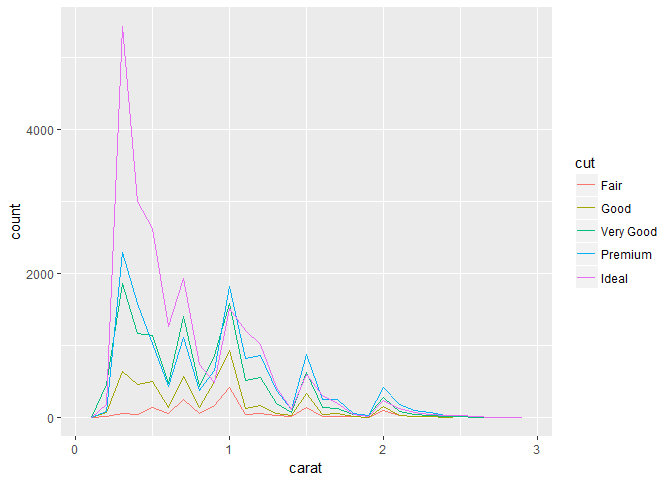
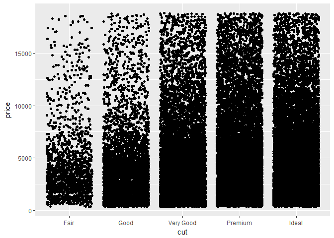
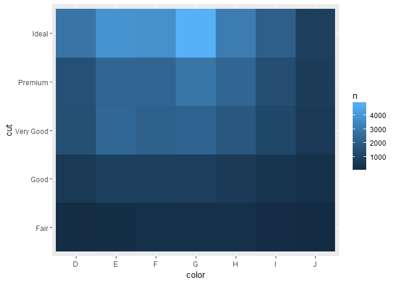

# Exploratory Data Analysis
Min-Yao  
2017年5月21日  

# 7 Exploratory Data Analysis

## 7.1 Introduction

### 7.1.1 Prerequisites


```r
library(tidyverse)
```

```
## Warning: package 'tidyverse' was built under R version 3.3.3
```

```
## Loading tidyverse: ggplot2
## Loading tidyverse: tibble
## Loading tidyverse: tidyr
## Loading tidyverse: readr
## Loading tidyverse: purrr
## Loading tidyverse: dplyr
```

```
## Warning: package 'purrr' was built under R version 3.3.3
```

```
## Conflicts with tidy packages ----------------------------------------------
```

```
## filter(): dplyr, stats
## lag():    dplyr, stats
```

## 7.2 Questions

## 7.3 Variation

### 7.3.1 Visualising distributions


```r
ggplot(data = diamonds) +
  geom_bar(mapping = aes(x = cut))
```

<!-- -->

```r
diamonds %>% 
  count(cut)
```

```
## # A tibble: 5 × 2
##         cut     n
##       <ord> <int>
## 1      Fair  1610
## 2      Good  4906
## 3 Very Good 12082
## 4   Premium 13791
## 5     Ideal 21551
```

```r
ggplot(data = diamonds) +
  geom_histogram(mapping = aes(x = carat), binwidth = 0.5)
```

<!-- -->

```r
diamonds %>% 
  count(cut_width(carat, 0.5))
```

```
## # A tibble: 11 × 2
##    `cut_width(carat, 0.5)`     n
##                     <fctr> <int>
## 1             [-0.25,0.25]   785
## 2              (0.25,0.75] 29498
## 3              (0.75,1.25] 15977
## 4              (1.25,1.75]  5313
## 5              (1.75,2.25]  2002
## 6              (2.25,2.75]   322
## 7              (2.75,3.25]    32
## 8              (3.25,3.75]     5
## 9              (3.75,4.25]     4
## 10             (4.25,4.75]     1
## 11             (4.75,5.25]     1
```

```r
smaller <- diamonds %>% 
  filter(carat < 3)
  
ggplot(data = smaller, mapping = aes(x = carat)) +
  geom_histogram(binwidth = 0.1)
```

<!-- -->

```r
ggplot(data = smaller, mapping = aes(x = carat, colour = cut)) +
  geom_freqpoly(binwidth = 0.1)
```

<!-- -->


### 7.3.2 Typical values


```r
ggplot(data = smaller, mapping = aes(x = carat)) +
  geom_histogram(binwidth = 0.01)
```

<!-- -->

```r
ggplot(data = faithful, mapping = aes(x = eruptions)) + 
  geom_histogram(binwidth = 0.25)
```

<!-- -->


### 7.3.3 Unusual values


```r
ggplot(diamonds) + 
  geom_histogram(mapping = aes(x = y), binwidth = 0.5)
```

<!-- -->

```r
ggplot(diamonds) + 
  geom_histogram(mapping = aes(x = y), binwidth = 0.5) +
  coord_cartesian(ylim = c(0, 50))
```

<!-- -->

```r
unusual <- diamonds %>% 
  filter(y < 3 | y > 20) %>% 
  select(price, x, y, z) %>%
  arrange(y)
unusual
```

```
## # A tibble: 9 × 4
##   price     x     y     z
##   <int> <dbl> <dbl> <dbl>
## 1  5139  0.00   0.0  0.00
## 2  6381  0.00   0.0  0.00
## 3 12800  0.00   0.0  0.00
## 4 15686  0.00   0.0  0.00
## 5 18034  0.00   0.0  0.00
## 6  2130  0.00   0.0  0.00
## 7  2130  0.00   0.0  0.00
## 8  2075  5.15  31.8  5.12
## 9 12210  8.09  58.9  8.06
```


### 7.3.4 Exercises

1.Explore the distribution of each of the x, y, and z variables in diamonds. What do you learn? Think about a diamond and how you might decide which dimension is the length, width, and depth.


```r
#?diamonds

ggplot(diamonds) + 
  geom_histogram(mapping = aes(x = x), binwidth = 0.5)
```

<!-- -->

```r
ggplot(diamonds) + 
  geom_histogram(mapping = aes(x = y), binwidth = 0.5)
```

<!-- -->

```r
ggplot(diamonds) + 
  geom_histogram(mapping = aes(x = z), binwidth = 0.5)
```

<!-- -->

```r
summary(diamonds)
```

```
##      carat               cut        color        clarity     
##  Min.   :0.2000   Fair     : 1610   D: 6775   SI1    :13065  
##  1st Qu.:0.4000   Good     : 4906   E: 9797   VS2    :12258  
##  Median :0.7000   Very Good:12082   F: 9542   SI2    : 9194  
##  Mean   :0.7979   Premium  :13791   G:11292   VS1    : 8171  
##  3rd Qu.:1.0400   Ideal    :21551   H: 8304   VVS2   : 5066  
##  Max.   :5.0100                     I: 5422   VVS1   : 3655  
##                                     J: 2808   (Other): 2531  
##      depth           table           price             x         
##  Min.   :43.00   Min.   :43.00   Min.   :  326   Min.   : 0.000  
##  1st Qu.:61.00   1st Qu.:56.00   1st Qu.:  950   1st Qu.: 4.710  
##  Median :61.80   Median :57.00   Median : 2401   Median : 5.700  
##  Mean   :61.75   Mean   :57.46   Mean   : 3933   Mean   : 5.731  
##  3rd Qu.:62.50   3rd Qu.:59.00   3rd Qu.: 5324   3rd Qu.: 6.540  
##  Max.   :79.00   Max.   :95.00   Max.   :18823   Max.   :10.740  
##                                                                  
##        y                z         
##  Min.   : 0.000   Min.   : 0.000  
##  1st Qu.: 4.720   1st Qu.: 2.910  
##  Median : 5.710   Median : 3.530  
##  Mean   : 5.735   Mean   : 3.539  
##  3rd Qu.: 6.540   3rd Qu.: 4.040  
##  Max.   :58.900   Max.   :31.800  
## 
```

> x=length in mm (0–10.74), y= width in mm (0–58.9), z= depth in mm (0–31.8)

2.Explore the distribution of price. Do you discover anything unusual or surprising? (Hint: Carefully think about the binwidth and make sure you try a wide range of values.)


```r
ggplot(diamonds) + 
  geom_histogram(mapping = aes(x = price), binwidth = 100)
```

<!-- -->

```r
ggplot(diamonds) + 
  geom_histogram(mapping = aes(x = price), binwidth = 100) +
  coord_cartesian(ylim = c(0, 500))
```

<!-- -->

```r
ggplot(diamonds) + 
  geom_histogram(mapping = aes(x = price), binwidth = 50)
```

<!-- -->

```r
ggplot(diamonds) + 
  geom_histogram(mapping = aes(x = price), binwidth = 50) +
  coord_cartesian(ylim = c(0, 100))
```

<!-- -->

```r
ggplot(diamonds) + 
  geom_histogram(mapping = aes(x = price), binwidth = 50) +
  coord_cartesian(xlim = c(1400,1600))
```

<!-- -->

> There is no diamond's price at between $1475 and $1525.

3.How many diamonds are 0.99 carat? How many are 1 carat? What do you think is the cause of the difference?


```r
ggplot(data = diamonds) +
  geom_histogram(mapping = aes(x = carat), binwidth = 0.01)
```

<!-- -->

```r
diamonds %>% 
  count(carat)
```

```
## # A tibble: 273 × 2
##    carat     n
##    <dbl> <int>
## 1   0.20    12
## 2   0.21     9
## 3   0.22     5
## 4   0.23   293
## 5   0.24   254
## 6   0.25   212
## 7   0.26   253
## 8   0.27   233
## 9   0.28   198
## 10  0.29   130
## # ... with 263 more rows
```

> 23 diamonds are 0.99 carat. 1558 diamonds are 1 carat. I think the cause of the difference is price because 1 carat diamonds are much more expensive than 0.99 carat.

4.Compare and contrast coord_cartesian() vs xlim() or ylim() when zooming in on a histogram. What happens if you leave binwidth unset? What happens if you try and zoom so only half a bar shows?


```r
ggplot(diamonds) + 
  geom_histogram(mapping = aes(x = y), binwidth = 0.5) +
  coord_cartesian(ylim = c(0, 50))
```

<!-- -->

```r
ggplot(diamonds) + 
  geom_histogram(mapping = aes(x = y), binwidth = 0.5) +
  ylim(0, 50)
```

```
## Warning: Removed 11 rows containing missing values (geom_bar).
```

<!-- -->

```r
ggplot(diamonds) + 
  geom_histogram(mapping = aes(x = y), binwidth = 0.5) +
  xlim(0, 50)
```

```
## Warning: Removed 1 rows containing non-finite values (stat_bin).
```

<!-- -->

> `coord_cartesian()` only zooms in on the certain part. `xlim()` or `ylim()` removes data points outside of the given range.

## 7.4 Missing values


```r
diamonds2 <- diamonds %>% 
  filter(between(y, 3, 20))

ggplot(data = diamonds2, mapping = aes(x = x, y = y)) + 
  geom_point()
```

<!-- -->

```r
diamonds2 <- diamonds %>% 
  mutate(y = ifelse(y < 3 | y > 20, NA, y))

ggplot(data = diamonds2, mapping = aes(x = x, y = y)) + 
  geom_point()
```

```
## Warning: Removed 9 rows containing missing values (geom_point).
```

<!-- -->

```r
ggplot(data = diamonds2, mapping = aes(x = x, y = y)) + 
  geom_point(na.rm = TRUE)
```

<!-- -->


```r
nycflights13::flights %>% 
  mutate(
    cancelled = is.na(dep_time),
    sched_hour = sched_dep_time %/% 100,
    sched_min = sched_dep_time %% 100,
    sched_dep_time = sched_hour + sched_min / 60
  ) %>% 
  ggplot(mapping = aes(sched_dep_time)) + 
    geom_freqpoly(mapping = aes(colour = cancelled), binwidth = 1/4)
```

<!-- -->


### 7.4.1 Exercises

1.What happens to missing values in a histogram? What happens to missing values in a bar chart? Why is there a difference?


```r
diamonds2 <- diamonds %>% 
  mutate(y = ifelse(y < 3 | y > 20, NA, y))

ggplot(diamonds2) + 
  geom_histogram(mapping = aes(x = y), binwidth = 0.5)
```

```
## Warning: Removed 9 rows containing non-finite values (stat_bin).
```

<!-- -->

```r
ggplot(diamonds2) +
  geom_bar(mapping = aes(x = y))
```

```
## Warning: Removed 9 rows containing non-finite values (stat_count).
```

<!-- -->

> ggplot2 doesn’t include them in the plot, but it does warn that they’ve been removed.

2.What does na.rm = TRUE do in mean() and sum()?


```r
#?mean
#?sum()
```

> `na.rm` a logical value indicating whether NA values should be stripped before the computation proceeds.
> If na.rm is FALSE an NA or NaN value in any of the arguments will cause a value of NA or NaN to be returned, otherwise NA and NaN values are ignored.


## 7.5 Covariation

### 7.5.1 A categorical and continuous variable


```r
ggplot(data = diamonds, mapping = aes(x = price)) + 
  geom_freqpoly(mapping = aes(colour = cut), binwidth = 500)
```

<!-- -->

```r
ggplot(diamonds) + 
  geom_bar(mapping = aes(x = cut))
```

<!-- -->

```r
ggplot(data = diamonds, mapping = aes(x = price, y = ..density..)) + 
  geom_freqpoly(mapping = aes(colour = cut), binwidth = 500)
```

<!-- -->

```r
ggplot(data = diamonds, mapping = aes(x = cut, y = price)) +
  geom_boxplot()
```

<!-- -->


```r
ggplot(data = mpg, mapping = aes(x = class, y = hwy)) +
  geom_boxplot()
```

<!-- -->

```r
ggplot(data = mpg) +
  geom_boxplot(mapping = aes(x = reorder(class, hwy, FUN = median), y = hwy))
```

<!-- -->

```r
ggplot(data = mpg) +
  geom_boxplot(mapping = aes(x = reorder(class, hwy, FUN = median), y = hwy)) +
  coord_flip()
```

<!-- -->


#### 7.5.1.1 Exercises

1.Use what you’ve learned to improve the visualisation of the departure times of cancelled vs. non-cancelled flights.


```r
# original version
nycflights13::flights %>% 
  mutate(
    cancelled = is.na(dep_time),
    sched_hour = sched_dep_time %/% 100,
    sched_min = sched_dep_time %% 100,
    sched_dep_time = sched_hour + sched_min / 60
  ) %>% 
  ggplot(mapping = aes(sched_dep_time)) + 
    geom_freqpoly(mapping = aes(colour = cancelled), binwidth = 1/4)
```

<!-- -->

```r
# improved version
nycflights13::flights %>% 
  mutate(
    cancelled = is.na(dep_time),
    sched_hour = sched_dep_time %/% 100,
    sched_min = sched_dep_time %% 100,
    sched_dep_time = sched_hour + sched_min / 60
  ) %>% 
  ggplot(mapping = aes(x = sched_dep_time, y = ..density..)) + 
    geom_freqpoly(mapping = aes(colour = cancelled), binwidth = 1/4)
```

<!-- -->


2.What variable in the diamonds dataset is most important for predicting the price of a diamond? How is that variable correlated with cut? Why does the combination of those two relationships lead to lower quality diamonds being more expensive?


```r
#?diamonds
#1
ggplot(data = diamonds, mapping = aes(x = carat, y = price)) + 
  geom_point()+
  geom_smooth()
```

```
## `geom_smooth()` using method = 'gam'
```

<!-- -->

```r
ggplot(data = diamonds, mapping = aes(x = x, y = price)) + 
  geom_point()+
  geom_smooth()
```

```
## `geom_smooth()` using method = 'gam'
```

<!-- -->

```r
ggplot(data = diamonds, mapping = aes(x = y, y = price)) + 
  geom_point()+
  geom_smooth()
```

```
## `geom_smooth()` using method = 'gam'
```

<!-- -->

```r
ggplot(data = diamonds, mapping = aes(x = z, y = price)) + 
  geom_point()+
  geom_smooth()
```

```
## `geom_smooth()` using method = 'gam'
```

<!-- -->

```r
ggplot(data = diamonds, mapping = aes(x = depth, y = price)) + 
  geom_point()+
  geom_smooth()
```

```
## `geom_smooth()` using method = 'gam'
```

<!-- -->

```r
ggplot(data = diamonds, mapping = aes(x = table, y = price)) + 
  geom_point()+
  geom_smooth()
```

```
## `geom_smooth()` using method = 'gam'
```

<!-- -->

```r
ggplot(data = diamonds, mapping = aes(x = cut, y = price)) + 
  geom_boxplot()
```

<!-- -->

```r
ggplot(data = diamonds, mapping = aes(x = color, y = price)) + 
  geom_boxplot()
```

<!-- -->

```r
ggplot(data = diamonds, mapping = aes(x = clarity, y = price)) + 
  geom_boxplot()
```

<!-- -->
> Carat is most important for predicting the price of a diamond.


```r
ggplot(data = diamonds, mapping = aes(x = cut, y = carat)) + 
  geom_boxplot()
```

<!-- -->
> In general, fair cut diamonds have higher carat than others. Therefore, the combination of carat and cut relationships lead to lower quality diamonds being more expensive.

3.Install the ggstance package, and create a horizontal boxplot. How does this compare to using coord_flip()?


```r
library("ggplot2")

# Vertical
ggplot(mpg, aes(class, hwy, fill = factor(cyl))) +
  geom_boxplot()
```

<!-- -->

```r
# Horizontal with coord_flip()
ggplot(mpg, aes(class, hwy, fill = factor(cyl))) +
  geom_boxplot() +
  coord_flip()
```

<!-- -->

```r
#install.packages("ggstance")
library("ggstance")
```

```
## Warning: package 'ggstance' was built under R version 3.3.3
```

```
## 
## Attaching package: 'ggstance'
```

```
## The following objects are masked from 'package:ggplot2':
## 
##     geom_errorbarh, GeomErrorbarh
```

```r
# Horizontal with ggstance
ggplot(mpg, aes(hwy, class, fill = factor(cyl))) +
  geom_boxploth()
```

<!-- -->
> Horizontal Geoms draw horizontal legend keys to keep the appearance of your plots consistent.

4.One problem with boxplots is that they were developed in an era of much smaller datasets and tend to display a prohibitively large number of “outlying values”. One approach to remedy this problem is the letter value plot. Install the lvplot package, and try using geom_lv() to display the distribution of price vs cut. What do you learn? How do you interpret the plots?


```r
#install.packages("lvplot")
library(lvplot)
```

```
## Warning: package 'lvplot' was built under R version 3.3.3
```

```r
ggplot(data = diamonds, mapping = aes(x = cut, y = price)) + 
  geom_boxplot()
```

<!-- -->

```r
ggplot(data = diamonds, mapping = aes(x = cut, y = price)) + 
  geom_lv()
```

<!-- -->


5.Compare and contrast geom_violin() with a facetted geom_histogram(), or a coloured geom_freqpoly(). What are the pros and cons of each method?


```r
ggplot(data = diamonds, mapping = aes(x = cut, y = price)) + 
  geom_violin()
```

<!-- -->

```r
ggplot(data = diamonds, mapping = aes(price, colour = cut)) + 
  geom_freqpoly(binwidth = 100)
```

<!-- -->

```r
ggplot(diamonds, aes(price, fill = cut)) +
  geom_histogram(binwidth = 100)
```

<!-- -->


6.If you have a small dataset, it’s sometimes useful to use geom_jitter() to see the relationship between a continuous and categorical variable. The ggbeeswarm package provides a number of methods similar to geom_jitter(). List them and briefly describe what each one does.


```r
library(ggbeeswarm)
```

```
## Warning: package 'ggbeeswarm' was built under R version 3.3.3
```

```r
ggplot(data = diamonds, mapping = aes(x = cut, y = price)) + 
  geom_jitter()
```

<!-- -->

```r
ggplot(data = diamonds, mapping = aes(x = cut, y = price)) + 
  geom_quasirandom()
```

<!-- -->

```r
#ggplot(data = diamonds, mapping = aes(x = cut, y = price)) + 
#  geom_beeswarm()
```

> Beeswarm plots (aka column scatter plots or violin scatter plots) are a way of plotting points that would ordinarily overlap so that they fall next to each other instead. In addition to reducing overplotting, it helps visualize the density of the data at each point (similar to a violin plot), while still showing each data point individually.

> ggbeeswarm provides two different methods to create beeswarm-style plots using ggplot2. It does this by adding two new ggplot geom objects:

> geom_quasirandom: Uses a van der Corput sequence or Tukey texturing (Tukey and Tukey "Strips displaying empirical distributions: I. textured dot strips") to space the dots to avoid overplotting. This uses sherrillmix/vipor.

> geom_beeswarm: Uses the beeswarm library to do point-size based offset.


### 7.5.2 Two categorical variables


```r
ggplot(data = diamonds) +
  geom_count(mapping = aes(x = cut, y = color))
```

<!-- -->

```r
diamonds %>% 
  count(color, cut)
```

```
## Source: local data frame [35 x 3]
## Groups: color [?]
## 
##    color       cut     n
##    <ord>     <ord> <int>
## 1      D      Fair   163
## 2      D      Good   662
## 3      D Very Good  1513
## 4      D   Premium  1603
## 5      D     Ideal  2834
## 6      E      Fair   224
## 7      E      Good   933
## 8      E Very Good  2400
## 9      E   Premium  2337
## 10     E     Ideal  3903
## # ... with 25 more rows
```

```r
diamonds %>% 
  count(color, cut) %>%  
  ggplot(mapping = aes(x = color, y = cut)) +
    geom_tile(mapping = aes(fill = n)) 
```

<!-- -->


#### 7.5.2.1 Exercises

1.How could you rescale the count dataset above to more clearly show the distribution of cut within colour, or colour within cut?


```r
diamonds %>% 
  count(color, cut) %>%  
  ggplot(mapping = aes(x = color, y = cut)) +
    geom_tile(mapping = aes(fill = n)) +
    scale_fill_gradient2(low="red", mid="yellow", high="blue")
```

<!-- -->


2.Use geom_tile() together with dplyr to explore how average flight delays vary by destination and month of year. What makes the plot difficult to read? How could you improve it?


```r
library(dplyr)
library(nycflights13)
```

```
## Warning: package 'nycflights13' was built under R version 3.3.3
```

```r
library(tidyverse)

summary(flights)
```

```
##       year          month             day           dep_time   
##  Min.   :2013   Min.   : 1.000   Min.   : 1.00   Min.   :   1  
##  1st Qu.:2013   1st Qu.: 4.000   1st Qu.: 8.00   1st Qu.: 907  
##  Median :2013   Median : 7.000   Median :16.00   Median :1401  
##  Mean   :2013   Mean   : 6.549   Mean   :15.71   Mean   :1349  
##  3rd Qu.:2013   3rd Qu.:10.000   3rd Qu.:23.00   3rd Qu.:1744  
##  Max.   :2013   Max.   :12.000   Max.   :31.00   Max.   :2400  
##                                                  NA's   :8255  
##  sched_dep_time   dep_delay          arr_time    sched_arr_time
##  Min.   : 106   Min.   : -43.00   Min.   :   1   Min.   :   1  
##  1st Qu.: 906   1st Qu.:  -5.00   1st Qu.:1104   1st Qu.:1124  
##  Median :1359   Median :  -2.00   Median :1535   Median :1556  
##  Mean   :1344   Mean   :  12.64   Mean   :1502   Mean   :1536  
##  3rd Qu.:1729   3rd Qu.:  11.00   3rd Qu.:1940   3rd Qu.:1945  
##  Max.   :2359   Max.   :1301.00   Max.   :2400   Max.   :2359  
##                 NA's   :8255      NA's   :8713                 
##    arr_delay          carrier              flight       tailnum         
##  Min.   : -86.000   Length:336776      Min.   :   1   Length:336776     
##  1st Qu.: -17.000   Class :character   1st Qu.: 553   Class :character  
##  Median :  -5.000   Mode  :character   Median :1496   Mode  :character  
##  Mean   :   6.895                      Mean   :1972                     
##  3rd Qu.:  14.000                      3rd Qu.:3465                     
##  Max.   :1272.000                      Max.   :8500                     
##  NA's   :9430                                                           
##     origin              dest              air_time        distance   
##  Length:336776      Length:336776      Min.   : 20.0   Min.   :  17  
##  Class :character   Class :character   1st Qu.: 82.0   1st Qu.: 502  
##  Mode  :character   Mode  :character   Median :129.0   Median : 872  
##                                        Mean   :150.7   Mean   :1040  
##                                        3rd Qu.:192.0   3rd Qu.:1389  
##                                        Max.   :695.0   Max.   :4983  
##                                        NA's   :9430                  
##       hour           minute        time_hour                  
##  Min.   : 1.00   Min.   : 0.00   Min.   :2013-01-01 05:00:00  
##  1st Qu.: 9.00   1st Qu.: 8.00   1st Qu.:2013-04-04 13:00:00  
##  Median :13.00   Median :29.00   Median :2013-07-03 10:00:00  
##  Mean   :13.18   Mean   :26.23   Mean   :2013-07-03 05:02:36  
##  3rd Qu.:17.00   3rd Qu.:44.00   3rd Qu.:2013-10-01 07:00:00  
##  Max.   :23.00   Max.   :59.00   Max.   :2013-12-31 23:00:00  
## 
```

```r
flights %>% 
  count(arr_delay, dest) %>%  
  ggplot(mapping = aes(x = arr_delay, y = dest)) +
    geom_tile(mapping = aes(fill = n))
```

```
## Warning: Removed 100 rows containing missing values (geom_tile).
```

<!-- -->

```r
flights %>% 
  count(arr_delay, month) %>%  
  ggplot(mapping = aes(x = arr_delay, y = month)) +
    geom_tile(mapping = aes(fill = n))
```

```
## Warning: Removed 12 rows containing missing values (geom_tile).
```

<!-- -->

```r
flights %>%
  group_by(dest, month) %>%
  summarise(arr_delay_mean = mean(arr_delay, na.rm = TRUE)) %>%
  ggplot(aes(x = dest, y = month, fill = arr_delay_mean)) +
  geom_tile() 
```

<!-- -->


3.Why is it slightly better to use aes(x = color, y = cut) rather than aes(x = cut, y = color) in the example above?


```r
diamonds %>% 
  count(color, cut) %>%  
  ggplot(mapping = aes(x = color, y = cut)) +
    geom_tile(mapping = aes(fill = n))
```

<!-- -->

```r
diamonds %>% 
  count(color, cut) %>%  
  ggplot(mapping = aes(x = cut, y = color)) +
    geom_tile(mapping = aes(fill = n))
```

<!-- -->


### 7.5.3 Two continuous variables


```r
ggplot(data = diamonds) +
  geom_point(mapping = aes(x = carat, y = price))
```

<!-- -->

```r
ggplot(data = diamonds) + 
  geom_point(mapping = aes(x = carat, y = price), alpha = 1 / 100)
```

<!-- -->

```r
ggplot(data = smaller) +
  geom_bin2d(mapping = aes(x = carat, y = price))
```

<!-- -->

```r
#install.packages("hexbin")
library(hexbin)
```

```
## Warning: package 'hexbin' was built under R version 3.3.3
```

```r
ggplot(data = smaller) +
  geom_hex(mapping = aes(x = carat, y = price))
```

<!-- -->

```r
ggplot(data = smaller, mapping = aes(x = carat, y = price)) + 
  geom_boxplot(mapping = aes(group = cut_width(carat, 0.1)))
```

<!-- -->

```r
ggplot(data = smaller, mapping = aes(x = carat, y = price)) + 
  geom_boxplot(mapping = aes(group = cut_number(carat, 20)))
```

<!-- -->

#### 7.5.3.1 Exercises

1.Instead of summarising the conditional distribution with a boxplot, you could use a frequency polygon. What do you need to consider when using cut_width() vs cut_number()? How does that impact a visualisation of the 2d distribution of carat and price?


```r
ggplot(data = diamonds, mapping = aes(x = price, colour = cut_width(carat, 0.1))) +
  geom_freqpoly()
```

```
## `stat_bin()` using `bins = 30`. Pick better value with `binwidth`.
```

<!-- -->

```r
ggplot(data = diamonds, mapping = aes(x = price, colour = cut_number(carat, 20))) +
  geom_freqpoly()
```

```
## `stat_bin()` using `bins = 30`. Pick better value with `binwidth`.
```

<!-- -->


2.Visualise the distribution of carat, partitioned by price.


```r
summary(diamonds)
```

```
##      carat               cut        color        clarity     
##  Min.   :0.2000   Fair     : 1610   D: 6775   SI1    :13065  
##  1st Qu.:0.4000   Good     : 4906   E: 9797   VS2    :12258  
##  Median :0.7000   Very Good:12082   F: 9542   SI2    : 9194  
##  Mean   :0.7979   Premium  :13791   G:11292   VS1    : 8171  
##  3rd Qu.:1.0400   Ideal    :21551   H: 8304   VVS2   : 5066  
##  Max.   :5.0100                     I: 5422   VVS1   : 3655  
##                                     J: 2808   (Other): 2531  
##      depth           table           price             x         
##  Min.   :43.00   Min.   :43.00   Min.   :  326   Min.   : 0.000  
##  1st Qu.:61.00   1st Qu.:56.00   1st Qu.:  950   1st Qu.: 4.710  
##  Median :61.80   Median :57.00   Median : 2401   Median : 5.700  
##  Mean   :61.75   Mean   :57.46   Mean   : 3933   Mean   : 5.731  
##  3rd Qu.:62.50   3rd Qu.:59.00   3rd Qu.: 5324   3rd Qu.: 6.540  
##  Max.   :79.00   Max.   :95.00   Max.   :18823   Max.   :10.740  
##                                                                  
##        y                z         
##  Min.   : 0.000   Min.   : 0.000  
##  1st Qu.: 4.720   1st Qu.: 2.910  
##  Median : 5.710   Median : 3.530  
##  Mean   : 5.735   Mean   : 3.539  
##  3rd Qu.: 6.540   3rd Qu.: 4.040  
##  Max.   :58.900   Max.   :31.800  
## 
```

```r
ggplot(data = diamonds, aes(x = cut_width(price, 5000), y = carat)) +
  geom_boxplot(varwidth = TRUE)
```

<!-- -->

```r
ggplot(data = diamonds, aes(x = cut_number(price, 5), y = carat)) +
  geom_boxplot()
```

<!-- -->


3.How does the price distribution of very large diamonds compare to small diamonds. Is it as you expect, or does it surprise you?


```r
summary(diamonds)
```

```
##      carat               cut        color        clarity     
##  Min.   :0.2000   Fair     : 1610   D: 6775   SI1    :13065  
##  1st Qu.:0.4000   Good     : 4906   E: 9797   VS2    :12258  
##  Median :0.7000   Very Good:12082   F: 9542   SI2    : 9194  
##  Mean   :0.7979   Premium  :13791   G:11292   VS1    : 8171  
##  3rd Qu.:1.0400   Ideal    :21551   H: 8304   VVS2   : 5066  
##  Max.   :5.0100                     I: 5422   VVS1   : 3655  
##                                     J: 2808   (Other): 2531  
##      depth           table           price             x         
##  Min.   :43.00   Min.   :43.00   Min.   :  326   Min.   : 0.000  
##  1st Qu.:61.00   1st Qu.:56.00   1st Qu.:  950   1st Qu.: 4.710  
##  Median :61.80   Median :57.00   Median : 2401   Median : 5.700  
##  Mean   :61.75   Mean   :57.46   Mean   : 3933   Mean   : 5.731  
##  3rd Qu.:62.50   3rd Qu.:59.00   3rd Qu.: 5324   3rd Qu.: 6.540  
##  Max.   :79.00   Max.   :95.00   Max.   :18823   Max.   :10.740  
##                                                                  
##        y                z         
##  Min.   : 0.000   Min.   : 0.000  
##  1st Qu.: 4.720   1st Qu.: 2.910  
##  Median : 5.710   Median : 3.530  
##  Mean   : 5.735   Mean   : 3.539  
##  3rd Qu.: 6.540   3rd Qu.: 4.040  
##  Max.   :58.900   Max.   :31.800  
## 
```

```r
ggplot(data = diamonds, aes(x = cut_width(carat, 0.5), y = price)) +
  geom_boxplot(varwidth = TRUE)
```

<!-- -->


4.Combine two of the techniques you’ve learned to visualise the combined distribution of cut, carat, and price.


```r
ggplot(data = diamonds, aes(x = cut_width(price, 5000), y = carat, color = cut)) +
  geom_boxplot()
```

<!-- -->


5.Two dimensional plots reveal outliers that are not visible in one dimensional plots. For example, some points in the plot below have an unusual combination of x and y values, which makes the points outliers even though their x and y values appear normal when examined separately.


```r
ggplot(data = diamonds) +
  geom_point(mapping = aes(x = x, y = y)) +
  coord_cartesian(xlim = c(4, 11), ylim = c(4, 11))
```

<!-- -->

Why is a scatterplot a better display than a binned plot for this case?


```r
ggplot(data = diamonds) +
  geom_boxplot(mapping = aes(x = cut_width(x, 2), y = y)) +
  coord_cartesian()
```

<!-- -->

```r
ggplot(data = diamonds) +
  geom_boxplot(mapping = aes(x = cut_width(y, 2), y = x)) +
  coord_cartesian()
```

<!-- -->

> their x and y values appear normal when examined separately.
