# May-3-ggplot
Min-Yao  
2017年5月1日  

## 3.6 Geometric objects


```r
library(ggplot2)
library(tibble)
library(maps)
```

```
## Warning: package 'maps' was built under R version 3.3.3
```


```r
# left
ggplot(data = mpg) + 
  geom_point(mapping = aes(x = displ, y = hwy))
```

<!-- -->

```r
# right
ggplot(data = mpg) + 
  geom_smooth(mapping = aes(x = displ, y = hwy))
```

```
## `geom_smooth()` using method = 'loess'
```

<!-- -->

```r
ggplot(data = mpg) + 
  geom_smooth(mapping = aes(x = displ, y = hwy, linetype = drv))
```

```
## `geom_smooth()` using method = 'loess'
```

<!-- -->

```r
ggplot(data = mpg) + 
  geom_smooth(mapping = aes(x = displ, y = hwy, linetype = drv, color = drv)) +
  geom_point(mapping = aes(x = displ, y = hwy, color = drv))
```

```
## `geom_smooth()` using method = 'loess'
```

<!-- -->


```r
ggplot(data = mpg) +
  geom_smooth(mapping = aes(x = displ, y = hwy))
```

```
## `geom_smooth()` using method = 'loess'
```

<!-- -->

```r
ggplot(data = mpg) +
  geom_smooth(mapping = aes(x = displ, y = hwy, group = drv))
```

```
## `geom_smooth()` using method = 'loess'
```

<!-- -->

```r
ggplot(data = mpg) +
  geom_smooth(
    mapping = aes(x = displ, y = hwy, group = drv)
  )
```

```
## `geom_smooth()` using method = 'loess'
```

<!-- -->

```r
ggplot(data = mpg) + 
  geom_point(mapping = aes(x = displ, y = hwy)) +
  geom_smooth(mapping = aes(x = displ, y = hwy))
```

```
## `geom_smooth()` using method = 'loess'
```

<!-- -->

```r
ggplot(data = mpg, mapping = aes(x = displ, y = hwy)) + 
  geom_point() + 
  geom_smooth()
```

```
## `geom_smooth()` using method = 'loess'
```

<!-- -->

```r
ggplot(data = mpg, mapping = aes(x = displ, y = hwy)) + 
  geom_point(mapping = aes(color = class)) + 
  geom_smooth()
```

```
## `geom_smooth()` using method = 'loess'
```

<!-- -->

```r
#ggplot(data = mpg, mapping = aes(x = displ, y = hwy)) + 
#  geom_point(mapping = aes(color = class)) + 
#  geom_smooth(data = filter (mpg, class == "subcompact"), se = FALSE)
```

### 3.6.1 Exercises


```r
#2
ggplot(data = mpg, mapping = aes(x = displ, y = hwy, color = drv)) + 
  geom_point() + 
  geom_smooth(se = FALSE)
```

```
## `geom_smooth()` using method = 'loess'
```

<!-- -->

```r
#5
ggplot(data = mpg, mapping = aes(x = displ, y = hwy)) + 
  geom_point() + 
  geom_smooth()
```

```
## `geom_smooth()` using method = 'loess'
```

<!-- -->

```r
ggplot() + 
  geom_point(data = mpg, mapping = aes(x = displ, y = hwy)) + 
  geom_smooth(data = mpg, mapping = aes(x = displ, y = hwy))
```

```
## `geom_smooth()` using method = 'loess'
```

<!-- -->

```r
#6
ggplot(data = mpg) + 
  geom_point(mapping = aes(x = displ, y = hwy)) +
  geom_smooth(mapping = aes(x = displ, y = hwy), se = FALSE)
```

```
## `geom_smooth()` using method = 'loess'
```

<!-- -->

```r
ggplot(data = mpg) + 
  geom_point(mapping = aes(x = displ, y = hwy)) +
  geom_smooth(mapping = aes(x = displ, y = hwy, group = drv), se = FALSE)
```

```
## `geom_smooth()` using method = 'loess'
```

<!-- -->

```r
ggplot(data = mpg) + 
  geom_smooth(mapping = aes(x = displ, y = hwy, color = drv), se = FALSE) +
  geom_point(mapping = aes(x = displ, y = hwy, color = drv))
```

```
## `geom_smooth()` using method = 'loess'
```

<!-- -->

```r
ggplot(data = mpg, mapping = aes(x = displ, y = hwy)) + 
  geom_smooth(se = FALSE) +
  geom_point(mapping = aes(color = drv))
```

```
## `geom_smooth()` using method = 'loess'
```

<!-- -->

```r
ggplot(data = mpg, mapping = aes(x = displ, y = hwy)) + 
  geom_smooth(mapping = aes(group = drv, linetype = drv), se = FALSE) +
  geom_point(mapping = aes(color = drv))
```

```
## `geom_smooth()` using method = 'loess'
```

<!-- -->

```r
#ggplot(data = mpg, mapping = aes(x = displ, y = hwy)) + 
#  geom_point(mapping = aes(color = drv, size = 2), shape = 21, stroke = 3, color = "white")

ggplot() + 
  geom_point(data=mpg, aes(x=displ, y=hwy), color ="white", size = 3) + 
  geom_point(data = mpg, aes(x=displ, y = hwy, color=drv))
```

<!-- -->

>1. a line chart:  `geom_curve()`. A boxplot: `geom_boxplot()`. A histogram: `geom_histogram()`. An area chart: `geom_area(stat = "bin")`.

>3. show.legend: logical. Should this layer be included in the legends? NA, the default, includes if any aesthetics are mapped. FALSE never includes, and TRUE always includes.`show.legend = FALSE` will not show the legend labels. If you remove it, it will show the legend labels. You used it earlier in the chapter because you don't need the legend labels.

>4. se: display confidence interval around smooth (TRUE by default, see level to control.

>5. No, these two graphs look the same. By passing a set of mappings to ggplot(), ggplot2 will treat these mappings as global mappings that apply to each geom in the graph. In other words, this code will produce the same plot as the previous code.

## 3.7 Statistical transformations


```r
ggplot(data = diamonds) + 
  geom_bar(mapping = aes(x = cut))
```

<!-- -->

```r
?geom_bar
```

```
## starting httpd help server ...
```

```
##  done
```

```r
ggplot(data = diamonds) + 
  stat_count(mapping = aes(x = cut))
```

<!-- -->

```r
demo <- tribble(
  ~a,      ~b,
  "bar_1", 20,
  "bar_2", 30,
  "bar_3", 40
)

ggplot(data = demo) +
  geom_bar(mapping = aes(x = a, y = b), stat = "identity")
```

<!-- -->

```r
ggplot(data = diamonds) + 
  geom_bar(mapping = aes(x = cut, y = ..prop.., group = 1))
```

<!-- -->

```r
ggplot(data = diamonds) + 
  stat_summary(
    mapping = aes(x = cut, y = depth),
    fun.ymin = min,
    fun.ymax = max,
    fun.y = median
  )
```

<!-- -->

```r
?stat_bin
```

### 3.7.1 Exercises


```r
#1
stat_summary()
```

```
## geom_pointrange: na.rm = FALSE
## stat_summary: fun.data = NULL, fun.y = NULL, fun.ymax = NULL, fun.ymin = NULL, fun.args = list(), na.rm = FALSE
## position_identity
```

```r
?geom_pointrange

ggplot(data = diamonds, aes(x = cut, y = depth)) + 
  geom_pointrange(stat = "summary", fun.ymin = min, fun.ymax = max, fun.y = median)
```

<!-- -->

```r
#2
?geom_col()
?geom_bar()

#3
?stat_count
?stat_summary
?geoms_point
```

```
## No documentation for 'geoms_point' in specified packages and libraries:
## you could try '??geoms_point'
```

```r
?geom_smooth
?geom_bar
?
#4
?stat_smooth()

#5
ggplot(data = diamonds) + 
  geom_bar(mapping = aes(x = cut, y = ..prop..))
```

<!-- -->

```r
ggplot(data = diamonds) + 
  geom_bar(mapping = aes(x = cut, fill = color, y = ..prop..))
```

<!-- -->

```r
ggplot(data = diamonds) + 
  geom_bar(mapping = aes(x = cut, y = ..prop.., group = 1))
```

<!-- -->

```r
ggplot(data = diamonds) + 
  geom_bar(mapping = aes(x = cut, fill = color, y = ..prop.., group = 1))
```

<!-- -->

>1. geom_pointrange: na.rm = FALSE
stat_summary: fun.data = NULL, fun.y = NULL, fun.ymax = NULL, fun.ymin = NULL, fun.args = list(), na.rm = FALSE
position_identity

>2. There are two types of bar charts: geom_bar makes the height of the bar proportional to the number of cases in each group (or if the weight aethetic is supplied, the sum of the weights). If you want the heights of the bars to represent values in the data, use geom_col instead. geom_bar uses stat_count by default: it counts the number of cases at each x position. geom_col uses stat_identity: it leaves the data as is.

>3.  in common: ggplot2 will treat these mappings as global mappings that apply to each geom in the graph.

>4. `stat_smooth()` Calculation is performed by the (currently undocumented) predictdf generic and its methods. For most methods the standard error bounds are computed using the predict method - the exceptions are loess which uses a t-based approximation, and glm where the normal confidence interval is constructed on the link scale, and then back-transformed to the response scale.

>5. geom_bar by default groups by the x variable. Therefore by default, the data is grouped by cut. The proportions are then determined by these groups, so "Ideal" is present 100% in "Ideal". This is why all bars equal one. To override this we change the group to "1" which is a fake grouping and allows each level of cut to be relative to the other levels of cut. For the second plot cut has a proportion of 1. By filling by color we stack for each color and get 7 for each because there are 7 colors present in each cut type and 7 * 1 is 7. Below is what happens if you remove the color "E" from the "Ideal" cut group.

## 3.8 Position adjustments


```r
ggplot(data = diamonds) + 
  geom_bar(mapping = aes(x = cut, colour = cut))
```

<!-- -->

```r
ggplot(data = diamonds) + 
  geom_bar(mapping = aes(x = cut, fill = cut))
```

<!-- -->

```r
ggplot(data = diamonds) + 
  geom_bar(mapping = aes(x = cut, fill = clarity))
```

<!-- -->

```r
# alpha = 1 is not transparent
# all the graph stack together, position = "identity"
ggplot(data = diamonds, mapping = aes(x = cut, fill = clarity)) + 
  geom_bar(alpha = 1/5, position = "identity")
```

<!-- -->

```r
ggplot(data = diamonds, mapping = aes(x = cut, colour = clarity)) + 
  geom_bar(fill = NA, position = "identity")
```

<!-- -->

```r
ggplot(data = diamonds) + 
  geom_bar(mapping = aes(x = cut, fill = clarity), position = "fill")
```

<!-- -->

```r
ggplot(data = diamonds) + 
  geom_bar(mapping = aes(x = cut, fill = clarity), position = "dodge")
```

<!-- -->

```r
ggplot(data = mpg) + 
  geom_point(mapping = aes(x = displ, y = hwy), position = "jitter")
```

<!-- -->


```r
#1
ggplot(data = mpg, mapping = aes(x = cty, y = hwy)) + 
  geom_point()
```

<!-- -->

```r
ggplot(data = mpg, mapping = aes(x = cty, y = hwy)) + 
  geom_point(position = "jitter")
```

<!-- -->

```r
#2
?geom_jitter()

#3
ggplot(data = mpg, mapping = aes(x = cty, y = hwy)) + geom_jitter()
```

<!-- -->

```r
ggplot(data = mpg, mapping = aes(x = cty, y = hwy)) + geom_count()
```

<!-- -->

```r
?geom_count
#
ggplot(data = mpg, mapping = aes(x = cty, y = hwy)) + geom_point(alpha = 1/5)
```

<!-- -->

```r
#4
?geom_boxplot

ggplot(data = mpg, mapping = aes(x = class, y = hwy)) +
  geom_boxplot(aes(color = drv))
```

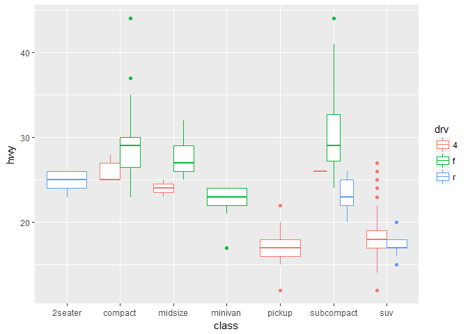<!-- -->

```r
#
ggplot(data = mpg, mapping = aes(x = drv, y = hwy, fill = manufacturer)) +
  geom_boxplot()
```

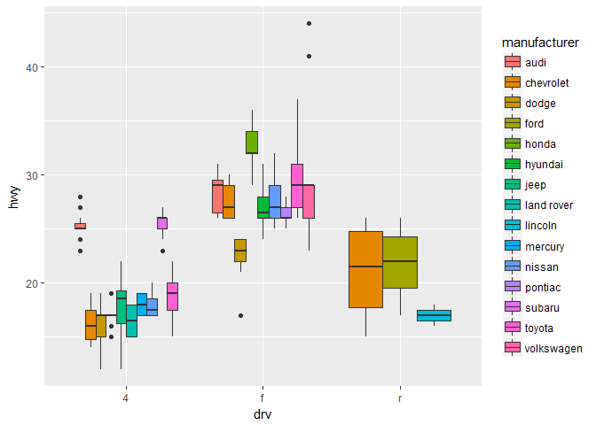<!-- -->

```r
ggplot(data = mpg, mapping = aes(x = drv, y = hwy, fill = manufacturer)) +
  geom_boxplot(position = position_dodge(4))
```

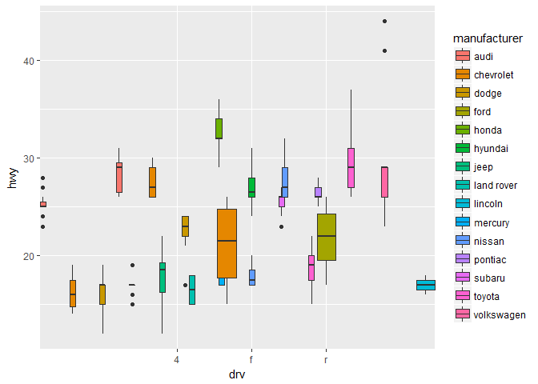<!-- -->

```r
ggplot(data = mpg, mapping = aes(x = drv, y = hwy, fill = manufacturer)) +
  geom_boxplot(position = "identity")
```

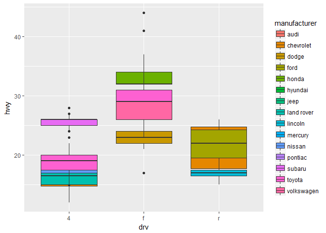<!-- -->

```r
ggplot(data = mpg, mapping = aes(x = cty, y = hwy)) + geom_boxplot(mapping = aes(group = 1, position = "jitter"))
```

```
## Warning: Ignoring unknown aesthetics: position
```

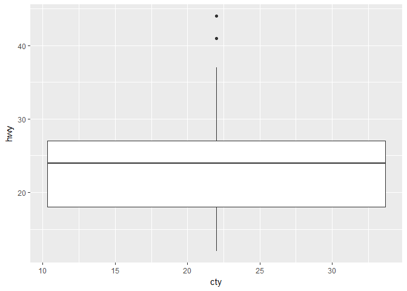<!-- -->

>1. This problem is known as overplotting. This arrangement makes it hard to see where the mass of the data is. We can improve it by adding `position = "jitter"`.

>2. position: Position adjustment, either as a string, or the result of a call to a position adjustment function.
width: Amount of vertical and horizontal jitter. The jitter is added in both positive and negative directions, so the total spread is twice the value specified here.
height: Amount of vertical and horizontal jitter. The jitter is added in both positive and negative directions, so the total spread is twice the value specified here.

>3. `geom_count` This is a variant geom_point that counts the number of observations at each location, then maps the count to point area. It useful when you have discrete data and overplotting.

>4. 

## 3.9 Coordinate systems

```r
ggplot(data = mpg, mapping = aes(x = class, y = hwy)) + 
  geom_boxplot()
```

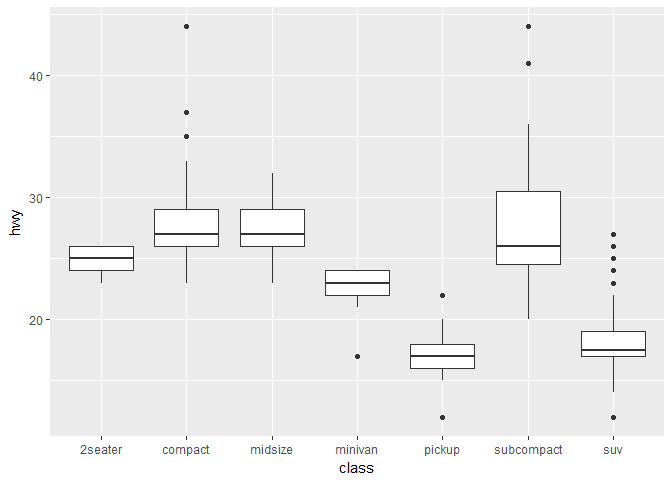<!-- -->

```r
ggplot(data = mpg, mapping = aes(x = class, y = hwy)) + 
  geom_boxplot() +
  coord_flip()
```

<!-- -->

```r
#
nz <- map_data("nz")

ggplot(nz, aes(long, lat, group = group)) +
  geom_polygon(fill = "white", colour = "black")
```

<!-- -->

```r
ggplot(nz, aes(long, lat, group = group)) +
  geom_polygon(fill = "white", colour = "black") +
  coord_quickmap()
```

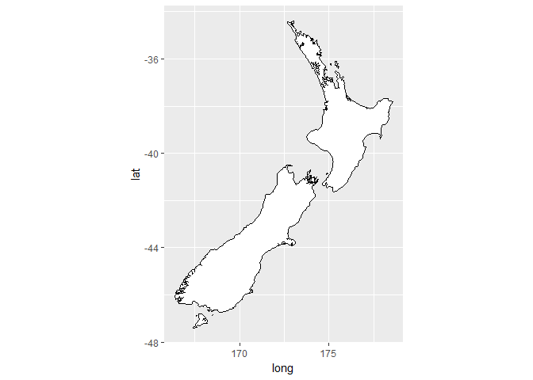<!-- -->

```r
#
bar <- ggplot(data = diamonds) + 
  geom_bar(
    mapping = aes(x = cut, fill = cut), 
    show.legend = FALSE,
    width = 1
  ) + 
  theme(aspect.ratio = 1) +
  labs(x = NULL, y = NULL)

bar + coord_flip()
```

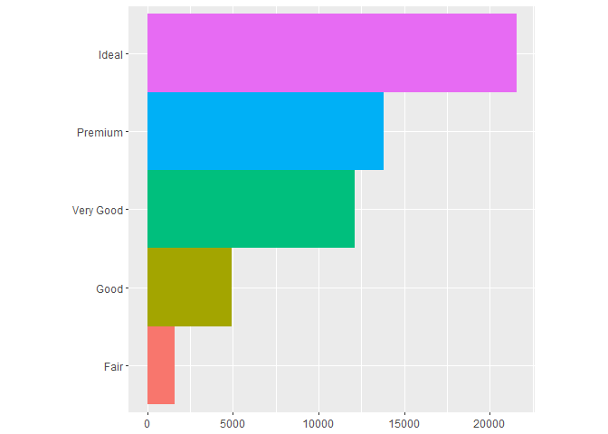<!-- -->

```r
bar + coord_polar()
```

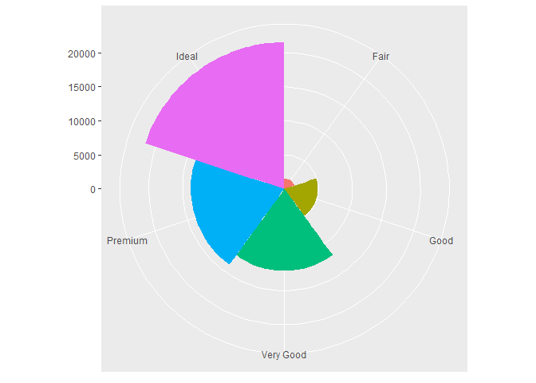<!-- -->

### 3.9.1 Exercises


```r
#1.
bar2 <- ggplot(data = diamonds) + 
  geom_bar(mapping = aes(x = cut, fill = clarity))
bar2 + coord_polar()
```

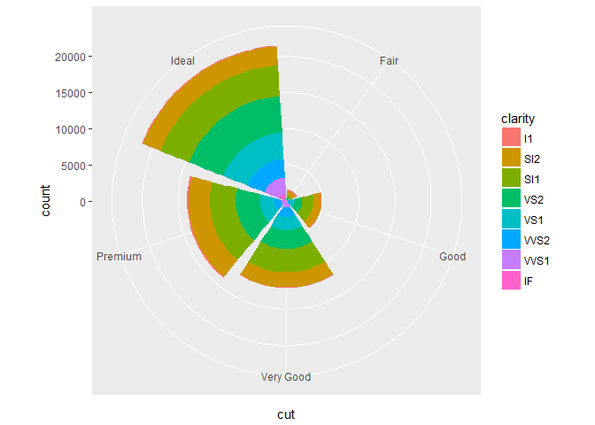<!-- -->

```r
bar2 <- ggplot(data = diamonds) + 
  geom_bar(mapping = aes(x = cut, fill = clarity), position = "fill")
bar2 + coord_polar()
```

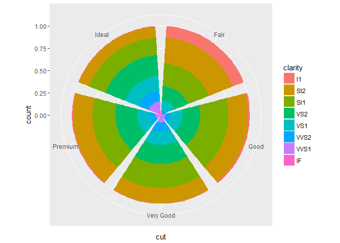<!-- -->

```r
#2
?labs()

#3
?coord_quickmap()
?coord_map()
nz <- map_data("nz")

ggplot(nz, aes(long, lat, group = group)) +
  geom_polygon(fill = "white", colour = "black")
```

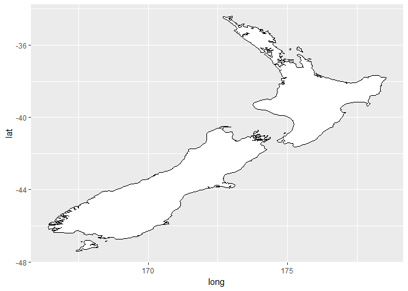<!-- -->

```r
  coord_map()
```

```
## <ggproto object: Class CoordMap, Coord>
##     aspect: function
##     distance: function
##     is_linear: function
##     labels: function
##     limits: list
##     orientation: NULL
##     params: list
##     projection: mercator
##     range: function
##     render_axis_h: function
##     render_axis_v: function
##     render_bg: function
##     render_fg: function
##     train: function
##     transform: function
##     super:  <ggproto object: Class CoordMap, Coord>
```

```r
#4
ggplot(data = mpg, mapping = aes(x = cty, y = hwy)) +
  geom_point() + 
  geom_abline() +
  coord_fixed()  
```

<!-- -->

```r
?coord_fixed()
?geom_abline()
```

>1. Turn a stacked bar chart into a pie chart using coord_polar().

>2. `labs` Good labels are critical for making your plots accessible to a wider audience. Ensure the axis and legend labels display the full variable name. Use the plot title and subtitle to explain the main findings. It's common to use the caption to provide information about the data source. You can also set axis and legend labels in the individual scales (using the first argument, the name. I recommend doing that if you're changing other scale options.

>3. coord_map projects a portion of the earth, which is approximately spherical, onto a flat 2D plane using any projection defined by the mapproj package. Map projections do not, in general, preserve straight lines, so this requires considerable computation. coord_quickmap is a quick approximation that does preserve straight lines. It works best for smaller areas closer to the equator.

>4.`coord_fixed` A fixed scale coordinate system forces a specified ratio between the physical representation of data units on the axes. The ratio represents the number of units on the y-axis equivalent to one unit on the x-axis. The default, ratio = 1, ensures that one unit on the x-axis is the same length as one unit on the y-axis. Ratios higher than one make units on the y axis longer than units on the x-axis, and vice versa. This is similar to eqscplot, but it works for all types of graphics.
> `geom_abline()` These geoms add reference lines (sometimes called rules) to a plot, either horizontal, vertical, or diagonal (specified by slope and intercept). These are useful for annotating plots.

## 3.10 The layered grammar of graphics


```r
ggplot(data = diamonds) + 
  stat_count(mapping = aes(x = cut, y = ..count.., fill = ..count..))
```

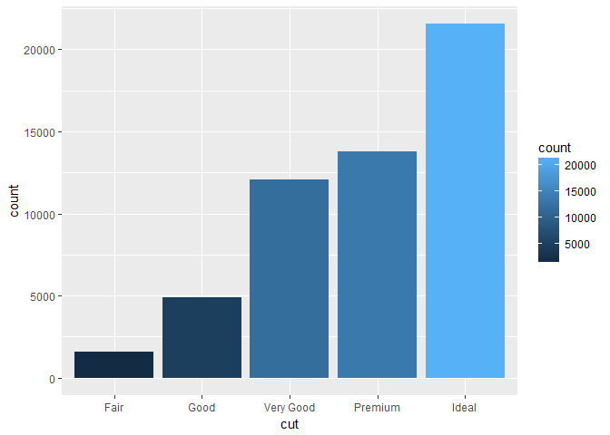<!-- -->

```r
#
ggplot(data = diamonds) + 
  stat_count(mapping = aes(x = cut, y = ..count.., fill = cut))
```

<!-- -->

# use ggplot to make a graph using some of your own data.


```r
IVHall <- read.csv("D:/2017SQ/R club/Rclub-r4ds_Min.Yao.Jhu/R-club-May-3/IVHall-reduced.csv")
ggplot(data = IVHall) +
  geom_boxplot(mapping = aes(x = identity, y = total.number, fill = identity))
```

<!-- -->

# 4 Workflow: basics

## 4.1 Coding basics

```r
1 / 200 * 30
```

```
## [1] 0.15
```

```r
(59 + 73 + 2) / 3
```

```
## [1] 44.66667
```

```r
sin(pi / 2)
```

```
## [1] 1
```

```r
x <- 3 * 4
```

## 4.2 What’s in a name?


```r
x
```

```
## [1] 12
```

```r
this_is_a_really_long_name <- 2.5
this_is_a_really_long_name
```

```
## [1] 2.5
```

```r
r_rocks <- 2 ^ 3
r_rocks
```

```
## [1] 8
```

## 4.3 Calling functions


```r
seq(1, 10)
```

```
##  [1]  1  2  3  4  5  6  7  8  9 10
```

```r
x <- "hello world"
x
```

```
## [1] "hello world"
```

```r
y <- seq(1, 10, length.out = 5)
y
```

```
## [1]  1.00  3.25  5.50  7.75 10.00
```

```r
(y <- seq(1, 10, length.out = 5))
```

```
## [1]  1.00  3.25  5.50  7.75 10.00
```

## 4.4 Practice


```r
#1.
my_variable <- 10
my_variable
```

```
## [1] 10
```

```r
#2
library(tidyverse)
```

```
## Warning: package 'tidyverse' was built under R version 3.3.3
```

```
## Loading tidyverse: tidyr
## Loading tidyverse: readr
## Loading tidyverse: purrr
## Loading tidyverse: dplyr
```

```
## Warning: package 'purrr' was built under R version 3.3.3
```

```
## Conflicts with tidy packages ----------------------------------------------
```

```
## filter(): dplyr, stats
## lag():    dplyr, stats
## map():    purrr, maps
```

```r
ggplot(data = mpg) + 
  geom_point(mapping = aes(x = displ, y = hwy))
```

<!-- -->

```r
filter(mpg, cyl == 8)
```

```
## # A tibble: 70 × 11
##    manufacturer              model displ  year   cyl      trans   drv
##           <chr>              <chr> <dbl> <int> <int>      <chr> <chr>
## 1          audi         a6 quattro   4.2  2008     8   auto(s6)     4
## 2     chevrolet c1500 suburban 2wd   5.3  2008     8   auto(l4)     r
## 3     chevrolet c1500 suburban 2wd   5.3  2008     8   auto(l4)     r
## 4     chevrolet c1500 suburban 2wd   5.3  2008     8   auto(l4)     r
## 5     chevrolet c1500 suburban 2wd   5.7  1999     8   auto(l4)     r
## 6     chevrolet c1500 suburban 2wd   6.0  2008     8   auto(l4)     r
## 7     chevrolet           corvette   5.7  1999     8 manual(m6)     r
## 8     chevrolet           corvette   5.7  1999     8   auto(l4)     r
## 9     chevrolet           corvette   6.2  2008     8 manual(m6)     r
## 10    chevrolet           corvette   6.2  2008     8   auto(s6)     r
## # ... with 60 more rows, and 4 more variables: cty <int>, hwy <int>,
## #   fl <chr>, class <chr>
```

```r
filter(diamonds, carat > 3)
```

```
## # A tibble: 32 × 10
##    carat     cut color clarity depth table price     x     y     z
##    <dbl>   <ord> <ord>   <ord> <dbl> <dbl> <int> <dbl> <dbl> <dbl>
## 1   3.01 Premium     I      I1  62.7    58  8040  9.10  8.97  5.67
## 2   3.11    Fair     J      I1  65.9    57  9823  9.15  9.02  5.98
## 3   3.01 Premium     F      I1  62.2    56  9925  9.24  9.13  5.73
## 4   3.05 Premium     E      I1  60.9    58 10453  9.26  9.25  5.66
## 5   3.02    Fair     I      I1  65.2    56 10577  9.11  9.02  5.91
## 6   3.01    Fair     H      I1  56.1    62 10761  9.54  9.38  5.31
## 7   3.65    Fair     H      I1  67.1    53 11668  9.53  9.48  6.38
## 8   3.24 Premium     H      I1  62.1    58 12300  9.44  9.40  5.85
## 9   3.22   Ideal     I      I1  62.6    55 12545  9.49  9.42  5.92
## 10  3.50   Ideal     H      I1  62.8    57 12587  9.65  9.59  6.03
## # ... with 22 more rows
```

```r
#3
```

>1. my_variable not my_varıable

>2.

>3. Press Alt + Shift + K. = Knit, shortcut


```r
#other useful things
#library(gridExtra)
#grid.arrange()
#cowplot
```

