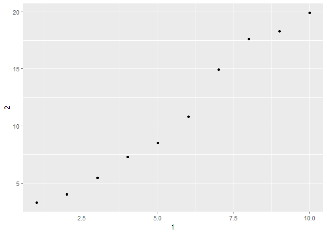

# Exploratory Data Analysis, cont Tibbles
Min-Yao  
2017年5月29日  

## 7.6 Patterns and models


## 7.7 ggplot2 calls


## 7.8 Learning more


# 8 Workflow: projects

## 8.1 What is real?

## 8.2 Where does your analysis live?


```r
getwd()
```

```
## [1] "D:/2017SQ/R club/Rclub-r4ds_Min.Yao.Jhu/R-club-May-31"
```


## 8.3 Paths and directories


## 8.4 RStudio projects


```r
library(tidyverse)
```

```
## Warning: package 'tidyverse' was built under R version 3.3.3
```

```
## Loading tidyverse: ggplot2
## Loading tidyverse: tibble
## Loading tidyverse: tidyr
## Loading tidyverse: readr
## Loading tidyverse: purrr
## Loading tidyverse: dplyr
```

```
## Warning: package 'purrr' was built under R version 3.3.3
```

```
## Conflicts with tidy packages ----------------------------------------------
```

```
## filter(): dplyr, stats
## lag():    dplyr, stats
```

```r
ggplot(diamonds, aes(carat, price)) + 
  geom_hex()
```

```
## Warning: package 'hexbin' was built under R version 3.3.3
```

<!-- -->

```r
ggsave("diamonds.pdf")
```

```
## Saving 7 x 5 in image
```

```r
write_csv(diamonds, "diamonds.csv")
```


## 8.5 Summary

# 10 Tibbles

## 10.1 Introduction

### 10.1.1 Prerequisites


```r
library(tidyverse)
```


## 10.2 Creating tibbles


```r
as_tibble(iris)
```

```
## # A tibble: 150 × 5
##    Sepal.Length Sepal.Width Petal.Length Petal.Width Species
##           <dbl>       <dbl>        <dbl>       <dbl>  <fctr>
## 1           5.1         3.5          1.4         0.2  setosa
## 2           4.9         3.0          1.4         0.2  setosa
## 3           4.7         3.2          1.3         0.2  setosa
## 4           4.6         3.1          1.5         0.2  setosa
## 5           5.0         3.6          1.4         0.2  setosa
## 6           5.4         3.9          1.7         0.4  setosa
## 7           4.6         3.4          1.4         0.3  setosa
## 8           5.0         3.4          1.5         0.2  setosa
## 9           4.4         2.9          1.4         0.2  setosa
## 10          4.9         3.1          1.5         0.1  setosa
## # ... with 140 more rows
```

```r
tibble(
  x = 1:5, 
  y = 1, 
  z = x ^ 2 + y
)
```

```
## # A tibble: 5 × 3
##       x     y     z
##   <int> <dbl> <dbl>
## 1     1     1     2
## 2     2     1     5
## 3     3     1    10
## 4     4     1    17
## 5     5     1    26
```

```r
tb <- tibble(
  `:)` = "smile", 
  ` ` = "space",
  `2000` = "number"
)
tb
```

```
## # A tibble: 1 × 3
##    `:)`   ` ` `2000`
##   <chr> <chr>  <chr>
## 1 smile space number
```

```r
tribble(
  ~x, ~y, ~z,
  #--|--|----
  "a", 2, 3.6,
  "b", 1, 8.5
)
```

```
## # A tibble: 2 × 3
##       x     y     z
##   <chr> <dbl> <dbl>
## 1     a     2   3.6
## 2     b     1   8.5
```

## 10.3 Tibbles vs. data.frame

### 10.3.1 Printing


```r
library(lubridate)
```

```
## Warning: package 'lubridate' was built under R version 3.3.3
```

```
## 
## Attaching package: 'lubridate'
```

```
## The following object is masked from 'package:base':
## 
##     date
```

```r
newtibble <- tibble(
  a = lubridate::now() + runif(1e3) * 86400,
  b = lubridate::today() + runif(1e3) * 30,
  c = 1:1e3,
  d = runif(1e3),
  e = sample(letters, 1e3, replace = TRUE)
)
newtibble
```

```
## # A tibble: 1,000 × 5
##                      a          b     c         d     e
##                 <dttm>     <date> <int>     <dbl> <chr>
## 1  2017-05-30 12:48:51 2017-05-29     1 0.4430248     a
## 2  2017-05-29 22:23:23 2017-06-13     2 0.9256173     u
## 3  2017-05-30 00:51:40 2017-06-25     3 0.4501180     i
## 4  2017-05-29 23:27:22 2017-05-31     4 0.9809327     d
## 5  2017-05-30 04:53:55 2017-06-11     5 0.2300678     j
## 6  2017-05-29 17:42:16 2017-06-18     6 0.6975973     t
## 7  2017-05-30 14:56:41 2017-05-29     7 0.2852085     c
## 8  2017-05-30 06:48:17 2017-06-26     8 0.8937396     r
## 9  2017-05-30 10:06:55 2017-06-24     9 0.9135054     b
## 10 2017-05-30 08:06:56 2017-06-24    10 0.6430005     c
## # ... with 990 more rows
```

```r
nycflights13::flights %>% 
  print(n = 10, width = Inf)
```

```
## # A tibble: 336,776 × 19
##     year month   day dep_time sched_dep_time dep_delay arr_time
##    <int> <int> <int>    <int>          <int>     <dbl>    <int>
## 1   2013     1     1      517            515         2      830
## 2   2013     1     1      533            529         4      850
## 3   2013     1     1      542            540         2      923
## 4   2013     1     1      544            545        -1     1004
## 5   2013     1     1      554            600        -6      812
## 6   2013     1     1      554            558        -4      740
## 7   2013     1     1      555            600        -5      913
## 8   2013     1     1      557            600        -3      709
## 9   2013     1     1      557            600        -3      838
## 10  2013     1     1      558            600        -2      753
##    sched_arr_time arr_delay carrier flight tailnum origin  dest air_time
##             <int>     <dbl>   <chr>  <int>   <chr>  <chr> <chr>    <dbl>
## 1             819        11      UA   1545  N14228    EWR   IAH      227
## 2             830        20      UA   1714  N24211    LGA   IAH      227
## 3             850        33      AA   1141  N619AA    JFK   MIA      160
## 4            1022       -18      B6    725  N804JB    JFK   BQN      183
## 5             837       -25      DL    461  N668DN    LGA   ATL      116
## 6             728        12      UA   1696  N39463    EWR   ORD      150
## 7             854        19      B6    507  N516JB    EWR   FLL      158
## 8             723       -14      EV   5708  N829AS    LGA   IAD       53
## 9             846        -8      B6     79  N593JB    JFK   MCO      140
## 10            745         8      AA    301  N3ALAA    LGA   ORD      138
##    distance  hour minute           time_hour
##       <dbl> <dbl>  <dbl>              <dttm>
## 1      1400     5     15 2013-01-01 05:00:00
## 2      1416     5     29 2013-01-01 05:00:00
## 3      1089     5     40 2013-01-01 05:00:00
## 4      1576     5     45 2013-01-01 05:00:00
## 5       762     6      0 2013-01-01 06:00:00
## 6       719     5     58 2013-01-01 05:00:00
## 7      1065     6      0 2013-01-01 06:00:00
## 8       229     6      0 2013-01-01 06:00:00
## 9       944     6      0 2013-01-01 06:00:00
## 10      733     6      0 2013-01-01 06:00:00
## # ... with 3.368e+05 more rows
```

```r
nycflights13::flights %>% 
  View()
```


### 10.3.2 Subsetting


```r
df <- tibble(
  x = runif(5),
  y = rnorm(5)
)

df$x
```

```
## [1] 0.3284541 0.9730902 0.8856468 0.2955235 0.1488190
```

```r
df[["x"]]
```

```
## [1] 0.3284541 0.9730902 0.8856468 0.2955235 0.1488190
```

```r
df[[1]]
```

```
## [1] 0.3284541 0.9730902 0.8856468 0.2955235 0.1488190
```

```r
df %>% .$x
```

```
## [1] 0.3284541 0.9730902 0.8856468 0.2955235 0.1488190
```

```r
df %>% .[["x"]]
```

```
## [1] 0.3284541 0.9730902 0.8856468 0.2955235 0.1488190
```


## 10.4 Interacting with older code


```r
class(as.data.frame(tb))
```

```
## [1] "data.frame"
```


## 10.5 Exercises

1. How can you tell if an object is a tibble? (Hint: try printing mtcars, which is a regular data frame).

```r
mtcars
```

```
##                      mpg cyl  disp  hp drat    wt  qsec vs am gear carb
## Mazda RX4           21.0   6 160.0 110 3.90 2.620 16.46  0  1    4    4
## Mazda RX4 Wag       21.0   6 160.0 110 3.90 2.875 17.02  0  1    4    4
## Datsun 710          22.8   4 108.0  93 3.85 2.320 18.61  1  1    4    1
## Hornet 4 Drive      21.4   6 258.0 110 3.08 3.215 19.44  1  0    3    1
## Hornet Sportabout   18.7   8 360.0 175 3.15 3.440 17.02  0  0    3    2
## Valiant             18.1   6 225.0 105 2.76 3.460 20.22  1  0    3    1
## Duster 360          14.3   8 360.0 245 3.21 3.570 15.84  0  0    3    4
## Merc 240D           24.4   4 146.7  62 3.69 3.190 20.00  1  0    4    2
## Merc 230            22.8   4 140.8  95 3.92 3.150 22.90  1  0    4    2
## Merc 280            19.2   6 167.6 123 3.92 3.440 18.30  1  0    4    4
## Merc 280C           17.8   6 167.6 123 3.92 3.440 18.90  1  0    4    4
## Merc 450SE          16.4   8 275.8 180 3.07 4.070 17.40  0  0    3    3
## Merc 450SL          17.3   8 275.8 180 3.07 3.730 17.60  0  0    3    3
## Merc 450SLC         15.2   8 275.8 180 3.07 3.780 18.00  0  0    3    3
## Cadillac Fleetwood  10.4   8 472.0 205 2.93 5.250 17.98  0  0    3    4
## Lincoln Continental 10.4   8 460.0 215 3.00 5.424 17.82  0  0    3    4
## Chrysler Imperial   14.7   8 440.0 230 3.23 5.345 17.42  0  0    3    4
## Fiat 128            32.4   4  78.7  66 4.08 2.200 19.47  1  1    4    1
## Honda Civic         30.4   4  75.7  52 4.93 1.615 18.52  1  1    4    2
## Toyota Corolla      33.9   4  71.1  65 4.22 1.835 19.90  1  1    4    1
## Toyota Corona       21.5   4 120.1  97 3.70 2.465 20.01  1  0    3    1
## Dodge Challenger    15.5   8 318.0 150 2.76 3.520 16.87  0  0    3    2
## AMC Javelin         15.2   8 304.0 150 3.15 3.435 17.30  0  0    3    2
## Camaro Z28          13.3   8 350.0 245 3.73 3.840 15.41  0  0    3    4
## Pontiac Firebird    19.2   8 400.0 175 3.08 3.845 17.05  0  0    3    2
## Fiat X1-9           27.3   4  79.0  66 4.08 1.935 18.90  1  1    4    1
## Porsche 914-2       26.0   4 120.3  91 4.43 2.140 16.70  0  1    5    2
## Lotus Europa        30.4   4  95.1 113 3.77 1.513 16.90  1  1    5    2
## Ford Pantera L      15.8   8 351.0 264 4.22 3.170 14.50  0  1    5    4
## Ferrari Dino        19.7   6 145.0 175 3.62 2.770 15.50  0  1    5    6
## Maserati Bora       15.0   8 301.0 335 3.54 3.570 14.60  0  1    5    8
## Volvo 142E          21.4   4 121.0 109 4.11 2.780 18.60  1  1    4    2
```

```r
as_tibble(mtcars)
```

```
## # A tibble: 32 × 11
##      mpg   cyl  disp    hp  drat    wt  qsec    vs    am  gear  carb
## *  <dbl> <dbl> <dbl> <dbl> <dbl> <dbl> <dbl> <dbl> <dbl> <dbl> <dbl>
## 1   21.0     6 160.0   110  3.90 2.620 16.46     0     1     4     4
## 2   21.0     6 160.0   110  3.90 2.875 17.02     0     1     4     4
## 3   22.8     4 108.0    93  3.85 2.320 18.61     1     1     4     1
## 4   21.4     6 258.0   110  3.08 3.215 19.44     1     0     3     1
## 5   18.7     8 360.0   175  3.15 3.440 17.02     0     0     3     2
## 6   18.1     6 225.0   105  2.76 3.460 20.22     1     0     3     1
## 7   14.3     8 360.0   245  3.21 3.570 15.84     0     0     3     4
## 8   24.4     4 146.7    62  3.69 3.190 20.00     1     0     4     2
## 9   22.8     4 140.8    95  3.92 3.150 22.90     1     0     4     2
## 10  19.2     6 167.6   123  3.92 3.440 18.30     1     0     4     4
## # ... with 22 more rows
```

2. Compare and contrast the following operations on a data.frame and equivalent tibble. What is different? Why might the default data frame behaviours cause you frustration?


```r
df <- data.frame(abc = 1, xyz = "a")
df$x
```

```
## [1] a
## Levels: a
```

```r
df[, "xyz"]
```

```
## [1] a
## Levels: a
```

```r
df[, c("abc", "xyz")]
```

```
##   abc xyz
## 1   1   a
```

```r
df2 <- tibble(abc = 1, xyz = "a")
df2$x
```

```
## Warning: Unknown column 'x'
```

```
## NULL
```

```r
df2[, "xyz"]
```

```
## # A tibble: 1 × 1
##     xyz
##   <chr>
## 1     a
```

```r
df2[, c("abc", "xyz")]
```

```
## # A tibble: 1 × 2
##     abc   xyz
##   <dbl> <chr>
## 1     1     a
```


3. If you have the name of a variable stored in an object, e.g. var <- "mpg", how can you extract the reference variable from a tibble?


```r
mpg
```

```
## # A tibble: 234 × 11
##    manufacturer      model displ  year   cyl      trans   drv   cty   hwy
##           <chr>      <chr> <dbl> <int> <int>      <chr> <chr> <int> <int>
## 1          audi         a4   1.8  1999     4   auto(l5)     f    18    29
## 2          audi         a4   1.8  1999     4 manual(m5)     f    21    29
## 3          audi         a4   2.0  2008     4 manual(m6)     f    20    31
## 4          audi         a4   2.0  2008     4   auto(av)     f    21    30
## 5          audi         a4   2.8  1999     6   auto(l5)     f    16    26
## 6          audi         a4   2.8  1999     6 manual(m5)     f    18    26
## 7          audi         a4   3.1  2008     6   auto(av)     f    18    27
## 8          audi a4 quattro   1.8  1999     4 manual(m5)     4    18    26
## 9          audi a4 quattro   1.8  1999     4   auto(l5)     4    16    25
## 10         audi a4 quattro   2.0  2008     4 manual(m6)     4    20    28
## # ... with 224 more rows, and 2 more variables: fl <chr>, class <chr>
```


4. Practice referring to non-syntactic names in the following data frame by:


```r
annoying <- tibble(
  `1` = 1:10,
  `2` = `1` * 2 + rnorm(length(`1`))
)
```


Extracting the variable called 1.

```r
annoying$`1`
```

```
##  [1]  1  2  3  4  5  6  7  8  9 10
```


Plotting a scatterplot of 1 vs 2.

```r
ggplot(annoying, aes(x=`1`, y=`2`)) +
    geom_point() 
```

<!-- -->

Creating a new column called 3 which is 2 divided by 1.


```r
annoying2 <- tibble(
  `1` = 1:10,
  `2` = `1` * 2 + rnorm(length(`1`)),
  `3` = `2` / `1`
)
annoying2
```

```
## # A tibble: 10 × 3
##      `1`       `2`      `3`
##    <int>     <dbl>    <dbl>
## 1      1  2.844275 2.844275
## 2      2  4.994922 2.497461
## 3      3  6.578258 2.192753
## 4      4  7.092239 1.773060
## 5      5 12.336350 2.467270
## 6      6 11.053124 1.842187
## 7      7 12.092954 1.727565
## 8      8 15.384802 1.923100
## 9      9 18.631017 2.070113
## 10    10 20.080625 2.008062
```


Renaming the columns to one, two and three.


```r
annoying3 <- tibble(
  one = 1:10,
  two = one * 2 + rnorm(length(one)),
  three = two / one
)
annoying3
```

```
## # A tibble: 10 × 3
##      one        two     three
##    <int>      <dbl>     <dbl>
## 1      1  0.4448261 0.4448261
## 2      2  3.7962237 1.8981118
## 3      3  5.8065809 1.9355270
## 4      4  8.5921934 2.1480484
## 5      5  8.6323778 1.7264756
## 6      6 13.3883677 2.2313946
## 7      7 15.1735395 2.1676485
## 8      8 15.0775640 1.8846955
## 9      9 19.3697425 2.1521936
## 10    10 19.6629452 1.9662945
```


5. What does tibble::enframe() do? When might you use it?


```r
?enframe()
```

```
## starting httpd help server ...
```

```
##  done
```

```r
enframe(1:3)
```

```
## # A tibble: 3 × 2
##    name value
##   <int> <int>
## 1     1     1
## 2     2     2
## 3     3     3
```

```r
enframe(c(a = 5, b = 7))
```

```
## # A tibble: 2 × 2
##    name value
##   <chr> <dbl>
## 1     a     5
## 2     b     7
```

> A helper function that converts named atomic vectors or lists to two-column data frames. For unnamed vectors, the natural sequence is used as name column.
> enframe(x, name = "name", value = "value")

6. What option controls how many additional column names are printed at the footer of a tibble?


```r
package?tibble
```

tibble.print_max
Row number threshold: Maximum number of rows printed. Set to Inf to always print all rows. Default: 20.

tibble.print_min
Number of rows printed if row number threshold is exceeded. Default: 10.

tibble.width
Output width. Default: NULL (use width option).

tibble.max_extra_cols
Number of extra columns printed in reduced form. Default: 100.
