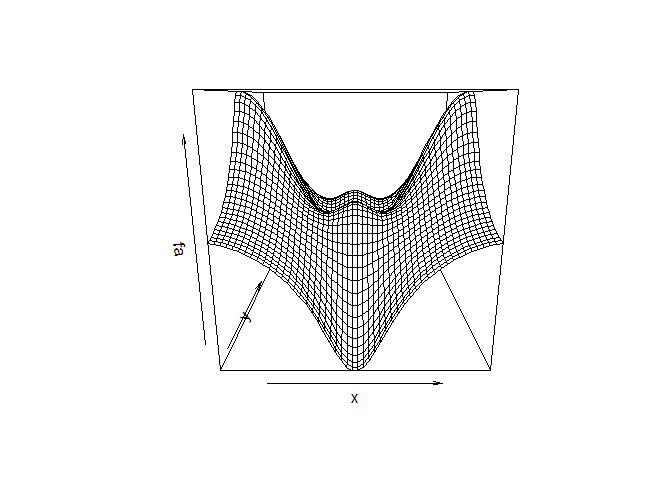
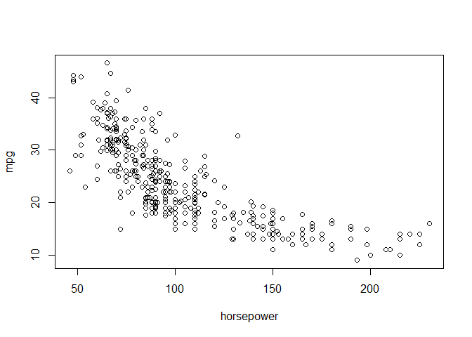

# Lab 2
Min-Yao  
2017?~11??28??  
# Chapter 2 Lab: Introduction to R

```r
# Chapter 2 Lab: Introduction to R

library(ISLR)
```

```
## Warning: package 'ISLR' was built under R version 3.4.2
```

```r
head(Auto)
```

```
##   mpg cylinders displacement horsepower weight acceleration year origin
## 1  18         8          307        130   3504         12.0   70      1
## 2  15         8          350        165   3693         11.5   70      1
## 3  18         8          318        150   3436         11.0   70      1
## 4  16         8          304        150   3433         12.0   70      1
## 5  17         8          302        140   3449         10.5   70      1
## 6  15         8          429        198   4341         10.0   70      1
##                        name
## 1 chevrolet chevelle malibu
## 2         buick skylark 320
## 3        plymouth satellite
## 4             amc rebel sst
## 5               ford torino
## 6          ford galaxie 500
```

```r
# Basic Commands

x <- c(1,3,2,5)
x
```

```
## [1] 1 3 2 5
```

```r
x = c(1,6,2)
x
```

```
## [1] 1 6 2
```

```r
y = c(1,4,3)
length(x)
```

```
## [1] 3
```

```r
length(y)
```

```
## [1] 3
```

```r
x+y
```

```
## [1]  2 10  5
```

```r
ls()
```

```
## [1] "x" "y"
```

```r
rm(x,y)
ls()
```

```
## character(0)
```

```r
rm(list=ls())
#?matrix
x=matrix(data=c(1,2,3,4), nrow=2, ncol=2)
x
```

```
##      [,1] [,2]
## [1,]    1    3
## [2,]    2    4
```

```r
x=matrix(c(1,2,3,4),2,2)
matrix(c(1,2,3,4),2,2,byrow=TRUE)
```

```
##      [,1] [,2]
## [1,]    1    2
## [2,]    3    4
```

```r
sqrt(x)
```

```
##          [,1]     [,2]
## [1,] 1.000000 1.732051
## [2,] 1.414214 2.000000
```

```r
x^2
```

```
##      [,1] [,2]
## [1,]    1    9
## [2,]    4   16
```

```r
x=rnorm(50)
y=x+rnorm(50,mean=50,sd=.1)
cor(x,y)
```

```
## [1] 0.9961895
```

```r
set.seed(1303)
rnorm(50)
```

```
##  [1] -1.1439763145  1.3421293656  2.1853904757  0.5363925179  0.0631929665
##  [6]  0.5022344825 -0.0004167247  0.5658198405 -0.5725226890 -1.1102250073
## [11] -0.0486871234 -0.6956562176  0.8289174803  0.2066528551 -0.2356745091
## [16] -0.5563104914 -0.3647543571  0.8623550343 -0.6307715354  0.3136021252
## [21] -0.9314953177  0.8238676185  0.5233707021  0.7069214120  0.4202043256
## [26] -0.2690521547 -1.5103172999 -0.6902124766 -0.1434719524 -1.0135274099
## [31]  1.5732737361  0.0127465055  0.8726470499  0.4220661905 -0.0188157917
## [36]  2.6157489689 -0.6931401748 -0.2663217810 -0.7206364412  1.3677342065
## [41]  0.2640073322  0.6321868074 -1.3306509858  0.0268888182  1.0406363208
## [46]  1.3120237985 -0.0300020767 -0.2500257125  0.0234144857  1.6598706557
```

```r
set.seed(3)
y=rnorm(100)
mean(y)
```

```
## [1] 0.01103557
```

```r
var(y)
```

```
## [1] 0.7328675
```

```r
sqrt(var(y))
```

```
## [1] 0.8560768
```

```r
sd(y)
```

```
## [1] 0.8560768
```
# Graphics

```r
# Graphics

x=rnorm(100)
y=rnorm(100)
plot(x,y)
```

<!-- -->

```r
plot(x,y,xlab="this is the x-axis",ylab="this is the y-axis",main="Plot of X vs Y")
```

<!-- -->

```r
pdf("Figure.pdf")
plot(x,y,col="green")
dev.off()
```

```
## png 
##   2
```

```r
x=seq(1,10)
x
```

```
##  [1]  1  2  3  4  5  6  7  8  9 10
```

```r
x=1:10
x
```

```
##  [1]  1  2  3  4  5  6  7  8  9 10
```

```r
x=seq(-pi,pi,length=50)
y=x
f=outer(x,y,function(x,y)cos(y)/(1+x^2))
contour(x,y,f)
contour(x,y,f,nlevels=45,add=T)
```

<!-- -->

```r
fa=(f-t(f))/2
contour(x,y,fa,nlevels=15)
```

<!-- -->

```r
image(x,y,fa)
```

<!-- -->

```r
persp(x,y,fa)
```

<!-- -->

```r
persp(x,y,fa,theta=30)
```

<!-- -->

```r
persp(x,y,fa,theta=30,phi=20)
```

<!-- -->

```r
persp(x,y,fa,theta=30,phi=70)
```

<!-- -->

```r
persp(x,y,fa,theta=30,phi=40)
```

<!-- -->
# Indexing Data

```r
# Indexing Data

A=matrix(1:16,4,4)
A
```

```
##      [,1] [,2] [,3] [,4]
## [1,]    1    5    9   13
## [2,]    2    6   10   14
## [3,]    3    7   11   15
## [4,]    4    8   12   16
```

```r
A[2,3]
```

```
## [1] 10
```

```r
A[c(1,3),c(2,4)]
```

```
##      [,1] [,2]
## [1,]    5   13
## [2,]    7   15
```

```r
A[1:3,2:4]
```

```
##      [,1] [,2] [,3]
## [1,]    5    9   13
## [2,]    6   10   14
## [3,]    7   11   15
```

```r
A[1:2,]
```

```
##      [,1] [,2] [,3] [,4]
## [1,]    1    5    9   13
## [2,]    2    6   10   14
```

```r
A[,1:2]
```

```
##      [,1] [,2]
## [1,]    1    5
## [2,]    2    6
## [3,]    3    7
## [4,]    4    8
```

```r
A[1,]
```

```
## [1]  1  5  9 13
```

```r
A[-c(1,3),]
```

```
##      [,1] [,2] [,3] [,4]
## [1,]    2    6   10   14
## [2,]    4    8   12   16
```

```r
A[-c(1,3),-c(1,3,4)]
```

```
## [1] 6 8
```

```r
dim(A)
```

```
## [1] 4 4
```
# Loading Data

```r
# Loading Data

Auto=read.table("Auto.data")
#fix(Auto)
Auto=read.table("Auto.data",header=T,na.strings="?")
#fix(Auto)
Auto=read.csv("Auto.csv",header=T,na.strings="?")
#fix(Auto)
dim(Auto)
```

```
## [1] 397   9
```

```r
Auto[1:4,]
```

```
##   mpg cylinders displacement horsepower weight acceleration year origin
## 1  18         8          307        130   3504         12.0   70      1
## 2  15         8          350        165   3693         11.5   70      1
## 3  18         8          318        150   3436         11.0   70      1
## 4  16         8          304        150   3433         12.0   70      1
##                        name
## 1 chevrolet chevelle malibu
## 2         buick skylark 320
## 3        plymouth satellite
## 4             amc rebel sst
```

```r
Auto=na.omit(Auto)
dim(Auto)
```

```
## [1] 392   9
```

```r
names(Auto)
```

```
## [1] "mpg"          "cylinders"    "displacement" "horsepower"  
## [5] "weight"       "acceleration" "year"         "origin"      
## [9] "name"
```
# Additional Graphical and Numerical Summaries

```r
# Additional Graphical and Numerical Summaries

#plot(cylinders, mpg)
plot(Auto$cylinders, Auto$mpg)
```

<!-- -->

```r
attach(Auto)
plot(cylinders, mpg)
```

<!-- -->

```r
cylinders=as.factor(cylinders)
plot(cylinders, mpg)
```

<!-- -->

```r
plot(cylinders, mpg, col="red")
```

<!-- -->

```r
plot(cylinders, mpg, col="red", varwidth=T)
```

<!-- -->

```r
plot(cylinders, mpg, col="red", varwidth=T,horizontal=T)
```

<!-- -->

```r
plot(cylinders, mpg, col="red", varwidth=T, xlab="cylinders", ylab="MPG")
```

<!-- -->

```r
hist(mpg)
```

<!-- -->

```r
hist(mpg,col=2)
```

<!-- -->

```r
hist(mpg,col=2,breaks=15)
```

<!-- -->

```r
pairs(Auto)
```

<!-- -->

```r
pairs(~ mpg + displacement + horsepower + weight + acceleration, Auto)
```

<!-- -->

```r
plot(horsepower,mpg)
identify(horsepower,mpg,name)
```

<!-- -->

```
## integer(0)
```


# 9.(a)
> quan: mpg, acceleration, weight, horsepower, displacement
> qual: origin, year, cylinders

# 9.(b,C)


```r
summary(Auto)
```

```
##       mpg          cylinders      displacement     horsepower   
##  Min.   : 9.00   Min.   :3.000   Min.   : 68.0   Min.   : 46.0  
##  1st Qu.:17.00   1st Qu.:4.000   1st Qu.:105.0   1st Qu.: 75.0  
##  Median :22.75   Median :4.000   Median :151.0   Median : 93.5  
##  Mean   :23.45   Mean   :5.472   Mean   :194.4   Mean   :104.5  
##  3rd Qu.:29.00   3rd Qu.:8.000   3rd Qu.:275.8   3rd Qu.:126.0  
##  Max.   :46.60   Max.   :8.000   Max.   :455.0   Max.   :230.0  
##                                                                 
##      weight      acceleration        year           origin     
##  Min.   :1613   Min.   : 8.00   Min.   :70.00   Min.   :1.000  
##  1st Qu.:2225   1st Qu.:13.78   1st Qu.:73.00   1st Qu.:1.000  
##  Median :2804   Median :15.50   Median :76.00   Median :1.000  
##  Mean   :2978   Mean   :15.54   Mean   :75.98   Mean   :1.577  
##  3rd Qu.:3615   3rd Qu.:17.02   3rd Qu.:79.00   3rd Qu.:2.000  
##  Max.   :5140   Max.   :24.80   Max.   :82.00   Max.   :3.000  
##                                                                
##                  name    
##  amc matador       :  5  
##  ford pinto        :  5  
##  toyota corolla    :  5  
##  amc gremlin       :  4  
##  amc hornet        :  4  
##  chevrolet chevette:  4  
##  (Other)           :365
```


```r
str(Auto)
```

```
## 'data.frame':	392 obs. of  9 variables:
##  $ mpg         : num  18 15 18 16 17 15 14 14 14 15 ...
##  $ cylinders   : int  8 8 8 8 8 8 8 8 8 8 ...
##  $ displacement: num  307 350 318 304 302 429 454 440 455 390 ...
##  $ horsepower  : int  130 165 150 150 140 198 220 215 225 190 ...
##  $ weight      : int  3504 3693 3436 3433 3449 4341 4354 4312 4425 3850 ...
##  $ acceleration: num  12 11.5 11 12 10.5 10 9 8.5 10 8.5 ...
##  $ year        : int  70 70 70 70 70 70 70 70 70 70 ...
##  $ origin      : int  1 1 1 1 1 1 1 1 1 1 ...
##  $ name        : Factor w/ 304 levels "amc ambassador brougham",..: 49 36 231 14 161 141 54 223 241 2 ...
##  - attr(*, "na.action")=Class 'omit'  Named int [1:5] 33 127 331 337 355
##   .. ..- attr(*, "names")= chr [1:5] "33" "127" "331" "337" ...
```

```r
summary(mpg)
```

```
##    Min. 1st Qu.  Median    Mean 3rd Qu.    Max. 
##    9.00   17.00   22.75   23.45   29.00   46.60
```

```r
range(mpg)
```

```
## [1]  9.0 46.6
```

```r
range(acceleration)
```

```
## [1]  8.0 24.8
```

```r
range(displacement)
```

```
## [1]  68 455
```

```r
range(horsepower)
```

```
## [1]  46 230
```

```r
range(weight)
```

```
## [1] 1613 5140
```

```r
sd(mpg)
```

```
## [1] 7.805007
```

```r
sd(acceleration)
```

```
## [1] 2.758864
```

```r
sd(displacement)
```

```
## [1] 104.644
```

```r
sd(horsepower)
```

```
## [1] 38.49116
```

```r
sd(weight)
```

```
## [1] 849.4026
```

# 9.(d)

```r
new.Auto = Auto[-c(10:85),]
#new.Auto
#Auto

summary(Auto)
```

```
##       mpg          cylinders      displacement     horsepower   
##  Min.   : 9.00   Min.   :3.000   Min.   : 68.0   Min.   : 46.0  
##  1st Qu.:17.00   1st Qu.:4.000   1st Qu.:105.0   1st Qu.: 75.0  
##  Median :22.75   Median :4.000   Median :151.0   Median : 93.5  
##  Mean   :23.45   Mean   :5.472   Mean   :194.4   Mean   :104.5  
##  3rd Qu.:29.00   3rd Qu.:8.000   3rd Qu.:275.8   3rd Qu.:126.0  
##  Max.   :46.60   Max.   :8.000   Max.   :455.0   Max.   :230.0  
##                                                                 
##      weight      acceleration        year           origin     
##  Min.   :1613   Min.   : 8.00   Min.   :70.00   Min.   :1.000  
##  1st Qu.:2225   1st Qu.:13.78   1st Qu.:73.00   1st Qu.:1.000  
##  Median :2804   Median :15.50   Median :76.00   Median :1.000  
##  Mean   :2978   Mean   :15.54   Mean   :75.98   Mean   :1.577  
##  3rd Qu.:3615   3rd Qu.:17.02   3rd Qu.:79.00   3rd Qu.:2.000  
##  Max.   :5140   Max.   :24.80   Max.   :82.00   Max.   :3.000  
##                                                                
##                  name    
##  amc matador       :  5  
##  ford pinto        :  5  
##  toyota corolla    :  5  
##  amc gremlin       :  4  
##  amc hornet        :  4  
##  chevrolet chevette:  4  
##  (Other)           :365
```

```r
summary(new.Auto)
```

```
##       mpg          cylinders      displacement     horsepower   
##  Min.   :11.00   Min.   :3.000   Min.   : 68.0   Min.   : 46.0  
##  1st Qu.:18.00   1st Qu.:4.000   1st Qu.:100.2   1st Qu.: 75.0  
##  Median :23.95   Median :4.000   Median :145.5   Median : 90.0  
##  Mean   :24.40   Mean   :5.373   Mean   :187.2   Mean   :100.7  
##  3rd Qu.:30.55   3rd Qu.:6.000   3rd Qu.:250.0   3rd Qu.:115.0  
##  Max.   :46.60   Max.   :8.000   Max.   :455.0   Max.   :230.0  
##                                                                 
##      weight      acceleration        year           origin     
##  Min.   :1649   Min.   : 8.50   Min.   :70.00   Min.   :1.000  
##  1st Qu.:2214   1st Qu.:14.00   1st Qu.:75.00   1st Qu.:1.000  
##  Median :2792   Median :15.50   Median :77.00   Median :1.000  
##  Mean   :2936   Mean   :15.73   Mean   :77.15   Mean   :1.601  
##  3rd Qu.:3508   3rd Qu.:17.30   3rd Qu.:80.00   3rd Qu.:2.000  
##  Max.   :4997   Max.   :24.80   Max.   :82.00   Max.   :3.000  
##                                                                
##                         name    
##  ford pinto               :  5  
##  toyota corolla           :  5  
##  amc matador              :  4  
##  chevrolet chevette       :  4  
##  amc hornet               :  3  
##  chevrolet caprice classic:  3  
##  (Other)                  :292
```

```r
range(new.Auto$mpg)
```

```
## [1] 11.0 46.6
```

```r
range(new.Auto$acceleration)
```

```
## [1]  8.5 24.8
```

```r
range(new.Auto$displacement)
```

```
## [1]  68 455
```

```r
range(new.Auto$horsepower)
```

```
## [1]  46 230
```

```r
range(new.Auto$weight)
```

```
## [1] 1649 4997
```

```r
sd(new.Auto$mpg)
```

```
## [1] 7.867283
```

```r
sd(new.Auto$acceleration)
```

```
## [1] 2.693721
```

```r
sd(new.Auto$displacement)
```

```
## [1] 99.67837
```

```r
sd(new.Auto$horsepower)
```

```
## [1] 35.70885
```

```r
sd(new.Auto$weight)
```

```
## [1] 811.3002
```

# 9.(e)

```r
#9.(e)
plot(cylinders, mpg, xlab="cylinders", ylab="MPG")
```

<!-- -->

```r
plot(displacement, mpg, xlab="displacement", ylab="MPG")
```

<!-- -->

```r
plot(horsepower, mpg, xlab="horsepower", ylab="MPG")
```

<!-- -->

```r
plot(weight, mpg, xlab="weight", ylab="MPG")
```

<!-- -->

```r
plot(acceleration, mpg, xlab="acceleration", ylab="MPG")
```

<!-- -->

```r
plot(year, mpg, xlab="year", ylab="MPG")
```

<!-- -->

```r
plot(origin, mpg, xlab="origin", ylab="MPG")
```

<!-- -->
# 9.(f)
> The cars with lower displacement, horsepower, weight have higher gas mileage (mpg). 

# 10.(a)

```r
#10.
#(a)
library (MASS)
#Boston
#?Boston
summary(Boston)
```

```
##       crim                zn             indus            chas        
##  Min.   : 0.00632   Min.   :  0.00   Min.   : 0.46   Min.   :0.00000  
##  1st Qu.: 0.08204   1st Qu.:  0.00   1st Qu.: 5.19   1st Qu.:0.00000  
##  Median : 0.25651   Median :  0.00   Median : 9.69   Median :0.00000  
##  Mean   : 3.61352   Mean   : 11.36   Mean   :11.14   Mean   :0.06917  
##  3rd Qu.: 3.67708   3rd Qu.: 12.50   3rd Qu.:18.10   3rd Qu.:0.00000  
##  Max.   :88.97620   Max.   :100.00   Max.   :27.74   Max.   :1.00000  
##       nox               rm             age              dis        
##  Min.   :0.3850   Min.   :3.561   Min.   :  2.90   Min.   : 1.130  
##  1st Qu.:0.4490   1st Qu.:5.886   1st Qu.: 45.02   1st Qu.: 2.100  
##  Median :0.5380   Median :6.208   Median : 77.50   Median : 3.207  
##  Mean   :0.5547   Mean   :6.285   Mean   : 68.57   Mean   : 3.795  
##  3rd Qu.:0.6240   3rd Qu.:6.623   3rd Qu.: 94.08   3rd Qu.: 5.188  
##  Max.   :0.8710   Max.   :8.780   Max.   :100.00   Max.   :12.127  
##       rad              tax           ptratio          black       
##  Min.   : 1.000   Min.   :187.0   Min.   :12.60   Min.   :  0.32  
##  1st Qu.: 4.000   1st Qu.:279.0   1st Qu.:17.40   1st Qu.:375.38  
##  Median : 5.000   Median :330.0   Median :19.05   Median :391.44  
##  Mean   : 9.549   Mean   :408.2   Mean   :18.46   Mean   :356.67  
##  3rd Qu.:24.000   3rd Qu.:666.0   3rd Qu.:20.20   3rd Qu.:396.23  
##  Max.   :24.000   Max.   :711.0   Max.   :22.00   Max.   :396.90  
##      lstat            medv      
##  Min.   : 1.73   Min.   : 5.00  
##  1st Qu.: 6.95   1st Qu.:17.02  
##  Median :11.36   Median :21.20  
##  Mean   :12.65   Mean   :22.53  
##  3rd Qu.:16.95   3rd Qu.:25.00  
##  Max.   :37.97   Max.   :50.00
```

```r
str(Boston)
```

```
## 'data.frame':	506 obs. of  14 variables:
##  $ crim   : num  0.00632 0.02731 0.02729 0.03237 0.06905 ...
##  $ zn     : num  18 0 0 0 0 0 12.5 12.5 12.5 12.5 ...
##  $ indus  : num  2.31 7.07 7.07 2.18 2.18 2.18 7.87 7.87 7.87 7.87 ...
##  $ chas   : int  0 0 0 0 0 0 0 0 0 0 ...
##  $ nox    : num  0.538 0.469 0.469 0.458 0.458 0.458 0.524 0.524 0.524 0.524 ...
##  $ rm     : num  6.58 6.42 7.18 7 7.15 ...
##  $ age    : num  65.2 78.9 61.1 45.8 54.2 58.7 66.6 96.1 100 85.9 ...
##  $ dis    : num  4.09 4.97 4.97 6.06 6.06 ...
##  $ rad    : int  1 2 2 3 3 3 5 5 5 5 ...
##  $ tax    : num  296 242 242 222 222 222 311 311 311 311 ...
##  $ ptratio: num  15.3 17.8 17.8 18.7 18.7 18.7 15.2 15.2 15.2 15.2 ...
##  $ black  : num  397 397 393 395 397 ...
##  $ lstat  : num  4.98 9.14 4.03 2.94 5.33 ...
##  $ medv   : num  24 21.6 34.7 33.4 36.2 28.7 22.9 27.1 16.5 18.9 ...
```

```r
dim(Boston)
```

```
## [1] 506  14
```
> 506 rows and 14 columns

>This data frame contains the following columns:

crim
per capita crime rate by town.

zn
proportion of residential land zoned for lots over 25,000 sq.ft.

indus
proportion of non-retail business acres per town.

chas
Charles River dummy variable (= 1 if tract bounds river; 0 otherwise).

nox
nitrogen oxides concentration (parts per 10 million).

rm
average number of rooms per dwelling.

age
proportion of owner-occupied units built prior to 1940.

dis
weighted mean of distances to five Boston employment centres.

rad
index of accessibility to radial highways.

tax
full-value property-tax rate per \$10,000.

ptratio
pupil-teacher ratio by town.

black
1000(Bk - 0.63)^2 where Bk is the proportion of blacks by town.

lstat
lower status of the population (percent).

medv
median value of owner-occupied homes in \$1000s.

# 10(b-c)

```r
#(b)
pairs(Boston)
```

<!-- -->

```r
#(c)
attach(Boston)
plot(zn, crim, xlab="zn", ylab="crim")
```

<!-- -->

```r
plot(indus, crim, xlab="indus", ylab="crim")
```

<!-- -->

```r
plot(chas, crim, xlab="chas", ylab="crim")
```

<!-- -->

```r
plot(nox, crim, xlab="nox", ylab="crim")
```

<!-- -->

```r
plot(rm, crim, xlab="rm", ylab="crim")
```

<!-- -->

```r
plot(age, crim, xlab="age", ylab="crim")
```

<!-- -->

```r
plot(dis, crim, xlab="dis", ylab="crim")
```

<!-- -->

```r
plot(rad, crim, xlab="rad", ylab="crim")
```

<!-- -->

```r
plot(tax, crim, xlab="tax", ylab="crim")
```

<!-- -->

```r
plot(ptratio, crim, xlab="ptratio", ylab="crim")
```

<!-- -->

```r
plot(black, crim, xlab="black", ylab="crim")
```

<!-- -->

```r
plot(lstat, crim, xlab="lstat", ylab="crim")
```

<!-- -->

```r
plot(medv, crim, xlab="medv", ylab="crim")
```

<!-- -->

#10(d-h)


```r
#(d)
summary(Boston$crim)
```

```
##     Min.  1st Qu.   Median     Mean  3rd Qu.     Max. 
##  0.00632  0.08204  0.25651  3.61352  3.67708 88.97620
```

```r
range(Boston$crim)
```

```
## [1]  0.00632 88.97620
```

```r
summary(Boston$tax)
```

```
##    Min. 1st Qu.  Median    Mean 3rd Qu.    Max. 
##   187.0   279.0   330.0   408.2   666.0   711.0
```

```r
range(Boston$tax)
```

```
## [1] 187 711
```

```r
summary(Boston$ptratio)
```

```
##    Min. 1st Qu.  Median    Mean 3rd Qu.    Max. 
##   12.60   17.40   19.05   18.46   20.20   22.00
```

```r
range(Boston$ptratio)
```

```
## [1] 12.6 22.0
```

```r
#(e)
as.data.frame(table(Boston$chas))
```

```
##   Var1 Freq
## 1    0  471
## 2    1   35
```

```r
#(f)
summary(Boston$ptratio)
```

```
##    Min. 1st Qu.  Median    Mean 3rd Qu.    Max. 
##   12.60   17.40   19.05   18.46   20.20   22.00
```

```r
#(g)
summary(Boston$medv)
```

```
##    Min. 1st Qu.  Median    Mean 3rd Qu.    Max. 
##    5.00   17.02   21.20   22.53   25.00   50.00
```

```r
range(Boston$medv)
```

```
## [1]  5 50
```

```r
#as.data.frame(table(Boston$medv))
min(Boston$medv)
```

```
## [1] 5
```

```r
attach(Boston)
```

```
## The following objects are masked from Boston (pos = 3):
## 
##     age, black, chas, crim, dis, indus, lstat, medv, nox, ptratio,
##     rad, rm, tax, zn
```

```r
newBoston <- Boston[order(medv),] 
head(newBoston)
```

```
##         crim zn indus chas   nox    rm   age    dis rad tax ptratio  black
## 399 38.35180  0 18.10    0 0.693 5.453 100.0 1.4896  24 666    20.2 396.90
## 406 67.92080  0 18.10    0 0.693 5.683 100.0 1.4254  24 666    20.2 384.97
## 401 25.04610  0 18.10    0 0.693 5.987 100.0 1.5888  24 666    20.2 396.90
## 400  9.91655  0 18.10    0 0.693 5.852  77.8 1.5004  24 666    20.2 338.16
## 415 45.74610  0 18.10    0 0.693 4.519 100.0 1.6582  24 666    20.2  88.27
## 490  0.18337  0 27.74    0 0.609 5.414  98.3 1.7554   4 711    20.1 344.05
##     lstat medv
## 399 30.59  5.0
## 406 22.98  5.0
## 401 26.77  5.6
## 400 29.97  6.3
## 415 36.98  7.0
## 490 23.97  7.0
```

```r
#(h)
as.data.frame(table(Boston$rm))
```

```
##      Var1 Freq
## 1   3.561    1
## 2   3.863    1
## 3   4.138    2
## 4   4.368    1
## 5   4.519    1
## 6   4.628    1
## 7   4.652    1
## 8    4.88    1
## 9   4.903    1
## 10  4.906    1
## 11  4.926    1
## 12  4.963    1
## 13   4.97    1
## 14  4.973    1
## 15      5    1
## 16  5.012    1
## 17  5.019    1
## 18  5.036    1
## 19  5.093    1
## 20  5.155    1
## 21  5.186    1
## 22  5.272    1
## 23  5.277    1
## 24  5.304    2
## 25  5.344    1
## 26  5.349    1
## 27  5.362    1
## 28   5.39    2
## 29  5.399    1
## 30  5.403    1
## 31  5.404    2
## 32  5.412    1
## 33  5.414    1
## 34  5.427    1
## 35  5.453    1
## 36  5.454    1
## 37  5.456    1
## 38  5.468    1
## 39   5.52    1
## 40  5.531    1
## 41  5.536    1
## 42   5.56    1
## 43  5.565    1
## 44  5.569    1
## 45   5.57    1
## 46  5.572    1
## 47  5.593    1
## 48  5.594    1
## 49  5.597    1
## 50  5.599    1
## 51  5.602    1
## 52  5.604    1
## 53  5.605    1
## 54  5.608    1
## 55  5.613    1
## 56  5.617    1
## 57  5.627    1
## 58  5.628    1
## 59  5.631    1
## 60  5.637    1
## 61  5.648    1
## 62  5.663    1
## 63   5.67    1
## 64  5.682    1
## 65  5.683    1
## 66  5.693    1
## 67  5.701    1
## 68  5.705    1
## 69  5.706    1
## 70  5.707    1
## 71  5.708    1
## 72  5.709    1
## 73  5.713    3
## 74  5.727    1
## 75  5.731    1
## 76  5.741    1
## 77  5.747    1
## 78  5.757    2
## 79  5.759    1
## 80  5.762    1
## 81  5.782    1
## 82  5.783    1
## 83  5.786    1
## 84  5.787    1
## 85   5.79    1
## 86  5.794    1
## 87  5.803    1
## 88  5.807    1
## 89  5.813    2
## 90  5.818    1
## 91  5.822    1
## 92  5.834    1
## 93  5.836    1
## 94  5.837    1
## 95  5.841    1
## 96   5.85    1
## 97  5.851    1
## 98  5.852    1
## 99  5.854    2
## 100 5.856    2
## 101 5.857    1
## 102 5.859    1
## 103 5.868    1
## 104 5.869    1
## 105  5.87    1
## 106 5.871    1
## 107 5.872    1
## 108 5.874    1
## 109 5.875    2
## 110 5.876    1
## 111 5.877    1
## 112 5.878    1
## 113 5.879    1
## 114  5.88    1
## 115 5.884    1
## 116 5.885    1
## 117 5.887    1
## 118 5.888    2
## 119 5.889    1
## 120 5.891    1
## 121 5.895    1
## 122 5.896    1
## 123 5.898    1
## 124 5.905    1
## 125 5.913    1
## 126 5.914    1
## 127  5.92    1
## 128 5.924    1
## 129 5.926    2
## 130 5.927    1
## 131 5.928    1
## 132 5.933    1
## 133 5.935    2
## 134 5.936    2
## 135 5.942    1
## 136 5.949    1
## 137  5.95    1
## 138 5.951    1
## 139 5.952    1
## 140 5.957    1
## 141  5.96    1
## 142 5.961    2
## 143 5.963    1
## 144 5.965    1
## 145 5.966    2
## 146 5.968    1
## 147 5.972    1
## 148 5.976    1
## 149 5.981    1
## 150 5.983    2
## 151 5.985    1
## 152 5.986    1
## 153 5.987    1
## 154  5.99    1
## 155 5.998    1
## 156 6.003    1
## 157 6.004    2
## 158 6.006    1
## 159 6.009    2
## 160 6.012    1
## 161 6.014    1
## 162 6.015    1
## 163 6.019    1
## 164  6.02    1
## 165 6.021    1
## 166 6.023    1
## 167 6.027    1
## 168  6.03    2
## 169 6.031    1
## 170 6.037    1
## 171 6.041    1
## 172 6.047    1
## 173 6.051    1
## 174 6.059    1
## 175 6.064    1
## 176 6.065    1
## 177 6.066    1
## 178 6.069    1
## 179 6.072    1
## 180 6.081    1
## 181 6.083    1
## 182 6.086    1
## 183 6.092    1
## 184 6.095    1
## 185 6.096    2
## 186 6.101    1
## 187 6.103    1
## 188 6.108    2
## 189 6.112    1
## 190 6.113    1
## 191 6.114    1
## 192 6.115    1
## 193  6.12    1
## 194 6.121    1
## 195 6.122    2
## 196 6.127    3
## 197 6.129    1
## 198  6.13    1
## 199 6.137    1
## 200  6.14    1
## 201 6.142    1
## 202 6.144    2
## 203 6.145    1
## 204 6.151    1
## 205 6.152    2
## 206 6.153    1
## 207 6.162    2
## 208 6.163    1
## 209 6.164    1
## 210 6.167    3
## 211 6.169    1
## 212 6.172    1
## 213 6.174    1
## 214 6.176    1
## 215 6.182    1
## 216 6.185    2
## 217 6.193    2
## 218 6.195    1
## 219 6.202    1
## 220 6.208    1
## 221 6.209    2
## 222 6.211    2
## 223 6.212    1
## 224 6.216    1
## 225 6.219    1
## 226 6.223    1
## 227 6.226    1
## 228 6.229    3
## 229  6.23    1
## 230 6.232    1
## 231  6.24    1
## 232 6.242    1
## 233 6.245    1
## 234 6.249    1
## 235  6.25    1
## 236 6.251    2
## 237 6.254    1
## 238 6.266    1
## 239 6.273    1
## 240 6.279    1
## 241 6.286    1
## 242  6.29    1
## 243 6.297    1
## 244 6.301    1
## 245 6.302    1
## 246  6.31    1
## 247 6.312    2
## 248 6.315    2
## 249 6.316    1
## 250 6.317    1
## 251 6.319    1
## 252 6.326    2
## 253 6.333    1
## 254 6.335    1
## 255 6.341    1
## 256 6.343    1
## 257 6.345    1
## 258 6.348    1
## 259 6.358    1
## 260 6.372    1
## 261 6.373    1
## 262 6.375    1
## 263 6.376    2
## 264 6.377    1
## 265  6.38    2
## 266 6.382    1
## 267 6.383    1
## 268 6.389    1
## 269 6.393    1
## 270 6.395    1
## 271 6.398    1
## 272 6.402    1
## 273 6.404    1
## 274 6.405    3
## 275 6.406    1
## 276 6.411    1
## 277 6.415    1
## 278 6.416    1
## 279 6.417    3
## 280 6.421    1
## 281 6.425    1
## 282 6.426    1
## 283  6.43    1
## 284 6.431    2
## 285 6.433    1
## 286 6.434    1
## 287 6.436    1
## 288 6.437    1
## 289 6.438    1
## 290 6.442    1
## 291 6.453    1
## 292 6.454    1
## 293 6.456    1
## 294 6.458    1
## 295 6.459    1
## 296 6.461    1
## 297 6.471    1
## 298 6.474    1
## 299 6.481    1
## 300 6.482    1
## 301 6.484    1
## 302 6.485    1
## 303 6.487    1
## 304  6.49    1
## 305 6.495    2
## 306  6.51    1
## 307 6.511    1
## 308 6.513    1
## 309 6.516    1
## 310 6.525    1
## 311 6.538    1
## 312  6.54    1
## 313 6.545    1
## 314 6.546    1
## 315 6.549    1
## 316 6.552    1
## 317 6.556    1
## 318 6.563    1
## 319 6.565    1
## 320 6.567    1
## 321 6.575    1
## 322 6.579    1
## 323  6.59    1
## 324 6.593    1
## 325 6.595    1
## 326 6.604    1
## 327 6.606    1
## 328 6.616    1
## 329 6.618    1
## 330 6.619    1
## 331 6.625    1
## 332 6.629    1
## 333  6.63    2
## 334 6.631    1
## 335 6.635    2
## 336 6.642    1
## 337 6.649    1
## 338 6.655    1
## 339 6.657    1
## 340 6.674    1
## 341 6.678    1
## 342 6.683    1
## 343 6.696    1
## 344 6.701    1
## 345 6.715    1
## 346 6.718    1
## 347 6.726    1
## 348 6.727    2
## 349 6.728    2
## 350 6.739    1
## 351 6.749    1
## 352  6.75    1
## 353 6.758    1
## 354 6.762    1
## 355  6.77    1
## 356 6.781    1
## 357 6.782    2
## 358 6.794    2
## 359   6.8    1
## 360 6.812    1
## 361 6.816    1
## 362 6.824    1
## 363 6.826    1
## 364 6.833    1
## 365 6.842    1
## 366 6.849    1
## 367 6.852    1
## 368 6.854    1
## 369  6.86    1
## 370 6.861    1
## 371 6.871    1
## 372 6.874    1
## 373 6.879    1
## 374 6.897    1
## 375 6.939    1
## 376 6.943    1
## 377 6.951    2
## 378 6.957    1
## 379 6.968    2
## 380 6.975    1
## 381 6.976    1
## 382  6.98    2
## 383 6.982    1
## 384 6.998    1
## 385 7.007    1
## 386 7.014    1
## 387 7.016    1
## 388 7.024    1
## 389 7.041    1
## 390 7.061    1
## 391 7.079    1
## 392 7.088    1
## 393 7.104    1
## 394 7.107    1
## 395 7.135    1
## 396 7.147    1
## 397 7.148    1
## 398 7.155    1
## 399 7.163    1
## 400 7.178    1
## 401 7.185    2
## 402 7.203    1
## 403 7.206    1
## 404 7.236    1
## 405 7.241    1
## 406 7.249    1
## 407 7.267    1
## 408 7.274    1
## 409 7.287    1
## 410 7.313    1
## 411 7.327    1
## 412 7.333    1
## 413 7.358    1
## 414 7.393    1
## 415 7.412    1
## 416 7.416    1
## 417  7.42    1
## 418 7.454    1
## 419  7.47    1
## 420 7.489    1
## 421  7.52    1
## 422  7.61    1
## 423 7.645    1
## 424 7.686    1
## 425 7.691    1
## 426 7.765    1
## 427 7.802    1
## 428  7.82    2
## 429 7.831    1
## 430 7.853    1
## 431 7.875    1
## 432 7.923    1
## 433 7.929    1
## 434 8.034    1
## 435  8.04    1
## 436 8.069    1
## 437 8.247    1
## 438 8.259    1
## 439 8.266    1
## 440 8.297    1
## 441 8.337    1
## 442 8.375    1
## 443 8.398    1
## 444 8.704    1
## 445 8.725    1
## 446  8.78    1
```

```r
library(plyr)
```

```
## Warning: package 'plyr' was built under R version 3.4.1
```

```r
#count(which(Boston$rm > 7))
Bostonrm7 <- subset(Boston, rm > 7)
Bostonrm7
```

```
##         crim   zn indus chas    nox    rm   age    dis rad tax ptratio
## 3    0.02729  0.0  7.07    0 0.4690 7.185  61.1 4.9671   2 242    17.8
## 5    0.06905  0.0  2.18    0 0.4580 7.147  54.2 6.0622   3 222    18.7
## 41   0.03359 75.0  2.95    0 0.4280 7.024  15.8 5.4011   3 252    18.3
## 56   0.01311 90.0  1.22    0 0.4030 7.249  21.9 8.6966   5 226    17.9
## 65   0.01951 17.5  1.38    0 0.4161 7.104  59.5 9.2229   3 216    18.6
## 89   0.05660  0.0  3.41    0 0.4890 7.007  86.3 3.4217   2 270    17.8
## 90   0.05302  0.0  3.41    0 0.4890 7.079  63.1 3.4145   2 270    17.8
## 98   0.12083  0.0  2.89    0 0.4450 8.069  76.0 3.4952   2 276    18.0
## 99   0.08187  0.0  2.89    0 0.4450 7.820  36.9 3.4952   2 276    18.0
## 100  0.06860  0.0  2.89    0 0.4450 7.416  62.5 3.4952   2 276    18.0
## 162  1.46336  0.0 19.58    0 0.6050 7.489  90.8 1.9709   5 403    14.7
## 163  1.83377  0.0 19.58    1 0.6050 7.802  98.2 2.0407   5 403    14.7
## 164  1.51902  0.0 19.58    1 0.6050 8.375  93.9 2.1620   5 403    14.7
## 167  2.01019  0.0 19.58    0 0.6050 7.929  96.2 2.0459   5 403    14.7
## 181  0.06588  0.0  2.46    0 0.4880 7.765  83.3 2.7410   3 193    17.8
## 183  0.09103  0.0  2.46    0 0.4880 7.155  92.2 2.7006   3 193    17.8
## 187  0.05602  0.0  2.46    0 0.4880 7.831  53.6 3.1992   3 193    17.8
## 190  0.08370 45.0  3.44    0 0.4370 7.185  38.9 4.5667   5 398    15.2
## 193  0.08664 45.0  3.44    0 0.4370 7.178  26.3 6.4798   5 398    15.2
## 196  0.01381 80.0  0.46    0 0.4220 7.875  32.0 5.6484   4 255    14.4
## 197  0.04011 80.0  1.52    0 0.4040 7.287  34.1 7.3090   2 329    12.6
## 198  0.04666 80.0  1.52    0 0.4040 7.107  36.6 7.3090   2 329    12.6
## 199  0.03768 80.0  1.52    0 0.4040 7.274  38.3 7.3090   2 329    12.6
## 201  0.01778 95.0  1.47    0 0.4030 7.135  13.9 7.6534   3 402    17.0
## 203  0.02177 82.5  2.03    0 0.4150 7.610  15.7 6.2700   2 348    14.7
## 204  0.03510 95.0  2.68    0 0.4161 7.853  33.2 5.1180   4 224    14.7
## 205  0.02009 95.0  2.68    0 0.4161 8.034  31.9 5.1180   4 224    14.7
## 225  0.31533  0.0  6.20    0 0.5040 8.266  78.3 2.8944   8 307    17.4
## 226  0.52693  0.0  6.20    0 0.5040 8.725  83.0 2.8944   8 307    17.4
## 227  0.38214  0.0  6.20    0 0.5040 8.040  86.5 3.2157   8 307    17.4
## 228  0.41238  0.0  6.20    0 0.5040 7.163  79.9 3.2157   8 307    17.4
## 229  0.29819  0.0  6.20    0 0.5040 7.686  17.0 3.3751   8 307    17.4
## 232  0.46296  0.0  6.20    0 0.5040 7.412  76.9 3.6715   8 307    17.4
## 233  0.57529  0.0  6.20    0 0.5070 8.337  73.3 3.8384   8 307    17.4
## 234  0.33147  0.0  6.20    0 0.5070 8.247  70.4 3.6519   8 307    17.4
## 238  0.51183  0.0  6.20    0 0.5070 7.358  71.6 4.1480   8 307    17.4
## 254  0.36894 22.0  5.86    0 0.4310 8.259   8.4 8.9067   7 330    19.1
## 257  0.01538 90.0  3.75    0 0.3940 7.454  34.2 6.3361   3 244    15.9
## 258  0.61154 20.0  3.97    0 0.6470 8.704  86.9 1.8010   5 264    13.0
## 259  0.66351 20.0  3.97    0 0.6470 7.333 100.0 1.8946   5 264    13.0
## 261  0.54011 20.0  3.97    0 0.6470 7.203  81.8 2.1121   5 264    13.0
## 262  0.53412 20.0  3.97    0 0.6470 7.520  89.4 2.1398   5 264    13.0
## 263  0.52014 20.0  3.97    0 0.6470 8.398  91.5 2.2885   5 264    13.0
## 264  0.82526 20.0  3.97    0 0.6470 7.327  94.5 2.0788   5 264    13.0
## 265  0.55007 20.0  3.97    0 0.6470 7.206  91.6 1.9301   5 264    13.0
## 267  0.78570 20.0  3.97    0 0.6470 7.014  84.6 2.1329   5 264    13.0
## 268  0.57834 20.0  3.97    0 0.5750 8.297  67.0 2.4216   5 264    13.0
## 269  0.54050 20.0  3.97    0 0.5750 7.470  52.6 2.8720   5 264    13.0
## 274  0.22188 20.0  6.96    1 0.4640 7.691  51.8 4.3665   3 223    18.6
## 277  0.10469 40.0  6.41    1 0.4470 7.267  49.0 4.7872   4 254    17.6
## 281  0.03578 20.0  3.33    0 0.4429 7.820  64.5 4.6947   5 216    14.9
## 283  0.06129 20.0  3.33    1 0.4429 7.645  49.7 5.2119   5 216    14.9
## 284  0.01501 90.0  1.21    1 0.4010 7.923  24.8 5.8850   1 198    13.6
## 285  0.00906 90.0  2.97    0 0.4000 7.088  20.8 7.3073   1 285    15.3
## 292  0.07886 80.0  4.95    0 0.4110 7.148  27.7 5.1167   4 245    19.2
## 300  0.05561 70.0  2.24    0 0.4000 7.041  10.0 7.8278   5 358    14.8
## 305  0.05515 33.0  2.18    0 0.4720 7.236  41.1 4.0220   7 222    18.4
## 307  0.07503 33.0  2.18    0 0.4720 7.420  71.9 3.0992   7 222    18.4
## 342  0.01301 35.0  1.52    0 0.4420 7.241  49.3 7.0379   1 284    15.5
## 365  3.47428  0.0 18.10    1 0.7180 8.780  82.9 1.9047  24 666    20.2
## 371  6.53876  0.0 18.10    1 0.6310 7.016  97.5 1.2024  24 666    20.2
## 376 19.60910  0.0 18.10    0 0.6710 7.313  97.9 1.3163  24 666    20.2
## 454  8.24809  0.0 18.10    0 0.7130 7.393  99.3 2.4527  24 666    20.2
## 483  5.73116  0.0 18.10    0 0.5320 7.061  77.0 3.4106  24 666    20.2
##      black lstat medv
## 3   392.83  4.03 34.7
## 5   396.90  5.33 36.2
## 41  395.62  1.98 34.9
## 56  395.93  4.81 35.4
## 65  393.24  8.05 33.0
## 89  396.90  5.50 23.6
## 90  396.06  5.70 28.7
## 98  396.90  4.21 38.7
## 99  393.53  3.57 43.8
## 100 396.90  6.19 33.2
## 162 374.43  1.73 50.0
## 163 389.61  1.92 50.0
## 164 388.45  3.32 50.0
## 167 369.30  3.70 50.0
## 181 395.56  7.56 39.8
## 183 394.12  4.82 37.9
## 187 392.63  4.45 50.0
## 190 396.90  5.39 34.9
## 193 390.49  2.87 36.4
## 196 394.23  2.97 50.0
## 197 396.90  4.08 33.3
## 198 354.31  8.61 30.3
## 199 392.20  6.62 34.6
## 201 384.30  4.45 32.9
## 203 395.38  3.11 42.3
## 204 392.78  3.81 48.5
## 205 390.55  2.88 50.0
## 225 385.05  4.14 44.8
## 226 382.00  4.63 50.0
## 227 387.38  3.13 37.6
## 228 372.08  6.36 31.6
## 229 377.51  3.92 46.7
## 232 376.14  5.25 31.7
## 233 385.91  2.47 41.7
## 234 378.95  3.95 48.3
## 238 390.07  4.73 31.5
## 254 396.90  3.54 42.8
## 257 386.34  3.11 44.0
## 258 389.70  5.12 50.0
## 259 383.29  7.79 36.0
## 261 392.80  9.59 33.8
## 262 388.37  7.26 43.1
## 263 386.86  5.91 48.8
## 264 393.42 11.25 31.0
## 265 387.89  8.10 36.5
## 267 384.07 14.79 30.7
## 268 384.54  7.44 50.0
## 269 390.30  3.16 43.5
## 274 390.77  6.58 35.2
## 277 389.25  6.05 33.2
## 281 387.31  3.76 45.4
## 283 377.07  3.01 46.0
## 284 395.52  3.16 50.0
## 285 394.72  7.85 32.2
## 292 396.90  3.56 37.3
## 300 371.58  4.74 29.0
## 305 393.68  6.93 36.1
## 307 396.90  6.47 33.4
## 342 394.74  5.49 32.7
## 365 354.55  5.29 21.9
## 371 392.05  2.96 50.0
## 376 396.90 13.44 15.0
## 454 375.87 16.74 17.8
## 483 395.28  7.01 25.0
```

```r
Bostonrm8 <- subset(Boston, rm > 8)
Bostonrm8
```

```
##        crim zn indus chas    nox    rm  age    dis rad tax ptratio  black
## 98  0.12083  0  2.89    0 0.4450 8.069 76.0 3.4952   2 276    18.0 396.90
## 164 1.51902  0 19.58    1 0.6050 8.375 93.9 2.1620   5 403    14.7 388.45
## 205 0.02009 95  2.68    0 0.4161 8.034 31.9 5.1180   4 224    14.7 390.55
## 225 0.31533  0  6.20    0 0.5040 8.266 78.3 2.8944   8 307    17.4 385.05
## 226 0.52693  0  6.20    0 0.5040 8.725 83.0 2.8944   8 307    17.4 382.00
## 227 0.38214  0  6.20    0 0.5040 8.040 86.5 3.2157   8 307    17.4 387.38
## 233 0.57529  0  6.20    0 0.5070 8.337 73.3 3.8384   8 307    17.4 385.91
## 234 0.33147  0  6.20    0 0.5070 8.247 70.4 3.6519   8 307    17.4 378.95
## 254 0.36894 22  5.86    0 0.4310 8.259  8.4 8.9067   7 330    19.1 396.90
## 258 0.61154 20  3.97    0 0.6470 8.704 86.9 1.8010   5 264    13.0 389.70
## 263 0.52014 20  3.97    0 0.6470 8.398 91.5 2.2885   5 264    13.0 386.86
## 268 0.57834 20  3.97    0 0.5750 8.297 67.0 2.4216   5 264    13.0 384.54
## 365 3.47428  0 18.10    1 0.7180 8.780 82.9 1.9047  24 666    20.2 354.55
##     lstat medv
## 98   4.21 38.7
## 164  3.32 50.0
## 205  2.88 50.0
## 225  4.14 44.8
## 226  4.63 50.0
## 227  3.13 37.6
## 233  2.47 41.7
## 234  3.95 48.3
## 254  3.54 42.8
## 258  5.12 50.0
## 263  5.91 48.8
## 268  7.44 50.0
## 365  5.29 21.9
```

