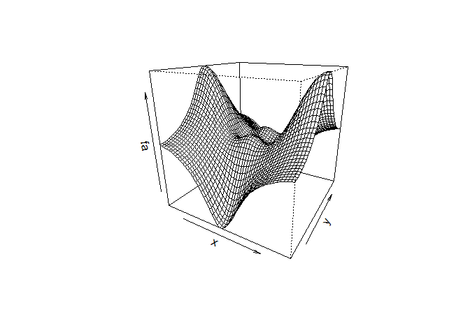

# Lab 2
Min-Yao  
2017?~11??28??  
# Chapter 2 Lab: Introduction to R

```r
# Chapter 2 Lab: Introduction to R

library(ISLR)
```

```
## Warning: package 'ISLR' was built under R version 3.4.2
```

```r
head(Auto)
```

```
##   mpg cylinders displacement horsepower weight acceleration year origin
## 1  18         8          307        130   3504         12.0   70      1
## 2  15         8          350        165   3693         11.5   70      1
## 3  18         8          318        150   3436         11.0   70      1
## 4  16         8          304        150   3433         12.0   70      1
## 5  17         8          302        140   3449         10.5   70      1
## 6  15         8          429        198   4341         10.0   70      1
##                        name
## 1 chevrolet chevelle malibu
## 2         buick skylark 320
## 3        plymouth satellite
## 4             amc rebel sst
## 5               ford torino
## 6          ford galaxie 500
```

```r
# Basic Commands

x <- c(1,3,2,5)
x
```

```
## [1] 1 3 2 5
```

```r
x = c(1,6,2)
x
```

```
## [1] 1 6 2
```

```r
y = c(1,4,3)
length(x)
```

```
## [1] 3
```

```r
length(y)
```

```
## [1] 3
```

```r
x+y
```

```
## [1]  2 10  5
```

```r
ls()
```

```
## [1] "x" "y"
```

```r
rm(x,y)
ls()
```

```
## character(0)
```

```r
rm(list=ls())
#?matrix
x=matrix(data=c(1,2,3,4), nrow=2, ncol=2)
x
```

```
##      [,1] [,2]
## [1,]    1    3
## [2,]    2    4
```

```r
x=matrix(c(1,2,3,4),2,2)
matrix(c(1,2,3,4),2,2,byrow=TRUE)
```

```
##      [,1] [,2]
## [1,]    1    2
## [2,]    3    4
```

```r
sqrt(x)
```

```
##          [,1]     [,2]
## [1,] 1.000000 1.732051
## [2,] 1.414214 2.000000
```

```r
x^2
```

```
##      [,1] [,2]
## [1,]    1    9
## [2,]    4   16
```

```r
x=rnorm(50)
y=x+rnorm(50,mean=50,sd=.1)
cor(x,y)
```

```
## [1] 0.9940219
```

```r
set.seed(1303)
rnorm(50)
```

```
##  [1] -1.1439763145  1.3421293656  2.1853904757  0.5363925179  0.0631929665
##  [6]  0.5022344825 -0.0004167247  0.5658198405 -0.5725226890 -1.1102250073
## [11] -0.0486871234 -0.6956562176  0.8289174803  0.2066528551 -0.2356745091
## [16] -0.5563104914 -0.3647543571  0.8623550343 -0.6307715354  0.3136021252
## [21] -0.9314953177  0.8238676185  0.5233707021  0.7069214120  0.4202043256
## [26] -0.2690521547 -1.5103172999 -0.6902124766 -0.1434719524 -1.0135274099
## [31]  1.5732737361  0.0127465055  0.8726470499  0.4220661905 -0.0188157917
## [36]  2.6157489689 -0.6931401748 -0.2663217810 -0.7206364412  1.3677342065
## [41]  0.2640073322  0.6321868074 -1.3306509858  0.0268888182  1.0406363208
## [46]  1.3120237985 -0.0300020767 -0.2500257125  0.0234144857  1.6598706557
```

```r
set.seed(3)
y=rnorm(100)
mean(y)
```

```
## [1] 0.01103557
```

```r
var(y)
```

```
## [1] 0.7328675
```

```r
sqrt(var(y))
```

```
## [1] 0.8560768
```

```r
sd(y)
```

```
## [1] 0.8560768
```
# Graphics

```r
# Graphics

x=rnorm(100)
y=rnorm(100)
plot(x,y)
```

<!-- -->

```r
plot(x,y,xlab="this is the x-axis",ylab="this is the y-axis",main="Plot of X vs Y")
```

<!-- -->

```r
pdf("Figure.pdf")
plot(x,y,col="green")
dev.off()
```

```
## png 
##   2
```

```r
x=seq(1,10)
x
```

```
##  [1]  1  2  3  4  5  6  7  8  9 10
```

```r
x=1:10
x
```

```
##  [1]  1  2  3  4  5  6  7  8  9 10
```

```r
x=seq(-pi,pi,length=50)
y=x
f=outer(x,y,function(x,y)cos(y)/(1+x^2))
contour(x,y,f)
contour(x,y,f,nlevels=45,add=T)
```

<!-- -->

```r
fa=(f-t(f))/2
contour(x,y,fa,nlevels=15)
```

<!-- -->

```r
image(x,y,fa)
```

<!-- -->

```r
persp(x,y,fa)
```

<!-- -->

```r
persp(x,y,fa,theta=30)
```

<!-- -->

```r
persp(x,y,fa,theta=30,phi=20)
```

<!-- -->

```r
persp(x,y,fa,theta=30,phi=70)
```

<!-- -->

```r
persp(x,y,fa,theta=30,phi=40)
```

<!-- -->
# Indexing Data

```r
# Indexing Data

A=matrix(1:16,4,4)
A
```

```
##      [,1] [,2] [,3] [,4]
## [1,]    1    5    9   13
## [2,]    2    6   10   14
## [3,]    3    7   11   15
## [4,]    4    8   12   16
```

```r
A[2,3]
```

```
## [1] 10
```

```r
A[c(1,3),c(2,4)]
```

```
##      [,1] [,2]
## [1,]    5   13
## [2,]    7   15
```

```r
A[1:3,2:4]
```

```
##      [,1] [,2] [,3]
## [1,]    5    9   13
## [2,]    6   10   14
## [3,]    7   11   15
```

```r
A[1:2,]
```

```
##      [,1] [,2] [,3] [,4]
## [1,]    1    5    9   13
## [2,]    2    6   10   14
```

```r
A[,1:2]
```

```
##      [,1] [,2]
## [1,]    1    5
## [2,]    2    6
## [3,]    3    7
## [4,]    4    8
```

```r
A[1,]
```

```
## [1]  1  5  9 13
```

```r
A[-c(1,3),]
```

```
##      [,1] [,2] [,3] [,4]
## [1,]    2    6   10   14
## [2,]    4    8   12   16
```

```r
A[-c(1,3),-c(1,3,4)]
```

```
## [1] 6 8
```

```r
dim(A)
```

```
## [1] 4 4
```
# Loading Data

```r
# Loading Data

Auto=read.table("Auto.data")
#fix(Auto)
Auto=read.table("Auto.data",header=T,na.strings="?")
#fix(Auto)
Auto=read.csv("Auto.csv",header=T,na.strings="?")
#fix(Auto)
dim(Auto)
```

```
## [1] 397   9
```

```r
Auto[1:4,]
```

```
##   mpg cylinders displacement horsepower weight acceleration year origin
## 1  18         8          307        130   3504         12.0   70      1
## 2  15         8          350        165   3693         11.5   70      1
## 3  18         8          318        150   3436         11.0   70      1
## 4  16         8          304        150   3433         12.0   70      1
##                        name
## 1 chevrolet chevelle malibu
## 2         buick skylark 320
## 3        plymouth satellite
## 4             amc rebel sst
```

```r
Auto=na.omit(Auto)
dim(Auto)
```

```
## [1] 392   9
```

```r
names(Auto)
```

```
## [1] "mpg"          "cylinders"    "displacement" "horsepower"  
## [5] "weight"       "acceleration" "year"         "origin"      
## [9] "name"
```
# Additional Graphical and Numerical Summaries

```r
# Additional Graphical and Numerical Summaries

#plot(cylinders, mpg)
plot(Auto$cylinders, Auto$mpg)
```

<!-- -->

```r
attach(Auto)
plot(cylinders, mpg)
```

<!-- -->

```r
cylinders=as.factor(cylinders)
plot(cylinders, mpg)
```

<!-- -->

```r
plot(cylinders, mpg, col="red")
```

<!-- -->

```r
plot(cylinders, mpg, col="red", varwidth=T)
```

<!-- -->

```r
plot(cylinders, mpg, col="red", varwidth=T,horizontal=T)
```

<!-- -->

```r
plot(cylinders, mpg, col="red", varwidth=T, xlab="cylinders", ylab="MPG")
```

<!-- -->

```r
hist(mpg)
```

<!-- -->

```r
hist(mpg,col=2)
```

<!-- -->

```r
hist(mpg,col=2,breaks=15)
```

<!-- -->

```r
pairs(Auto)
```

<!-- -->

```r
pairs(~ mpg + displacement + horsepower + weight + acceleration, Auto)
```

<!-- -->

```r
plot(horsepower,mpg)
identify(horsepower,mpg,name)
```

<!-- -->

```
## integer(0)
```


# 9.(a)
> quan: mpg, acceleration, weight, horsepower, displacement
> qual: origin, year, cylinders

# 9.(b,C)


```r
summary(Auto)
```

```
##       mpg          cylinders      displacement     horsepower   
##  Min.   : 9.00   Min.   :3.000   Min.   : 68.0   Min.   : 46.0  
##  1st Qu.:17.00   1st Qu.:4.000   1st Qu.:105.0   1st Qu.: 75.0  
##  Median :22.75   Median :4.000   Median :151.0   Median : 93.5  
##  Mean   :23.45   Mean   :5.472   Mean   :194.4   Mean   :104.5  
##  3rd Qu.:29.00   3rd Qu.:8.000   3rd Qu.:275.8   3rd Qu.:126.0  
##  Max.   :46.60   Max.   :8.000   Max.   :455.0   Max.   :230.0  
##                                                                 
##      weight      acceleration        year           origin     
##  Min.   :1613   Min.   : 8.00   Min.   :70.00   Min.   :1.000  
##  1st Qu.:2225   1st Qu.:13.78   1st Qu.:73.00   1st Qu.:1.000  
##  Median :2804   Median :15.50   Median :76.00   Median :1.000  
##  Mean   :2978   Mean   :15.54   Mean   :75.98   Mean   :1.577  
##  3rd Qu.:3615   3rd Qu.:17.02   3rd Qu.:79.00   3rd Qu.:2.000  
##  Max.   :5140   Max.   :24.80   Max.   :82.00   Max.   :3.000  
##                                                                
##                  name    
##  amc matador       :  5  
##  ford pinto        :  5  
##  toyota corolla    :  5  
##  amc gremlin       :  4  
##  amc hornet        :  4  
##  chevrolet chevette:  4  
##  (Other)           :365
```


```r
str(Auto)
```

```
## 'data.frame':	392 obs. of  9 variables:
##  $ mpg         : num  18 15 18 16 17 15 14 14 14 15 ...
##  $ cylinders   : int  8 8 8 8 8 8 8 8 8 8 ...
##  $ displacement: num  307 350 318 304 302 429 454 440 455 390 ...
##  $ horsepower  : int  130 165 150 150 140 198 220 215 225 190 ...
##  $ weight      : int  3504 3693 3436 3433 3449 4341 4354 4312 4425 3850 ...
##  $ acceleration: num  12 11.5 11 12 10.5 10 9 8.5 10 8.5 ...
##  $ year        : int  70 70 70 70 70 70 70 70 70 70 ...
##  $ origin      : int  1 1 1 1 1 1 1 1 1 1 ...
##  $ name        : Factor w/ 304 levels "amc ambassador brougham",..: 49 36 231 14 161 141 54 223 241 2 ...
##  - attr(*, "na.action")=Class 'omit'  Named int [1:5] 33 127 331 337 355
##   .. ..- attr(*, "names")= chr [1:5] "33" "127" "331" "337" ...
```

```r
summary(mpg)
```

```
##    Min. 1st Qu.  Median    Mean 3rd Qu.    Max. 
##    9.00   17.00   22.75   23.45   29.00   46.60
```

```r
range(mpg)
```

```
## [1]  9.0 46.6
```

```r
range(acceleration)
```

```
## [1]  8.0 24.8
```

```r
range(displacement)
```

```
## [1]  68 455
```

```r
range(horsepower)
```

```
## [1]  46 230
```

```r
range(weight)
```

```
## [1] 1613 5140
```

```r
sd(mpg)
```

```
## [1] 7.805007
```

```r
sd(acceleration)
```

```
## [1] 2.758864
```

```r
sd(displacement)
```

```
## [1] 104.644
```

```r
sd(horsepower)
```

```
## [1] 38.49116
```

```r
sd(weight)
```

```
## [1] 849.4026
```

# 9.(d)

```r
new.Auto = Auto[-c(10:85),]
#new.Auto
#Auto

summary(Auto)
```

```
##       mpg          cylinders      displacement     horsepower   
##  Min.   : 9.00   Min.   :3.000   Min.   : 68.0   Min.   : 46.0  
##  1st Qu.:17.00   1st Qu.:4.000   1st Qu.:105.0   1st Qu.: 75.0  
##  Median :22.75   Median :4.000   Median :151.0   Median : 93.5  
##  Mean   :23.45   Mean   :5.472   Mean   :194.4   Mean   :104.5  
##  3rd Qu.:29.00   3rd Qu.:8.000   3rd Qu.:275.8   3rd Qu.:126.0  
##  Max.   :46.60   Max.   :8.000   Max.   :455.0   Max.   :230.0  
##                                                                 
##      weight      acceleration        year           origin     
##  Min.   :1613   Min.   : 8.00   Min.   :70.00   Min.   :1.000  
##  1st Qu.:2225   1st Qu.:13.78   1st Qu.:73.00   1st Qu.:1.000  
##  Median :2804   Median :15.50   Median :76.00   Median :1.000  
##  Mean   :2978   Mean   :15.54   Mean   :75.98   Mean   :1.577  
##  3rd Qu.:3615   3rd Qu.:17.02   3rd Qu.:79.00   3rd Qu.:2.000  
##  Max.   :5140   Max.   :24.80   Max.   :82.00   Max.   :3.000  
##                                                                
##                  name    
##  amc matador       :  5  
##  ford pinto        :  5  
##  toyota corolla    :  5  
##  amc gremlin       :  4  
##  amc hornet        :  4  
##  chevrolet chevette:  4  
##  (Other)           :365
```

```r
summary(new.Auto)
```

```
##       mpg          cylinders      displacement     horsepower   
##  Min.   :11.00   Min.   :3.000   Min.   : 68.0   Min.   : 46.0  
##  1st Qu.:18.00   1st Qu.:4.000   1st Qu.:100.2   1st Qu.: 75.0  
##  Median :23.95   Median :4.000   Median :145.5   Median : 90.0  
##  Mean   :24.40   Mean   :5.373   Mean   :187.2   Mean   :100.7  
##  3rd Qu.:30.55   3rd Qu.:6.000   3rd Qu.:250.0   3rd Qu.:115.0  
##  Max.   :46.60   Max.   :8.000   Max.   :455.0   Max.   :230.0  
##                                                                 
##      weight      acceleration        year           origin     
##  Min.   :1649   Min.   : 8.50   Min.   :70.00   Min.   :1.000  
##  1st Qu.:2214   1st Qu.:14.00   1st Qu.:75.00   1st Qu.:1.000  
##  Median :2792   Median :15.50   Median :77.00   Median :1.000  
##  Mean   :2936   Mean   :15.73   Mean   :77.15   Mean   :1.601  
##  3rd Qu.:3508   3rd Qu.:17.30   3rd Qu.:80.00   3rd Qu.:2.000  
##  Max.   :4997   Max.   :24.80   Max.   :82.00   Max.   :3.000  
##                                                                
##                         name    
##  ford pinto               :  5  
##  toyota corolla           :  5  
##  amc matador              :  4  
##  chevrolet chevette       :  4  
##  amc hornet               :  3  
##  chevrolet caprice classic:  3  
##  (Other)                  :292
```

```r
range(new.Auto$mpg)
```

```
## [1] 11.0 46.6
```

```r
range(new.Auto$acceleration)
```

```
## [1]  8.5 24.8
```

```r
range(new.Auto$displacement)
```

```
## [1]  68 455
```

```r
range(new.Auto$horsepower)
```

```
## [1]  46 230
```

```r
range(new.Auto$weight)
```

```
## [1] 1649 4997
```

```r
sd(new.Auto$mpg)
```

```
## [1] 7.867283
```

```r
sd(new.Auto$acceleration)
```

```
## [1] 2.693721
```

```r
sd(new.Auto$displacement)
```

```
## [1] 99.67837
```

```r
sd(new.Auto$horsepower)
```

```
## [1] 35.70885
```

```r
sd(new.Auto$weight)
```

```
## [1] 811.3002
```

# 9.(e)

```r
#9.(e)
plot(cylinders, mpg, xlab="cylinders", ylab="MPG")
```

<!-- -->

```r
plot(displacement, mpg, xlab="displacement", ylab="MPG")
```

<!-- -->

```r
plot(horsepower, mpg, xlab="horsepower", ylab="MPG")
```

<!-- -->

```r
plot(weight, mpg, xlab="weight", ylab="MPG")
```

<!-- -->

```r
plot(acceleration, mpg, xlab="acceleration", ylab="MPG")
```

<!-- -->

```r
plot(year, mpg, xlab="year", ylab="MPG")
```

<!-- -->

```r
plot(origin, mpg, xlab="origin", ylab="MPG")
```

<!-- -->
# 9.(f)
> The cars with lower displacement, horsepower, weight have higher gas mileage (mpg). 

# 10.(a)

```r
#10.
#(a)
library (MASS)
#Boston
#?Boston
summary(Boston)
```

```
##       crim                zn             indus            chas        
##  Min.   : 0.00632   Min.   :  0.00   Min.   : 0.46   Min.   :0.00000  
##  1st Qu.: 0.08204   1st Qu.:  0.00   1st Qu.: 5.19   1st Qu.:0.00000  
##  Median : 0.25651   Median :  0.00   Median : 9.69   Median :0.00000  
##  Mean   : 3.61352   Mean   : 11.36   Mean   :11.14   Mean   :0.06917  
##  3rd Qu.: 3.67708   3rd Qu.: 12.50   3rd Qu.:18.10   3rd Qu.:0.00000  
##  Max.   :88.97620   Max.   :100.00   Max.   :27.74   Max.   :1.00000  
##       nox               rm             age              dis        
##  Min.   :0.3850   Min.   :3.561   Min.   :  2.90   Min.   : 1.130  
##  1st Qu.:0.4490   1st Qu.:5.886   1st Qu.: 45.02   1st Qu.: 2.100  
##  Median :0.5380   Median :6.208   Median : 77.50   Median : 3.207  
##  Mean   :0.5547   Mean   :6.285   Mean   : 68.57   Mean   : 3.795  
##  3rd Qu.:0.6240   3rd Qu.:6.623   3rd Qu.: 94.08   3rd Qu.: 5.188  
##  Max.   :0.8710   Max.   :8.780   Max.   :100.00   Max.   :12.127  
##       rad              tax           ptratio          black       
##  Min.   : 1.000   Min.   :187.0   Min.   :12.60   Min.   :  0.32  
##  1st Qu.: 4.000   1st Qu.:279.0   1st Qu.:17.40   1st Qu.:375.38  
##  Median : 5.000   Median :330.0   Median :19.05   Median :391.44  
##  Mean   : 9.549   Mean   :408.2   Mean   :18.46   Mean   :356.67  
##  3rd Qu.:24.000   3rd Qu.:666.0   3rd Qu.:20.20   3rd Qu.:396.23  
##  Max.   :24.000   Max.   :711.0   Max.   :22.00   Max.   :396.90  
##      lstat            medv      
##  Min.   : 1.73   Min.   : 5.00  
##  1st Qu.: 6.95   1st Qu.:17.02  
##  Median :11.36   Median :21.20  
##  Mean   :12.65   Mean   :22.53  
##  3rd Qu.:16.95   3rd Qu.:25.00  
##  Max.   :37.97   Max.   :50.00
```

```r
str(Boston)
```

```
## 'data.frame':	506 obs. of  14 variables:
##  $ crim   : num  0.00632 0.02731 0.02729 0.03237 0.06905 ...
##  $ zn     : num  18 0 0 0 0 0 12.5 12.5 12.5 12.5 ...
##  $ indus  : num  2.31 7.07 7.07 2.18 2.18 2.18 7.87 7.87 7.87 7.87 ...
##  $ chas   : int  0 0 0 0 0 0 0 0 0 0 ...
##  $ nox    : num  0.538 0.469 0.469 0.458 0.458 0.458 0.524 0.524 0.524 0.524 ...
##  $ rm     : num  6.58 6.42 7.18 7 7.15 ...
##  $ age    : num  65.2 78.9 61.1 45.8 54.2 58.7 66.6 96.1 100 85.9 ...
##  $ dis    : num  4.09 4.97 4.97 6.06 6.06 ...
##  $ rad    : int  1 2 2 3 3 3 5 5 5 5 ...
##  $ tax    : num  296 242 242 222 222 222 311 311 311 311 ...
##  $ ptratio: num  15.3 17.8 17.8 18.7 18.7 18.7 15.2 15.2 15.2 15.2 ...
##  $ black  : num  397 397 393 395 397 ...
##  $ lstat  : num  4.98 9.14 4.03 2.94 5.33 ...
##  $ medv   : num  24 21.6 34.7 33.4 36.2 28.7 22.9 27.1 16.5 18.9 ...
```

```r
dim(Boston)
```

```
## [1] 506  14
```
> 506 rows and 14 columns

>This data frame contains the following columns:

crim
per capita crime rate by town.

zn
proportion of residential land zoned for lots over 25,000 sq.ft.

indus
proportion of non-retail business acres per town.

chas
Charles River dummy variable (= 1 if tract bounds river; 0 otherwise).

nox
nitrogen oxides concentration (parts per 10 million).

rm
average number of rooms per dwelling.

age
proportion of owner-occupied units built prior to 1940.

dis
weighted mean of distances to five Boston employment centres.

rad
index of accessibility to radial highways.

tax
full-value property-tax rate per \$10,000.

ptratio
pupil-teacher ratio by town.

black
1000(Bk - 0.63)^2 where Bk is the proportion of blacks by town.

lstat
lower status of the population (percent).

medv
median value of owner-occupied homes in \$1000s.

# 10(b-c)

```r
#(b)
pairs(Boston)
```

<!-- -->

```r
#(c)
attach(Boston)
plot(zn, crim, xlab="zn", ylab="crim")
```

<!-- -->

```r
plot(indus, crim, xlab="indus", ylab="crim")
```

<!-- -->

```r
plot(chas, crim, xlab="chas", ylab="crim")
```

<!-- -->

```r
plot(nox, crim, xlab="nox", ylab="crim")
```

<!-- -->

```r
plot(rm, crim, xlab="rm", ylab="crim")
```

<!-- -->

```r
plot(age, crim, xlab="age", ylab="crim")
```

<!-- -->

```r
plot(dis, crim, xlab="dis", ylab="crim")
```

<!-- -->

```r
plot(rad, crim, xlab="rad", ylab="crim")
```

<!-- -->

```r
plot(tax, crim, xlab="tax", ylab="crim")
```

<!-- -->

```r
plot(ptratio, crim, xlab="ptratio", ylab="crim")
```

<!-- -->

```r
plot(black, crim, xlab="black", ylab="crim")
```

<!-- -->

```r
plot(lstat, crim, xlab="lstat", ylab="crim")
```

<!-- -->

```r
plot(medv, crim, xlab="medv", ylab="crim")
```

<!-- -->

#10(d-h)


```r
#(d)
summary(Boston$crim)
```

```
##     Min.  1st Qu.   Median     Mean  3rd Qu.     Max. 
##  0.00632  0.08204  0.25651  3.61352  3.67708 88.97620
```

```r
range(Boston$crim)
```

```
## [1]  0.00632 88.97620
```

```r
summary(Boston$tax)
```

```
##    Min. 1st Qu.  Median    Mean 3rd Qu.    Max. 
##   187.0   279.0   330.0   408.2   666.0   711.0
```

```r
range(Boston$tax)
```

```
## [1] 187 711
```

```r
summary(Boston$ptratio)
```

```
##    Min. 1st Qu.  Median    Mean 3rd Qu.    Max. 
##   12.60   17.40   19.05   18.46   20.20   22.00
```

```r
range(Boston$ptratio)
```

```
## [1] 12.6 22.0
```

```r
#(e)
as.data.frame(table(Boston$chas))
```

```
##   Var1 Freq
## 1    0  471
## 2    1   35
```

```r
#(f)
summary(Boston$ptratio)
```

```
##    Min. 1st Qu.  Median    Mean 3rd Qu.    Max. 
##   12.60   17.40   19.05   18.46   20.20   22.00
```

```r
#(g)
summary(Boston$medv)
```

```
##    Min. 1st Qu.  Median    Mean 3rd Qu.    Max. 
##    5.00   17.02   21.20   22.53   25.00   50.00
```

```r
range(Boston$medv)
```

```
## [1]  5 50
```

```r
as.data.frame(table(Boston$medv))
```

```
##     Var1 Freq
## 1      5    2
## 2    5.6    1
## 3    6.3    1
## 4      7    2
## 5    7.2    3
## 6    7.4    1
## 7    7.5    1
## 8    8.1    1
## 9    8.3    2
## 10   8.4    2
## 11   8.5    2
## 12   8.7    1
## 13   8.8    2
## 14   9.5    1
## 15   9.6    1
## 16   9.7    1
## 17  10.2    3
## 18  10.4    2
## 19  10.5    2
## 20  10.8    1
## 21  10.9    2
## 22    11    1
## 23  11.3    1
## 24  11.5    1
## 25  11.7    2
## 26  11.8    2
## 27  11.9    2
## 28    12    1
## 29  12.1    1
## 30  12.3    1
## 31  12.5    1
## 32  12.6    1
## 33  12.7    3
## 34  12.8    1
## 35    13    1
## 36  13.1    4
## 37  13.2    1
## 38  13.3    3
## 39  13.4    4
## 40  13.5    2
## 41  13.6    2
## 42  13.8    5
## 43  13.9    2
## 44    14    1
## 45  14.1    3
## 46  14.2    1
## 47  14.3    2
## 48  14.4    2
## 49  14.5    3
## 50  14.6    2
## 51  14.8    1
## 52  14.9    3
## 53    15    3
## 54  15.1    1
## 55  15.2    3
## 56  15.3    1
## 57  15.4    2
## 58  15.6    5
## 59  15.7    1
## 60    16    1
## 61  16.1    3
## 62  16.2    2
## 63  16.3    1
## 64  16.4    1
## 65  16.5    2
## 66  16.6    2
## 67  16.7    2
## 68  16.8    2
## 69    17    1
## 70  17.1    3
## 71  17.2    3
## 72  17.3    1
## 73  17.4    3
## 74  17.5    3
## 75  17.6    1
## 76  17.7    1
## 77  17.8    5
## 78  17.9    1
## 79    18    1
## 80  18.1    1
## 81  18.2    3
## 82  18.3    2
## 83  18.4    3
## 84  18.5    4
## 85  18.6    2
## 86  18.7    3
## 87  18.8    2
## 88  18.9    4
## 89    19    2
## 90  19.1    4
## 91  19.2    2
## 92  19.3    5
## 93  19.4    6
## 94  19.5    4
## 95  19.6    5
## 96  19.7    2
## 97  19.8    3
## 98  19.9    4
## 99    20    5
## 100 20.1    5
## 101 20.2    2
## 102 20.3    4
## 103 20.4    4
## 104 20.5    3
## 105 20.6    6
## 106 20.7    2
## 107 20.8    3
## 108 20.9    2
## 109   21    3
## 110 21.1    2
## 111 21.2    5
## 112 21.4    5
## 113 21.5    2
## 114 21.6    2
## 115 21.7    7
## 116 21.8    2
## 117 21.9    3
## 118   22    7
## 119 22.1    1
## 120 22.2    5
## 121 22.3    2
## 122 22.4    2
## 123 22.5    3
## 124 22.6    5
## 125 22.7    2
## 126 22.8    4
## 127 22.9    4
## 128   23    4
## 129 23.1    7
## 130 23.2    4
## 131 23.3    4
## 132 23.4    2
## 133 23.5    1
## 134 23.6    2
## 135 23.7    4
## 136 23.8    4
## 137 23.9    5
## 138   24    2
## 139 24.1    3
## 140 24.2    1
## 141 24.3    3
## 142 24.4    4
## 143 24.5    3
## 144 24.6    2
## 145 24.7    3
## 146 24.8    4
## 147   25    8
## 148 25.1    1
## 149 25.2    1
## 150 25.3    1
## 151 26.2    1
## 152 26.4    2
## 153 26.5    1
## 154 26.6    3
## 155 26.7    1
## 156   27    1
## 157 27.1    2
## 158 27.5    4
## 159 27.9    2
## 160   28    1
## 161 28.1    1
## 162 28.2    1
## 163 28.4    2
## 164 28.5    1
## 165 28.6    1
## 166 28.7    3
## 167   29    2
## 168 29.1    2
## 169 29.4    1
## 170 29.6    2
## 171 29.8    2
## 172 29.9    1
## 173 30.1    3
## 174 30.3    1
## 175 30.5    1
## 176 30.7    1
## 177 30.8    1
## 178   31    1
## 179 31.1    1
## 180 31.2    1
## 181 31.5    2
## 182 31.6    2
## 183 31.7    1
## 184   32    2
## 185 32.2    1
## 186 32.4    1
## 187 32.5    1
## 188 32.7    1
## 189 32.9    1
## 190   33    1
## 191 33.1    2
## 192 33.2    2
## 193 33.3    1
## 194 33.4    2
## 195 33.8    1
## 196 34.6    1
## 197 34.7    1
## 198 34.9    3
## 199 35.1    1
## 200 35.2    1
## 201 35.4    2
## 202   36    1
## 203 36.1    1
## 204 36.2    2
## 205 36.4    1
## 206 36.5    1
## 207   37    1
## 208 37.2    1
## 209 37.3    1
## 210 37.6    1
## 211 37.9    1
## 212 38.7    1
## 213 39.8    1
## 214 41.3    1
## 215 41.7    1
## 216 42.3    1
## 217 42.8    1
## 218 43.1    1
## 219 43.5    1
## 220 43.8    1
## 221   44    1
## 222 44.8    1
## 223 45.4    1
## 224   46    1
## 225 46.7    1
## 226 48.3    1
## 227 48.5    1
## 228 48.8    1
## 229   50   16
```

```r
min(Boston$medv)
```

```
## [1] 5
```

```r
attach(Boston)
```

```
## The following objects are masked from Boston (pos = 3):
## 
##     age, black, chas, crim, dis, indus, lstat, medv, nox, ptratio,
##     rad, rm, tax, zn
```

```r
newBoston <- Boston[order(medv),] 
newBoston
```

```
##         crim    zn indus chas    nox    rm   age     dis rad tax ptratio
## 399 38.35180   0.0 18.10    0 0.6930 5.453 100.0  1.4896  24 666    20.2
## 406 67.92080   0.0 18.10    0 0.6930 5.683 100.0  1.4254  24 666    20.2
## 401 25.04610   0.0 18.10    0 0.6930 5.987 100.0  1.5888  24 666    20.2
## 400  9.91655   0.0 18.10    0 0.6930 5.852  77.8  1.5004  24 666    20.2
## 415 45.74610   0.0 18.10    0 0.6930 4.519 100.0  1.6582  24 666    20.2
## 490  0.18337   0.0 27.74    0 0.6090 5.414  98.3  1.7554   4 711    20.1
## 386 16.81180   0.0 18.10    0 0.7000 5.277  98.1  1.4261  24 666    20.2
## 402 14.23620   0.0 18.10    0 0.6930 6.343 100.0  1.5741  24 666    20.2
## 416 18.08460   0.0 18.10    0 0.6790 6.434 100.0  1.8347  24 666    20.2
## 388 22.59710   0.0 18.10    0 0.7000 5.000  89.5  1.5184  24 666    20.2
## 417 10.83420   0.0 18.10    0 0.6790 6.782  90.8  1.8195  24 666    20.2
## 491  0.20746   0.0 27.74    0 0.6090 5.093  98.0  1.8226   4 711    20.1
## 404 24.80170   0.0 18.10    0 0.6930 5.349  96.0  1.7028  24 666    20.2
## 426 15.86030   0.0 18.10    0 0.6790 5.896  95.4  1.9096  24 666    20.2
## 420 11.81230   0.0 18.10    0 0.7180 6.824  76.5  1.7940  24 666    20.2
## 439 13.67810   0.0 18.10    0 0.7400 5.935  87.9  1.8206  24 666    20.2
## 398  7.67202   0.0 18.10    0 0.6930 5.747  98.9  1.6334  24 666    20.2
## 405 41.52920   0.0 18.10    0 0.6930 5.531  85.4  1.6074  24 666    20.2
## 438 15.17720   0.0 18.10    0 0.7400 6.152 100.0  1.9142  24 666    20.2
## 385 20.08490   0.0 18.10    0 0.7000 4.368  91.2  1.4395  24 666    20.2
## 419 73.53410   0.0 18.10    0 0.6790 5.957 100.0  1.8026  24 666    20.2
## 430  9.33889   0.0 18.10    0 0.6790 6.380  95.6  1.9682  24 666    20.2
## 437 14.42080   0.0 18.10    0 0.7400 6.461  93.3  2.0026  24 666    20.2
## 393 11.57790   0.0 18.10    0 0.7000 5.036  97.0  1.7700  24 666    20.2
## 380 17.86670   0.0 18.10    0 0.6710 6.223 100.0  1.3861  24 666    20.2
## 389 14.33370   0.0 18.10    0 0.7000 4.880 100.0  1.5895  24 666    20.2
## 427 12.24720   0.0 18.10    0 0.5840 5.837  59.7  1.9976  24 666    20.2
## 381 88.97620   0.0 18.10    0 0.6710 6.968  91.9  1.4165  24 666    20.2
## 418 25.94060   0.0 18.10    0 0.6790 5.304  89.1  1.6475  24 666    20.2
## 387 24.39380   0.0 18.10    0 0.7000 4.652 100.0  1.4672  24 666    20.2
## 441 22.05110   0.0 18.10    0 0.7400 5.818  92.4  1.8662  24 666    20.2
## 445 12.80230   0.0 18.10    0 0.7400 5.854  96.6  1.8956  24 666    20.2
## 382 15.87440   0.0 18.10    0 0.6710 6.545  99.1  1.5192  24 666    20.2
## 428 37.66190   0.0 18.10    0 0.6790 6.202  78.7  1.8629  24 666    20.2
## 429  7.36711   0.0 18.10    0 0.6790 6.193  78.1  1.9356  24 666    20.2
## 383  9.18702   0.0 18.10    0 0.7000 5.536 100.0  1.5804  24 666    20.2
## 390  8.15174   0.0 18.10    0 0.7000 5.390  98.9  1.7281  24 666    20.2
## 425  8.79212   0.0 18.10    0 0.5840 5.565  70.6  2.0635  24 666    20.2
## 435 13.91340   0.0 18.10    0 0.7130 6.208  95.0  2.2222  24 666    20.2
## 145  2.77974   0.0 19.58    0 0.8710 4.903  97.8  1.3459   5 403    14.7
## 446 10.67180   0.0 18.10    0 0.7400 6.459  94.8  1.9879  24 666    20.2
## 407 20.71620   0.0 18.10    0 0.6590 4.138 100.0  1.1781  24 666    20.2
## 506  0.04741   0.0 11.93    0 0.5730 6.030  80.8  2.5050   1 273    21.0
## 478 15.02340   0.0 18.10    0 0.6140 5.304  97.3  2.1007  24 666    20.2
## 403  9.59571   0.0 18.10    0 0.6930 6.404 100.0  1.6390  24 666    20.2
## 384  7.99248   0.0 18.10    0 0.7000 5.520 100.0  1.5331  24 666    20.2
## 397  5.87205   0.0 18.10    0 0.6930 6.405  96.0  1.6768  24 666    20.2
## 448  9.92485   0.0 18.10    0 0.7400 6.251  96.6  2.1980  24 666    20.2
## 31   1.13081   0.0  8.14    0 0.5380 5.713  94.1  4.2330   4 307    21.0
## 395 13.35980   0.0 18.10    0 0.6930 5.887  94.7  1.7821  24 666    20.2
## 457  4.66883   0.0 18.10    0 0.7130 5.976  87.9  2.5806  24 666    20.2
## 440  9.39063   0.0 18.10    0 0.7400 5.627  93.9  1.8172  24 666    20.2
## 450  7.52601   0.0 18.10    0 0.7130 6.417  98.3  2.1850  24 666    20.2
## 34   1.15172   0.0  8.14    0 0.5380 5.701  95.0  3.7872   4 307    21.0
## 157  2.44668   0.0 19.58    0 0.8710 5.272  94.0  1.7364   5 403    14.7
## 379 23.64820   0.0 18.10    0 0.6710 6.380  96.2  1.3861  24 666    20.2
## 396  8.71675   0.0 18.10    0 0.6930 6.471  98.8  1.7257  24 666    20.2
## 33   1.38799   0.0  8.14    0 0.5380 5.950  82.0  3.9900   4 307    21.0
## 139  0.24980   0.0 21.89    0 0.6240 5.857  98.2  1.6686   4 437    21.2
## 378  9.82349   0.0 18.10    0 0.6710 6.794  98.8  1.3580  24 666    20.2
## 476  6.39312   0.0 18.10    0 0.5840 6.162  97.4  2.2060  24 666    20.2
## 143  3.32105   0.0 19.58    1 0.8710 5.403 100.0  1.3216   5 403    14.7
## 424  7.05042   0.0 18.10    0 0.6140 6.103  85.1  2.0218  24 666    20.2
## 436 11.16040   0.0 18.10    0 0.7400 6.629  94.6  2.1247  24 666    20.2
## 451  6.71772   0.0 18.10    0 0.7130 6.749  92.6  2.3236  24 666    20.2
## 35   1.61282   0.0  8.14    0 0.5380 6.096  96.9  3.7598   4 307    21.0
## 458  8.20058   0.0 18.10    0 0.7130 5.936  80.3  2.7792  24 666    20.2
## 21   1.25179   0.0  8.14    0 0.5380 5.570  98.1  3.7979   4 307    21.0
## 492  0.10574   0.0 27.74    0 0.6090 5.983  98.8  1.8681   4 711    20.1
## 146  2.37934   0.0 19.58    0 0.8710 6.130 100.0  1.4191   5 403    14.7
## 374 11.10810   0.0 18.10    0 0.6680 4.906 100.0  1.1742  24 666    20.2
## 375 18.49820   0.0 18.10    0 0.6680 4.138 100.0  1.1370  24 666    20.2
## 394  8.64476   0.0 18.10    0 0.6930 6.193  92.6  1.7912  24 666    20.2
## 475  8.05579   0.0 18.10    0 0.5840 5.427  95.4  2.4298  24 666    20.2
## 26   0.84054   0.0  8.14    0 0.5380 5.599  85.7  4.4546   4 307    21.0
## 377 15.28800   0.0 18.10    0 0.6710 6.649  93.3  1.3449  24 666    20.2
## 141  0.29090   0.0 21.89    0 0.6240 6.174  93.6  1.6119   4 437    21.2
## 432 10.06230   0.0 18.10    0 0.5840 6.833  94.3  2.0882  24 666    20.2
## 449  9.32909   0.0 18.10    0 0.7130 6.185  98.7  2.2616  24 666    20.2
## 456  4.75237   0.0 18.10    0 0.7130 6.525  86.5  2.4358  24 666    20.2
## 422  7.02259   0.0 18.10    0 0.7180 6.006  95.3  1.8746  24 666    20.2
## 130  0.88125   0.0 21.89    0 0.6240 5.637  94.7  1.9799   4 437    21.2
## 434  5.58107   0.0 18.10    0 0.7130 6.436  87.9  2.3158  24 666    20.2
## 49   0.25387   0.0  6.91    0 0.4480 5.399  95.3  5.8700   3 233    17.9
## 142  1.62864   0.0 21.89    0 0.6240 5.019 100.0  1.4394   4 437    21.2
## 24   0.98843   0.0  8.14    0 0.5380 5.813 100.0  4.0952   4 307    21.0
## 32   1.35472   0.0  8.14    0 0.5380 6.072 100.0  4.1750   4 307    21.0
## 431  8.49213   0.0 18.10    0 0.5840 6.348  86.1  2.0527  24 666    20.2
## 148  2.36862   0.0 19.58    0 0.8710 4.926  95.7  1.4608   5 403    14.7
## 479 10.23300   0.0 18.10    0 0.6140 6.185  96.7  2.1705  24 666    20.2
## 28   0.95577   0.0  8.14    0 0.5380 6.047  88.8  4.4534   4 307    21.0
## 447  6.28807   0.0 18.10    0 0.7400 6.341  96.4  2.0720  24 666    20.2
## 455  9.51363   0.0 18.10    0 0.7130 6.728  94.1  2.4961  24 666    20.2
## 459  7.75223   0.0 18.10    0 0.7130 6.301  83.7  2.7831  24 666    20.2
## 11   0.22489  12.5  7.87    0 0.5240 6.377  94.3  6.3467   5 311    15.2
## 376 19.60910   0.0 18.10    0 0.6710 7.313  97.9  1.3163  24 666    20.2
## 411 51.13580   0.0 18.10    0 0.5970 5.757 100.0  1.4130  24 666    20.2
## 391  6.96215   0.0 18.10    0 0.7000 5.713  97.0  1.9265  24 666    20.2
## 23   1.23247   0.0  8.14    0 0.5380 6.142  91.7  3.9769   4 307    21.0
## 452  5.44114   0.0 18.10    0 0.7130 6.655  98.2  2.3552  24 666    20.2
## 489  0.15086   0.0 27.74    0 0.6090 5.454  92.7  1.8209   4 711    20.1
## 153  1.12658   0.0 19.58    1 0.8710 5.012  88.0  1.6102   5 403    14.7
## 150  2.73397   0.0 19.58    0 0.8710 5.597  94.9  1.5257   5 403    14.7
## 444  9.96654   0.0 18.10    0 0.7400 6.485 100.0  1.9784  24 666    20.2
## 25   0.75026   0.0  8.14    0 0.5380 5.924  94.1  4.3996   4 307    21.0
## 135  0.97617   0.0 21.89    0 0.6240 5.757  98.4  2.3460   4 437    21.2
## 144  4.09740   0.0 19.58    0 0.8710 5.468 100.0  1.4118   5 403    14.7
## 147  2.15505   0.0 19.58    0 0.8710 5.628 100.0  1.5166   5 403    14.7
## 156  3.53501   0.0 19.58    1 0.8710 6.152  82.6  1.7455   5 403    14.7
## 127  0.38735   0.0 25.65    0 0.5810 5.613  95.6  1.7572   2 188    19.1
## 62   0.17171  25.0  5.13    0 0.4530 5.966  93.4  6.8185   8 284    19.7
## 311  2.63548   0.0  9.90    0 0.5440 4.973  37.8  2.5194   4 304    18.4
## 433  6.44405   0.0 18.10    0 0.5840 6.425  74.8  2.2004  24 666    20.2
## 453  5.09017   0.0 18.10    0 0.7130 6.297  91.8  2.3682  24 666    20.2
## 128  0.25915   0.0 21.89    0 0.6240 5.693  96.0  1.7883   4 437    21.2
## 316  0.25356   0.0  9.90    0 0.5440 5.705  77.7  3.9450   4 304    18.4
## 414 28.65580   0.0 18.10    0 0.5970 5.155 100.0  1.5894  24 666    20.2
## 461  4.81213   0.0 18.10    0 0.7130 6.701  90.0  2.5975  24 666    20.2
## 9    0.21124  12.5  7.87    0 0.5240 5.631 100.0  6.0821   5 311    15.2
## 343  0.02498   0.0  1.89    0 0.5180 6.540  59.7  6.2669   1 422    15.9
## 27   0.67191   0.0  8.14    0 0.5380 5.813  90.3  4.6820   4 307    21.0
## 48   0.22927   0.0  6.91    0 0.4480 6.030  85.5  5.6894   3 233    17.9
## 421 11.08740   0.0 18.10    0 0.7180 6.411 100.0  1.8589  24 666    20.2
## 477  4.87141   0.0 18.10    0 0.6140 6.484  93.6  2.3053  24 666    20.2
## 364  4.22239   0.0 18.10    1 0.7700 5.803  89.0  1.9047  24 666    20.2
## 501  0.22438   0.0  9.69    0 0.5850 6.027  79.7  2.4982   6 391    19.2
## 155  1.41385   0.0 19.58    1 0.8710 6.129  96.0  1.7494   5 403    14.7
## 138  0.35233   0.0 21.89    0 0.6240 6.454  98.4  1.8498   4 437    21.2
## 332  0.05023  35.0  6.06    0 0.4379 5.706  28.4  6.6407   1 304    16.9
## 442  9.72418   0.0 18.10    0 0.7400 6.406  97.2  2.0651  24 666    20.2
## 347  0.06162   0.0  4.39    0 0.4420 5.898  52.3  8.0136   3 352    18.8
## 409  7.40389   0.0 18.10    0 0.5970 5.617  97.9  1.4547  24 666    20.2
## 412 14.05070   0.0 18.10    0 0.5970 6.657 100.0  1.5275  24 666    20.2
## 124  0.15038   0.0 25.65    0 0.5810 5.856  97.0  1.9444   2 188    19.1
## 69   0.13554  12.5  6.07    0 0.4090 5.594  36.8  6.4980   4 345    18.9
## 137  0.32264   0.0 21.89    0 0.6240 5.942  93.5  1.9669   4 437    21.2
## 171  1.20742   0.0 19.58    0 0.6050 5.875  94.6  2.4259   5 403    14.7
## 18   0.78420   0.0  8.14    0 0.5380 5.990  81.7  4.2579   4 307    21.0
## 346  0.03113   0.0  4.39    0 0.4420 6.014  48.5  8.0136   3 352    18.8
## 500  0.17783   0.0  9.69    0 0.5850 5.569  73.5  2.3999   6 391    19.2
## 245  0.20608  22.0  5.86    0 0.4310 5.593  76.5  7.9549   7 330    19.1
## 462  3.69311   0.0 18.10    0 0.7130 6.376  88.4  2.5671  24 666    20.2
## 140  0.54452   0.0 21.89    0 0.6240 6.151  97.9  1.6687   4 437    21.2
## 149  2.33099   0.0 19.58    0 0.8710 5.186  93.8  1.5296   5 403    14.7
## 317  0.31827   0.0  9.90    0 0.5440 5.914  83.2  3.9986   4 304    18.4
## 357  8.98296   0.0 18.10    1 0.7700 6.212  97.4  2.1222  24 666    20.2
## 454  8.24809   0.0 18.10    0 0.7130 7.393  99.3  2.4527  24 666    20.2
## 413 18.81100   0.0 18.10    0 0.5970 4.628 100.0  1.5539  24 666    20.2
## 129  0.32543   0.0 21.89    0 0.6240 6.431  98.8  1.8125   4 437    21.2
## 136  0.55778   0.0 21.89    0 0.6240 6.335  98.2  2.1107   4 437    21.2
## 15   0.63796   0.0  8.14    0 0.5380 6.096  84.5  4.4619   4 307    21.0
## 20   0.72580   0.0  8.14    0 0.5380 5.727  69.5  3.7965   4 307    21.0
## 355  0.04301  80.0  1.91    0 0.4130 5.663  21.9 10.5857   4 334    22.0
## 116  0.17134   0.0 10.01    0 0.5470 5.928  88.2  2.4631   6 432    17.8
## 498  0.26838   0.0  9.69    0 0.5850 5.794  70.6  2.8927   6 391    19.2
## 29   0.77299   0.0  8.14    0 0.5380 6.495  94.4  4.4547   4 307    21.0
## 134  0.32982   0.0 21.89    0 0.6240 5.822  95.4  2.4699   4 437    21.2
## 443  5.66637   0.0 18.10    0 0.7400 6.219 100.0  2.0048  24 666    20.2
## 115  0.14231   0.0 10.01    0 0.5470 6.254  84.2  2.2565   6 432    17.8
## 246  0.19133  22.0  5.86    0 0.4310 5.605  70.2  7.9549   7 330    19.1
## 324  0.28392   0.0  7.38    0 0.4930 5.708  74.3  4.7211   5 287    19.6
## 338  0.03041   0.0  5.19    0 0.5150 5.895  59.6  5.6150   5 224    20.2
## 103  0.22876   0.0  8.56    0 0.5200 6.405  85.4  2.7147   5 384    20.9
## 353  0.07244  60.0  1.69    0 0.4110 5.884  18.5 10.7103   4 411    18.3
## 61   0.14932  25.0  5.13    0 0.4530 5.741  66.2  7.2254   8 284    19.7
## 114  0.22212   0.0 10.01    0 0.5470 6.092  95.4  2.5480   6 432    17.8
## 341  0.06151   0.0  5.19    0 0.5150 5.968  58.5  4.8122   5 224    20.2
## 113  0.12329   0.0 10.01    0 0.5470 5.913  92.9  2.3534   6 432    17.8
## 125  0.09849   0.0 25.65    0 0.5810 5.879  95.8  2.0063   2 188    19.1
## 10   0.17004  12.5  7.87    0 0.5240 6.004  85.9  6.5921   5 311    15.2
## 12   0.11747  12.5  7.87    0 0.5240 6.009  82.9  6.2267   5 311    15.2
## 36   0.06417   0.0  5.96    0 0.4990 5.933  68.2  3.3603   5 279    19.2
## 55   0.01360  75.0  4.00    0 0.4100 5.888  47.6  7.3197   3 469    21.1
## 340  0.05497   0.0  5.19    0 0.5150 5.985  45.4  4.8122   5 224    20.2
## 467  3.77498   0.0 18.10    0 0.6550 5.952  84.7  2.8715  24 666    20.2
## 172  2.31390   0.0 19.58    0 0.6050 5.880  97.3  2.3887   5 403    14.7
## 468  4.42228   0.0 18.10    0 0.5840 6.003  94.5  2.5403  24 666    20.2
## 469 15.57570   0.0 18.10    0 0.5800 5.926  71.0  2.9084  24 666    20.2
## 487  5.69175   0.0 18.10    0 0.5830 6.114  79.8  3.5459  24 666    20.2
## 118  0.15098   0.0 10.01    0 0.5470 6.021  82.6  2.7474   6 432    17.8
## 131  0.34006   0.0 21.89    0 0.6240 6.458  98.9  2.1185   4 437    21.2
## 46   0.17142   0.0  6.91    0 0.4480 5.682  33.8  5.1004   3 233    17.9
## 104  0.21161   0.0  8.56    0 0.5200 6.137  87.4  2.7147   5 384    20.9
## 120  0.14476   0.0 10.01    0 0.5470 5.731  65.2  2.7592   6 432    17.8
## 212  0.37578   0.0 10.59    1 0.4890 5.404  88.6  3.6650   4 277    18.6
## 329  0.06617   0.0  3.24    0 0.4600 5.868  25.8  5.2146   4 430    16.9
## 50   0.21977   0.0  6.91    0 0.4480 5.602  62.0  6.0877   3 233    17.9
## 67   0.04379  80.0  3.37    0 0.3980 5.787  31.1  6.6115   4 337    16.1
## 110  0.26363   0.0  8.56    0 0.5200 6.229  91.2  2.5451   5 384    20.9
## 154  2.14918   0.0 19.58    0 0.8710 5.709  98.5  1.6232   5 403    14.7
## 313  0.26169   0.0  9.90    0 0.5440 6.023  90.4  2.8340   4 304    18.4
## 333  0.03466  35.0  6.06    0 0.4379 6.031  23.3  6.6407   1 304    16.9
## 106  0.13262   0.0  8.56    0 0.5200 5.851  96.7  2.1069   5 384    20.9
## 107  0.17120   0.0  8.56    0 0.5200 5.836  91.9  2.2110   5 384    20.9
## 337  0.03427   0.0  5.19    0 0.5150 5.869  46.3  5.2311   5 224    20.2
## 463  6.65492   0.0 18.10    0 0.7130 6.317  83.0  2.7344  24 666    20.2
## 22   0.85204   0.0  8.14    0 0.5380 5.965  89.2  4.0123   4 307    21.0
## 60   0.10328  25.0  5.13    0 0.4530 5.927  47.2  6.9320   8 284    19.7
## 132  1.19294   0.0 21.89    0 0.6240 6.326  97.7  2.2710   4 437    21.2
## 152  1.49632   0.0 19.58    0 0.8710 5.404 100.0  1.5916   5 403    14.7
## 472  4.03841   0.0 18.10    0 0.5320 6.229  90.7  3.0993  24 666    20.2
## 51   0.08873  21.0  5.64    0 0.4390 5.963  45.7  6.8147   4 243    16.8
## 497  0.28960   0.0  9.69    0 0.5850 5.390  72.9  2.7986   6 391    19.2
## 109  0.12802   0.0  8.56    0 0.5200 6.474  97.1  2.4329   5 384    20.9
## 318  0.24522   0.0  9.90    0 0.5440 5.782  71.7  4.0317   4 304    18.4
## 331  0.04544   0.0  3.24    0 0.4600 6.144  32.2  5.8736   4 430    16.9
## 16   0.62739   0.0  8.14    0 0.5380 5.834  56.5  4.4986   4 307    21.0
## 362  3.83684   0.0 18.10    0 0.7700 6.251  91.1  2.2955  24 666    20.2
## 466  3.16360   0.0 18.10    0 0.6550 5.759  48.2  3.0665  24 666    20.2
## 471  4.34879   0.0 18.10    0 0.5800 6.167  84.0  3.0334  24 666    20.2
## 37   0.09744   0.0  5.96    0 0.4990 5.841  61.4  3.3779   5 279    19.2
## 47   0.18836   0.0  6.91    0 0.4480 5.786  33.3  5.1004   3 233    17.9
## 77   0.10153   0.0 12.83    0 0.4370 6.279  74.5  4.0522   5 398    18.7
## 210  0.43571   0.0 10.59    1 0.4890 5.344 100.0  3.8750   4 277    18.6
## 460  6.80117   0.0 18.10    0 0.7130 6.081  84.4  2.7175  24 666    20.2
## 105  0.13960   0.0  8.56    0 0.5200 6.167  90.0  2.4210   5 384    20.9
## 242  0.10612  30.0  4.93    0 0.4280 6.095  65.1  6.3361   6 300    16.6
## 287  0.01965  80.0  1.76    0 0.3850 6.230  31.5  9.0892   1 241    18.2
## 470 13.07510   0.0 18.10    0 0.5800 5.713  56.7  2.8237  24 666    20.2
## 493  0.11132   0.0 27.74    0 0.6090 5.983  83.5  2.1099   4 711    20.1
## 19   0.80271   0.0  8.14    0 0.5380 5.456  36.6  3.7965   4 307    21.0
## 464  5.82115   0.0 18.10    0 0.7130 6.513  89.9  2.8016  24 666    20.2
## 80   0.08387   0.0 12.83    0 0.4370 5.874  36.6  4.5026   5 398    18.7
## 122  0.07165   0.0 25.65    0 0.5810 6.004  84.1  2.1974   2 188    19.1
## 298  0.14103   0.0 13.92    0 0.4370 5.790  58.0  6.3200   4 289    16.0
## 310  0.34940   0.0  9.90    0 0.5440 5.972  76.7  3.1025   4 304    18.4
## 14   0.62976   0.0  8.14    0 0.5380 5.949  61.8  4.7075   4 307    21.0
## 108  0.13117   0.0  8.56    0 0.5200 6.127  85.2  2.1224   5 384    20.9
## 119  0.13058   0.0 10.01    0 0.5470 5.872  73.1  2.4775   6 432    17.8
## 323  0.35114   0.0  7.38    0 0.4930 6.041  49.9  4.7211   5 287    19.6
## 52   0.04337  21.0  5.64    0 0.4390 6.115  63.0  6.8147   4 243    16.8
## 123  0.09299   0.0 25.65    0 0.5810 5.961  92.9  2.0869   2 188    19.1
## 248  0.19657  22.0  5.86    0 0.4310 6.226  79.2  8.0555   7 330    19.1
## 95   0.04294  28.0 15.04    0 0.4640 6.249  77.3  3.6150   4 270    18.2
## 339  0.03306   0.0  5.19    0 0.5150 6.059  37.3  4.8122   5 224    20.2
## 356  0.10659  80.0  1.91    0 0.4130 5.936  19.5 10.5857   4 334    22.0
## 485  2.37857   0.0 18.10    0 0.5830 5.871  41.9  3.7240  24 666    20.2
## 488  4.83567   0.0 18.10    0 0.5830 5.905  53.2  3.1523  24 666    20.2
## 503  0.04527   0.0 11.93    0 0.5730 6.120  76.7  2.2875   1 273    21.0
## 270  0.09065  20.0  6.96    1 0.4640 5.920  61.5  3.9175   3 223    18.6
## 335  0.03738   0.0  5.19    0 0.5150 6.310  38.5  6.4584   5 224    20.2
## 78   0.08707   0.0 12.83    0 0.4370 6.140  45.8  4.0905   5 398    18.7
## 363  3.67822   0.0 18.10    0 0.7700 5.362  96.2  2.1036  24 666    20.2
## 423 12.04820   0.0 18.10    0 0.6140 5.648  87.6  1.9512  24 666    20.2
## 70   0.12816  12.5  6.07    0 0.4090 5.885  33.0  6.4980   4 345    18.9
## 256  0.03548  80.0  3.64    0 0.3920 5.876  19.1  9.2203   1 315    16.4
## 30   1.00245   0.0  8.14    0 0.5380 6.674  87.3  4.2390   4 307    21.0
## 38   0.08014   0.0  5.96    0 0.4990 5.850  41.5  3.9342   5 279    19.2
## 320  0.47547   0.0  9.90    0 0.5440 6.113  58.8  4.0019   4 304    18.4
## 271  0.29916  20.0  6.96    0 0.4640 5.856  42.1  4.4290   3 223    18.6
## 336  0.03961   0.0  5.19    0 0.5150 6.037  34.5  5.9853   5 224    20.2
## 45   0.12269   0.0  6.91    0 0.4480 6.069  40.0  5.7209   3 233    17.9
## 79   0.05646   0.0 12.83    0 0.4370 6.232  53.7  5.0141   5 398    18.7
## 117  0.13158   0.0 10.01    0 0.5470 6.176  72.5  2.7301   6 432    17.8
## 486  3.67367   0.0 18.10    0 0.5830 6.312  51.9  3.9917  24 666    20.2
## 499  0.23912   0.0  9.69    0 0.5850 6.019  65.3  2.4091   6 391    19.2
## 76   0.09512   0.0 12.83    0 0.4370 6.286  45.0  4.5026   5 398    18.7
## 97   0.11504   0.0  2.89    0 0.4450 6.163  69.6  3.4952   2 276    18.0
## 126  0.16902   0.0 25.65    0 0.5810 5.986  88.4  1.9929   2 188    19.1
## 465  7.83932   0.0 18.10    0 0.6550 6.209  65.4  2.9634  24 666    20.2
## 480 14.33370   0.0 18.10    0 0.6140 6.229  88.0  1.9512  24 666    20.2
## 151  1.65660   0.0 19.58    0 0.8710 6.122  97.3  1.6180   5 403    14.7
## 219  0.11069   0.0 13.89    1 0.5500 5.951  93.8  2.8893   5 276    16.4
## 2    0.02731   0.0  7.07    0 0.4690 6.421  78.9  4.9671   2 242    17.8
## 314  0.26938   0.0  9.90    0 0.5440 6.266  82.8  3.2628   4 304    18.4
## 13   0.09378  12.5  7.87    0 0.5240 5.889  39.0  5.4509   5 311    15.2
## 72   0.15876   0.0 10.81    0 0.4130 5.961  17.5  5.2873   4 305    19.2
## 111  0.10793   0.0  8.56    0 0.5200 6.195  54.4  2.7778   5 384    20.9
## 211  0.17446   0.0 10.59    1 0.4890 5.960  92.1  3.8771   4 277    18.6
## 222  0.40771   0.0  6.20    1 0.5070 6.164  91.3  3.0480   8 307    17.4
## 295  0.08199   0.0 13.92    0 0.4370 6.009  42.3  5.5027   4 289    16.0
## 358  3.84970   0.0 18.10    1 0.7700 6.395  91.0  2.5052  24 666    20.2
## 484  2.81838   0.0 18.10    0 0.5320 5.762  40.3  4.0983  24 666    20.2
## 494  0.17331   0.0  9.69    0 0.5850 5.707  54.0  2.3817   6 391    19.2
## 255  0.04819  80.0  3.64    0 0.3920 6.108  32.0  9.2203   1 315    16.4
## 365  3.47428   0.0 18.10    1 0.7180 8.780  82.9  1.9047  24 666    20.2
## 367  3.69695   0.0 18.10    0 0.7180 4.963  91.4  1.7523  24 666    20.2
## 68   0.05789  12.5  6.07    0 0.4090 5.878  21.4  6.4980   4 345    18.9
## 92   0.03932   0.0  3.41    0 0.4890 6.405  73.9  3.0921   2 270    17.8
## 121  0.06899   0.0 25.65    0 0.5810 5.870  69.7  2.2577   2 188    19.1
## 241  0.11329  30.0  4.93    0 0.4280 6.897  54.3  6.3361   6 300    16.6
## 286  0.01096  55.0  2.25    0 0.3890 6.453  31.9  7.3073   1 300    15.3
## 302  0.03537  34.0  6.09    0 0.4330 6.590  40.4  5.4917   7 329    16.1
## 505  0.10959   0.0 11.93    0 0.5730 6.794  89.3  2.3889   1 273    21.0
## 312  0.79041   0.0  9.90    0 0.5440 6.122  52.8  2.6403   4 304    18.4
## 63   0.11027  25.0  5.13    0 0.4530 6.456  67.8  7.2255   8 284    19.7
## 88   0.07151   0.0  4.49    0 0.4490 6.121  56.8  3.7476   3 247    18.5
## 243  0.10290  30.0  4.93    0 0.4280 6.358  52.9  7.0355   6 300    16.6
## 328  0.24103   0.0  7.38    0 0.4930 6.083  43.7  5.4159   5 287    19.6
## 334  0.05083   0.0  5.19    0 0.5150 6.316  38.1  6.4584   5 224    20.2
## 170  2.44953   0.0 19.58    0 0.6050 6.402  95.2  2.2625   5 403    14.7
## 289  0.04590  52.5  5.32    0 0.4050 6.315  45.6  7.3172   6 293    16.6
## 213  0.21719   0.0 10.59    1 0.4890 5.807  53.8  3.6526   4 277    18.6
## 502  0.06263   0.0 11.93    0 0.5730 6.593  69.1  2.4786   1 273    21.0
## 87   0.05188   0.0  4.49    0 0.4490 6.015  45.1  4.4272   3 247    18.5
## 208  0.25199   0.0 10.59    0 0.4890 5.783  72.7  4.3549   4 277    18.6
## 299  0.06466  70.0  2.24    0 0.4000 6.345  20.1  7.8278   5 358    14.8
## 91   0.04684   0.0  3.41    0 0.4890 6.417  66.1  3.0923   2 270    17.8
## 175  0.08447   0.0  4.05    0 0.5100 5.859  68.7  2.7019   5 296    16.6
## 206  0.13642   0.0 10.59    0 0.4890 5.891  22.3  3.9454   4 277    18.6
## 330  0.06724   0.0  3.24    0 0.4600 6.333  17.2  5.2146   4 430    16.9
## 360  4.26131   0.0 18.10    0 0.7700 6.112  81.3  2.5091  24 666    20.2
## 165  2.24236   0.0 19.58    0 0.6050 5.854  91.8  2.4220   5 403    14.7
## 359  5.20177   0.0 18.10    1 0.7700 6.127  83.4  2.7227  24 666    20.2
## 73   0.09164   0.0 10.81    0 0.4130 6.065   7.8  5.2873   4 305    19.2
## 112  0.10084   0.0 10.01    0 0.5470 6.715  81.6  2.6775   6 432    17.8
## 266  0.76162  20.0  3.97    0 0.6470 5.560  62.8  1.9865   5 264    13.0
## 309  0.49298   0.0  9.90    0 0.5440 6.635  82.5  3.3175   4 304    18.4
## 7    0.08829  12.5  7.87    0 0.5240 6.012  66.6  5.5605   5 311    15.2
## 84   0.03551  25.0  4.86    0 0.4260 6.167  46.7  5.4007   4 281    19.0
## 93   0.04203  28.0 15.04    0 0.4640 6.442  53.6  3.6659   4 270    18.2
## 351  0.06211  40.0  1.25    0 0.4290 6.490  44.4  8.7921   1 335    19.7
## 133  0.59005   0.0 21.89    0 0.6240 6.372  97.9  2.3274   4 437    21.2
## 220  0.11425   0.0 13.89    1 0.5500 6.373  92.4  3.3633   5 276    16.4
## 327  0.30347   0.0  7.38    0 0.4930 6.312  28.9  5.4159   5 287    19.6
## 481  5.82401   0.0 18.10    0 0.5320 6.242  64.7  3.4242  24 666    20.2
## 17   1.05393   0.0  8.14    0 0.5380 5.935  29.3  4.4986   4 307    21.0
## 173  0.13914   0.0  4.05    0 0.5100 5.572  88.5  2.5961   5 296    16.6
## 319  0.40202   0.0  9.90    0 0.5440 6.382  67.2  3.5325   4 304    18.4
## 322  0.18159   0.0  7.38    0 0.4930 6.376  54.3  4.5404   5 287    19.6
## 348  0.01870  85.0  4.15    0 0.4290 6.516  27.7  8.5353   4 351    17.9
## 368 13.52220   0.0 18.10    0 0.6310 3.863 100.0  1.5106  24 666    20.2
## 496  0.17899   0.0  9.69    0 0.5850 5.670  28.8  2.7986   6 391    19.2
## 177  0.07022   0.0  4.05    0 0.5100 6.020  47.2  3.5549   5 296    16.6
## 288  0.03871  52.5  5.32    0 0.4050 6.209  31.3  7.3172   6 293    16.6
## 392  5.29305   0.0 18.10    0 0.7000 6.051  82.5  2.1678  24 666    20.2
## 473  3.56868   0.0 18.10    0 0.5800 6.437  75.0  2.8965  24 666    20.2
## 59   0.15445  25.0  5.13    0 0.4530 6.145  29.2  7.8148   8 284    19.7
## 160  1.42502   0.0 19.58    0 0.8710 6.510 100.0  1.7659   5 403    14.7
## 217  0.04560   0.0 13.89    1 0.5500 5.888  56.0  3.1121   5 276    16.4
## 240  0.09252  30.0  4.93    0 0.4280 6.606  42.2  6.1899   6 300    16.6
## 54   0.04981  21.0  5.64    0 0.4390 5.998  21.4  6.8147   4 243    16.8
## 74   0.19539   0.0 10.81    0 0.4130 6.245   6.2  5.2873   4 305    19.2
## 66   0.03584  80.0  3.37    0 0.3980 6.290  17.8  6.6115   4 337    16.1
## 89   0.05660   0.0  3.41    0 0.4890 7.007  86.3  3.4217   2 270    17.8
## 174  0.09178   0.0  4.05    0 0.5100 6.416  84.1  2.6463   5 296    16.6
## 215  0.28955   0.0 10.59    0 0.4890 5.412   9.8  3.5875   4 277    18.6
## 239  0.08244  30.0  4.93    0 0.4280 6.481  18.5  6.1899   6 300    16.6
## 244  0.12757  30.0  4.93    0 0.4280 6.393   7.8  7.0355   6 300    16.6
## 482  5.70818   0.0 18.10    0 0.5320 6.750  74.9  3.3317  24 666    20.2
## 168  1.80028   0.0 19.58    0 0.6050 5.877  79.2  2.4259   5 403    14.7
## 169  2.30040   0.0 19.58    0 0.6050 6.319  96.1  2.1000   5 403    14.7
## 315  0.36920   0.0  9.90    0 0.5440 6.567  87.3  3.6023   4 304    18.4
## 321  0.16760   0.0  7.38    0 0.4930 6.426  52.3  4.5404   5 287    19.6
## 82   0.04462  25.0  4.86    0 0.4260 6.619  70.4  5.4007   4 281    19.0
## 85   0.05059   0.0  4.49    0 0.4490 6.389  48.0  4.7794   3 247    18.5
## 294  0.08265   0.0 13.92    0 0.4370 6.127  18.4  5.5027   4 289    16.0
## 344  0.02543  55.0  3.78    0 0.4840 6.696  56.4  5.7321   5 370    17.6
## 504  0.06076   0.0 11.93    0 0.5730 6.976  91.0  2.1675   1 273    21.0
## 1    0.00632  18.0  2.31    0 0.5380 6.575  65.2  4.0900   1 296    15.3
## 236  0.33045   0.0  6.20    0 0.5070 6.086  61.5  3.6519   8 307    17.4
## 75   0.07896   0.0 12.83    0 0.4370 6.273   6.0  4.2515   5 398    18.7
## 202  0.03445  82.5  2.03    0 0.4150 6.162  38.4  6.2700   2 348    14.7
## 352  0.07950  60.0  1.69    0 0.4110 6.579  35.9 10.7103   4 411    18.3
## 71   0.08826   0.0 10.81    0 0.4130 6.417   6.6  5.2873   4 305    19.2
## 159  1.34284   0.0 19.58    0 0.6050 6.066 100.0  1.7573   5 403    14.7
## 231  0.53700   0.0  6.20    0 0.5040 5.981  68.1  3.6715   8 307    17.4
## 247  0.33983  22.0  5.86    0 0.4310 6.108  34.9  8.0555   7 330    19.1
## 207  0.22969   0.0 10.59    0 0.4890 6.326  52.5  4.3549   4 277    18.6
## 209  0.13587   0.0 10.59    1 0.4890 6.064  59.1  4.2392   4 277    18.6
## 251  0.14030  22.0  5.86    0 0.4310 6.487  13.0  7.3967   7 330    19.1
## 273  0.11460  20.0  6.96    0 0.4640 6.538  58.7  3.9175   3 223    18.6
## 249  0.16439  22.0  5.86    0 0.4310 6.433  49.1  7.8265   7 330    19.1
## 349  0.01501  80.0  2.01    0 0.4350 6.635  29.7  8.3440   4 280    17.0
## 495  0.27957   0.0  9.69    0 0.5850 5.926  42.6  2.3817   6 391    19.2
## 178  0.05425   0.0  4.05    0 0.5100 6.315  73.4  3.3175   5 296    16.6
## 326  0.19186   0.0  7.38    0 0.4930 6.431  14.7  5.4159   5 287    19.6
## 39   0.17505   0.0  5.96    0 0.4990 5.966  30.2  3.8473   5 279    19.2
## 44   0.15936   0.0  6.91    0 0.4480 6.211   6.5  5.7209   3 233    17.9
## 57   0.02055  85.0  0.74    0 0.4100 6.383  35.7  9.1876   2 313    17.3
## 83   0.03659  25.0  4.86    0 0.4260 6.302  32.2  5.4007   4 281    19.0
## 252  0.21409  22.0  5.86    0 0.4310 6.438   8.9  7.3967   7 330    19.1
## 290  0.04297  52.5  5.32    0 0.4050 6.565  22.9  7.3172   6 293    16.6
## 301  0.04417  70.0  2.24    0 0.4000 6.871  47.4  7.8278   5 358    14.8
## 53   0.05360  21.0  5.64    0 0.4390 6.511  21.1  6.8147   4 243    16.8
## 64   0.12650  25.0  5.13    0 0.4530 6.762  43.4  7.9809   8 284    19.7
## 94   0.02875  28.0 15.04    0 0.4640 6.211  28.9  3.6659   4 270    18.2
## 166  2.92400   0.0 19.58    0 0.6050 6.101  93.0  2.2834   5 403    14.7
## 216  0.19802   0.0 10.59    0 0.4890 6.182  42.4  3.9454   4 277    18.6
## 325  0.34109   0.0  7.38    0 0.4930 6.415  40.1  4.7211   5 287    19.6
## 361  4.54192   0.0 18.10    0 0.7700 6.398  88.0  2.5182  24 666    20.2
## 483  5.73116   0.0 18.10    0 0.5320 7.061  77.0  3.4106  24 666    20.2
## 237  0.52058   0.0  6.20    1 0.5070 6.631  76.5  4.1480   8 307    17.4
## 272  0.16211  20.0  6.96    0 0.4640 6.240  16.3  4.4290   3 223    18.6
## 43   0.14150   0.0  6.91    0 0.4480 6.169   6.6  5.7209   3 233    17.9
## 250  0.19073  22.0  5.86    0 0.4310 6.718  17.5  7.8265   7 330    19.1
## 185  0.08308   0.0  2.46    0 0.4880 5.604  89.8  2.9879   3 193    17.8
## 303  0.09266  34.0  6.09    0 0.4330 6.495  18.4  5.4917   7 329    16.1
## 102  0.11432   0.0  8.56    0 0.5200 6.781  71.3  2.8561   5 384    20.9
## 42   0.12744   0.0  6.91    0 0.4480 6.770   2.9  5.7209   3 233    17.9
## 86   0.05735   0.0  4.49    0 0.4490 6.630  56.1  4.4377   3 247    18.5
## 350  0.02899  40.0  1.25    0 0.4290 6.939  34.5  8.7921   1 335    19.7
## 221  0.35809   0.0  6.20    1 0.5070 6.951  88.5  2.8617   8 307    17.4
## 161  1.27346   0.0 19.58    1 0.6050 6.250  92.6  1.7984   5 403    14.7
## 8    0.14455  12.5  7.87    0 0.5240 6.172  96.1  5.9505   5 311    15.2
## 297  0.05372   0.0 13.92    0 0.4370 6.549  51.0  5.9604   4 289    16.0
## 101  0.14866   0.0  8.56    0 0.5200 6.727  79.9  2.7778   5 384    20.9
## 223  0.62356   0.0  6.20    1 0.5070 6.879  77.7  3.2721   8 307    17.4
## 366  4.55587   0.0 18.10    0 0.7180 3.561  87.9  1.6132  24 666    20.2
## 410 14.43830   0.0 18.10    0 0.5970 6.852 100.0  1.4655  24 666    20.2
## 293  0.03615  80.0  4.95    0 0.4110 6.630  23.4  5.1167   4 245    19.2
## 408 11.95110   0.0 18.10    0 0.6590 5.608 100.0  1.2852  24 666    20.2
## 81   0.04113  25.0  4.86    0 0.4260 6.727  33.5  5.4007   4 281    19.0
## 214  0.14052   0.0 10.59    0 0.4890 6.375  32.3  3.9454   4 277    18.6
## 308  0.04932  33.0  2.18    0 0.4720 6.849  70.3  3.1827   7 222    18.4
## 96   0.12204   0.0  2.89    0 0.4450 6.625  57.8  3.4952   2 276    18.0
## 306  0.05479  33.0  2.18    0 0.4720 6.616  58.1  3.3700   7 222    18.4
## 291  0.03502  80.0  4.95    0 0.4110 6.861  27.9  5.1167   4 245    19.2
## 296  0.12932   0.0 13.92    0 0.4370 6.678  31.1  5.9604   4 289    16.0
## 6    0.02985   0.0  2.18    0 0.4580 6.430  58.7  6.0622   3 222    18.7
## 90   0.05302   0.0  3.41    0 0.4890 7.079  63.1  3.4145   2 270    17.8
## 218  0.07013   0.0 13.89    0 0.5500 6.642  85.1  3.4211   5 276    16.4
## 235  0.44791   0.0  6.20    1 0.5070 6.726  66.5  3.6519   8 307    17.4
## 300  0.05561  70.0  2.24    0 0.4000 7.041  10.0  7.8278   5 358    14.8
## 195  0.01439  60.0  2.93    0 0.4010 6.604  18.8  6.2196   1 265    15.6
## 279  0.07978  40.0  6.41    0 0.4470 6.482  32.1  4.1403   4 254    17.6
## 176  0.06664   0.0  4.05    0 0.5100 6.546  33.1  3.1323   5 296    16.6
## 186  0.06047   0.0  2.46    0 0.4880 6.153  68.8  3.2797   3 193    17.8
## 253  0.08221  22.0  5.86    0 0.4310 6.957   6.8  8.9067   7 330    19.1
## 189  0.12579  45.0  3.44    0 0.4370 6.556  29.1  4.5667   5 398    15.2
## 474  4.64689   0.0 18.10    0 0.6140 6.980  67.6  2.5329  24 666    20.2
## 179  0.06642   0.0  4.05    0 0.5100 6.860  74.4  2.9153   5 296    16.6
## 224  0.61470   0.0  6.20    0 0.5070 6.618  80.8  3.2721   8 307    17.4
## 260  0.65665  20.0  3.97    0 0.6470 6.842 100.0  2.0107   5 264    13.0
## 354  0.01709  90.0  2.02    0 0.4100 6.728  36.1 12.1265   5 187    17.0
## 198  0.04666  80.0  1.52    0 0.4040 7.107  36.6  7.3090   2 329    12.6
## 192  0.06911  45.0  3.44    0 0.4370 6.739  30.8  6.4798   5 398    15.2
## 267  0.78570  20.0  3.97    0 0.6470 7.014  84.6  2.1329   5 264    13.0
## 40   0.02763  75.0  2.95    0 0.4280 6.595  21.8  5.4011   3 252    18.3
## 264  0.82526  20.0  3.97    0 0.6470 7.327  94.5  2.0788   5 264    13.0
## 194  0.02187  60.0  2.93    0 0.4010 6.800   9.9  6.2196   1 265    15.6
## 345  0.03049  55.0  3.78    0 0.4840 6.874  28.1  6.4654   5 370    17.6
## 230  0.44178   0.0  6.20    0 0.5040 6.552  21.4  3.3751   8 307    17.4
## 238  0.51183   0.0  6.20    0 0.5070 7.358  71.6  4.1480   8 307    17.4
## 58   0.01432 100.0  1.32    0 0.4110 6.816  40.5  8.3248   5 256    15.1
## 228  0.41238   0.0  6.20    0 0.5040 7.163  79.9  3.2157   8 307    17.4
## 232  0.46296   0.0  6.20    0 0.5040 7.412  76.9  3.6715   8 307    17.4
## 188  0.07875  45.0  3.44    0 0.4370 6.782  41.1  3.7886   5 398    15.2
## 276  0.09604  40.0  6.41    0 0.4470 6.854  42.8  4.2673   4 254    17.6
## 285  0.00906  90.0  2.97    0 0.4000 7.088  20.8  7.3073   1 285    15.3
## 275  0.05644  40.0  6.41    1 0.4470 6.758  32.9  4.0776   4 254    17.6
## 184  0.10008   0.0  2.46    0 0.4880 6.563  95.6  2.8470   3 193    17.8
## 342  0.01301  35.0  1.52    0 0.4420 7.241  49.3  7.0379   1 284    15.5
## 201  0.01778  95.0  1.47    0 0.4030 7.135  13.9  7.6534   3 402    17.0
## 65   0.01951  17.5  1.38    0 0.4161 7.104  59.5  9.2229   3 216    18.6
## 278  0.06127  40.0  6.41    1 0.4470 6.826  27.6  4.8628   4 254    17.6
## 304  0.10000  34.0  6.09    0 0.4330 6.982  17.7  5.4917   7 329    16.1
## 100  0.06860   0.0  2.89    0 0.4450 7.416  62.5  3.4952   2 276    18.0
## 277  0.10469  40.0  6.41    1 0.4470 7.267  49.0  4.7872   4 254    17.6
## 197  0.04011  80.0  1.52    0 0.4040 7.287  34.1  7.3090   2 329    12.6
## 4    0.03237   0.0  2.18    0 0.4580 6.998  45.8  6.0622   3 222    18.7
## 307  0.07503  33.0  2.18    0 0.4720 7.420  71.9  3.0992   7 222    18.4
## 261  0.54011  20.0  3.97    0 0.6470 7.203  81.8  2.1121   5 264    13.0
## 199  0.03768  80.0  1.52    0 0.4040 7.274  38.3  7.3090   2 329    12.6
## 3    0.02729   0.0  7.07    0 0.4690 7.185  61.1  4.9671   2 242    17.8
## 41   0.03359  75.0  2.95    0 0.4280 7.024  15.8  5.4011   3 252    18.3
## 190  0.08370  45.0  3.44    0 0.4370 7.185  38.9  4.5667   5 398    15.2
## 200  0.03150  95.0  1.47    0 0.4030 6.975  15.3  7.6534   3 402    17.0
## 280  0.21038  20.0  3.33    0 0.4429 6.812  32.2  4.1007   5 216    14.9
## 274  0.22188  20.0  6.96    1 0.4640 7.691  51.8  4.3665   3 223    18.6
## 56   0.01311  90.0  1.22    0 0.4030 7.249  21.9  8.6966   5 226    17.9
## 282  0.03705  20.0  3.33    0 0.4429 6.968  37.2  5.2447   5 216    14.9
## 259  0.66351  20.0  3.97    0 0.6470 7.333 100.0  1.8946   5 264    13.0
## 305  0.05515  33.0  2.18    0 0.4720 7.236  41.1  4.0220   7 222    18.4
## 5    0.06905   0.0  2.18    0 0.4580 7.147  54.2  6.0622   3 222    18.7
## 182  0.06888   0.0  2.46    0 0.4880 6.144  62.2  2.5979   3 193    17.8
## 193  0.08664  45.0  3.44    0 0.4370 7.178  26.3  6.4798   5 398    15.2
## 265  0.55007  20.0  3.97    0 0.6470 7.206  91.6  1.9301   5 264    13.0
## 191  0.09068  45.0  3.44    0 0.4370 6.951  21.5  6.4798   5 398    15.2
## 180  0.05780   0.0  2.46    0 0.4880 6.980  58.4  2.8290   3 193    17.8
## 292  0.07886  80.0  4.95    0 0.4110 7.148  27.7  5.1167   4 245    19.2
## 227  0.38214   0.0  6.20    0 0.5040 8.040  86.5  3.2157   8 307    17.4
## 183  0.09103   0.0  2.46    0 0.4880 7.155  92.2  2.7006   3 193    17.8
## 98   0.12083   0.0  2.89    0 0.4450 8.069  76.0  3.4952   2 276    18.0
## 181  0.06588   0.0  2.46    0 0.4880 7.765  83.3  2.7410   3 193    17.8
## 158  1.22358   0.0 19.58    0 0.6050 6.943  97.4  1.8773   5 403    14.7
## 233  0.57529   0.0  6.20    0 0.5070 8.337  73.3  3.8384   8 307    17.4
## 203  0.02177  82.5  2.03    0 0.4150 7.610  15.7  6.2700   2 348    14.7
## 254  0.36894  22.0  5.86    0 0.4310 8.259   8.4  8.9067   7 330    19.1
## 262  0.53412  20.0  3.97    0 0.6470 7.520  89.4  2.1398   5 264    13.0
## 269  0.54050  20.0  3.97    0 0.5750 7.470  52.6  2.8720   5 264    13.0
## 99   0.08187   0.0  2.89    0 0.4450 7.820  36.9  3.4952   2 276    18.0
## 257  0.01538  90.0  3.75    0 0.3940 7.454  34.2  6.3361   3 244    15.9
## 225  0.31533   0.0  6.20    0 0.5040 8.266  78.3  2.8944   8 307    17.4
## 281  0.03578  20.0  3.33    0 0.4429 7.820  64.5  4.6947   5 216    14.9
## 283  0.06129  20.0  3.33    1 0.4429 7.645  49.7  5.2119   5 216    14.9
## 229  0.29819   0.0  6.20    0 0.5040 7.686  17.0  3.3751   8 307    17.4
## 234  0.33147   0.0  6.20    0 0.5070 8.247  70.4  3.6519   8 307    17.4
## 204  0.03510  95.0  2.68    0 0.4161 7.853  33.2  5.1180   4 224    14.7
## 263  0.52014  20.0  3.97    0 0.6470 8.398  91.5  2.2885   5 264    13.0
## 162  1.46336   0.0 19.58    0 0.6050 7.489  90.8  1.9709   5 403    14.7
## 163  1.83377   0.0 19.58    1 0.6050 7.802  98.2  2.0407   5 403    14.7
## 164  1.51902   0.0 19.58    1 0.6050 8.375  93.9  2.1620   5 403    14.7
## 167  2.01019   0.0 19.58    0 0.6050 7.929  96.2  2.0459   5 403    14.7
## 187  0.05602   0.0  2.46    0 0.4880 7.831  53.6  3.1992   3 193    17.8
## 196  0.01381  80.0  0.46    0 0.4220 7.875  32.0  5.6484   4 255    14.4
## 205  0.02009  95.0  2.68    0 0.4161 8.034  31.9  5.1180   4 224    14.7
## 226  0.52693   0.0  6.20    0 0.5040 8.725  83.0  2.8944   8 307    17.4
## 258  0.61154  20.0  3.97    0 0.6470 8.704  86.9  1.8010   5 264    13.0
## 268  0.57834  20.0  3.97    0 0.5750 8.297  67.0  2.4216   5 264    13.0
## 284  0.01501  90.0  1.21    1 0.4010 7.923  24.8  5.8850   1 198    13.6
## 369  4.89822   0.0 18.10    0 0.6310 4.970 100.0  1.3325  24 666    20.2
## 370  5.66998   0.0 18.10    1 0.6310 6.683  96.8  1.3567  24 666    20.2
## 371  6.53876   0.0 18.10    1 0.6310 7.016  97.5  1.2024  24 666    20.2
## 372  9.23230   0.0 18.10    0 0.6310 6.216 100.0  1.1691  24 666    20.2
## 373  8.26725   0.0 18.10    1 0.6680 5.875  89.6  1.1296  24 666    20.2
##      black lstat medv
## 399 396.90 30.59  5.0
## 406 384.97 22.98  5.0
## 401 396.90 26.77  5.6
## 400 338.16 29.97  6.3
## 415  88.27 36.98  7.0
## 490 344.05 23.97  7.0
## 386 396.90 30.81  7.2
## 402 396.90 20.32  7.2
## 416  27.25 29.05  7.2
## 388 396.90 31.99  7.4
## 417  21.57 25.79  7.5
## 491 318.43 29.68  8.1
## 404 396.90 19.77  8.3
## 426   7.68 24.39  8.3
## 420  48.45 22.74  8.4
## 439  68.95 34.02  8.4
## 398 393.10 19.92  8.5
## 405 329.46 27.38  8.5
## 438   9.32 26.45  8.7
## 385 285.83 30.63  8.8
## 419  16.45 20.62  8.8
## 430  60.72 24.08  9.5
## 437  27.49 18.05  9.6
## 393 396.90 25.68  9.7
## 380 393.74 21.78 10.2
## 389 372.92 30.62 10.2
## 427  24.65 15.69 10.2
## 381 396.90 17.21 10.4
## 418 127.36 26.64 10.4
## 387 396.90 28.28 10.5
## 441 391.45 22.11 10.5
## 445 240.52 23.79 10.8
## 382 396.90 21.08 10.9
## 428  18.82 14.52 10.9
## 429  96.73 21.52 11.0
## 383 396.90 23.60 11.3
## 390 396.90 20.85 11.5
## 425   3.65 17.16 11.7
## 435 100.63 15.17 11.7
## 145 396.90 29.29 11.8
## 446  43.06 23.98 11.8
## 407 370.22 23.34 11.9
## 506 396.90  7.88 11.9
## 478 349.48 24.91 12.0
## 403 376.11 20.31 12.1
## 384 396.90 24.56 12.3
## 397 396.90 19.37 12.5
## 448 388.52 16.44 12.6
## 31  360.17 22.60 12.7
## 395 396.90 16.35 12.7
## 457  10.48 19.01 12.7
## 440 396.90 22.88 12.8
## 450 304.21 19.31 13.0
## 34  358.77 18.35 13.1
## 157  88.63 16.14 13.1
## 379 396.90 23.69 13.1
## 396 391.98 17.12 13.1
## 33  232.60 27.71 13.2
## 139 392.04 21.32 13.3
## 378 396.90 21.24 13.3
## 476 302.76 24.10 13.3
## 143 396.90 26.82 13.4
## 424   2.52 23.29 13.4
## 436 109.85 23.27 13.4
## 451   0.32 17.44 13.4
## 35  248.31 20.34 13.5
## 458   3.50 16.94 13.5
## 21  376.57 21.02 13.6
## 492 390.11 18.07 13.6
## 146 172.91 27.80 13.8
## 374 396.90 34.77 13.8
## 375 396.90 37.97 13.8
## 394 396.90 15.17 13.8
## 475 352.58 18.14 13.8
## 26  303.42 16.51 13.9
## 377 363.02 23.24 13.9
## 141 388.08 24.16 14.0
## 432  81.33 19.69 14.1
## 449 396.90 18.13 14.1
## 456  50.92 18.13 14.1
## 422 319.98 15.70 14.2
## 130 396.90 18.34 14.3
## 434 100.19 16.22 14.3
## 49  396.90 30.81 14.4
## 142 396.90 34.41 14.4
## 24  394.54 19.88 14.5
## 32  376.73 13.04 14.5
## 431  83.45 17.64 14.5
## 148 391.71 29.53 14.6
## 479 379.70 18.03 14.6
## 28  306.38 17.28 14.8
## 447 318.01 17.79 14.9
## 455   6.68 18.71 14.9
## 459 272.21 16.23 14.9
## 11  392.52 20.45 15.0
## 376 396.90 13.44 15.0
## 411   2.60 10.11 15.0
## 391 394.43 17.11 15.1
## 23  396.90 18.72 15.2
## 452 355.29 17.73 15.2
## 489 395.09 18.06 15.2
## 153 343.28 12.12 15.3
## 150 351.85 21.45 15.4
## 444 386.73 18.85 15.4
## 25  394.33 16.30 15.6
## 135 262.76 17.31 15.6
## 144 396.90 26.42 15.6
## 147 169.27 16.65 15.6
## 156  88.01 15.02 15.6
## 127 359.29 27.26 15.7
## 62  378.08 14.44 16.0
## 311 350.45 12.64 16.1
## 433  97.95 12.03 16.1
## 453 385.09 17.27 16.1
## 128 392.11 17.19 16.2
## 316 396.42 11.50 16.2
## 414 210.97 20.08 16.3
## 461 255.23 16.42 16.4
## 9   386.63 29.93 16.5
## 343 389.96  8.65 16.5
## 27  376.88 14.81 16.6
## 48  392.74 18.80 16.6
## 421 318.75 15.02 16.7
## 477 396.21 18.68 16.7
## 364 353.04 14.64 16.8
## 501 396.90 14.33 16.8
## 155 321.02 15.12 17.0
## 138 394.08 14.59 17.1
## 332 394.02 12.43 17.1
## 442 385.96 19.52 17.1
## 347 364.61 12.67 17.2
## 409 314.64 26.40 17.2
## 412  35.05 21.22 17.2
## 124 370.31 25.41 17.3
## 69  396.90 13.09 17.4
## 137 378.25 16.90 17.4
## 171 292.29 14.43 17.4
## 18  386.75 14.67 17.5
## 346 385.64 10.53 17.5
## 500 395.77 15.10 17.5
## 245 372.49 12.50 17.6
## 462 391.43 14.65 17.7
## 140 396.90 18.46 17.8
## 149 356.99 28.32 17.8
## 317 390.70 18.33 17.8
## 357 377.73 17.60 17.8
## 454 375.87 16.74 17.8
## 413  28.79 34.37 17.9
## 129 396.90 15.39 18.0
## 136 394.67 16.96 18.1
## 15  380.02 10.26 18.2
## 20  390.95 11.28 18.2
## 355 382.80  8.05 18.2
## 116 344.91 15.76 18.3
## 498 396.90 14.10 18.3
## 29  387.94 12.80 18.4
## 134 388.69 15.03 18.4
## 443 395.69 16.59 18.4
## 115 388.74 10.45 18.5
## 246 389.13 18.46 18.5
## 324 391.13 11.74 18.5
## 338 394.81 10.56 18.5
## 103  70.80 10.63 18.6
## 353 392.33  7.79 18.6
## 61  395.11 13.15 18.7
## 114 396.90 17.09 18.7
## 341 396.90  9.29 18.7
## 113 394.95 16.21 18.8
## 125 379.38 17.58 18.8
## 10  386.71 17.10 18.9
## 12  396.90 13.27 18.9
## 36  396.90  9.68 18.9
## 55  396.90 14.80 18.9
## 340 396.90  9.74 19.0
## 467  22.01 17.15 19.0
## 172 348.13 12.03 19.1
## 468 331.29 21.32 19.1
## 469 368.74 18.13 19.1
## 487 392.68 14.98 19.1
## 118 394.51 10.30 19.2
## 131 395.04 12.60 19.2
## 46  396.90 10.21 19.3
## 104 394.47 13.44 19.3
## 120 391.50 13.61 19.3
## 212 395.24 23.98 19.3
## 329 382.44  9.97 19.3
## 50  396.90 16.20 19.4
## 67  396.90 10.24 19.4
## 110 391.23 15.55 19.4
## 154 261.95 15.79 19.4
## 313 396.30 11.72 19.4
## 333 362.25  7.83 19.4
## 106 394.05 16.47 19.5
## 107 395.67 18.66 19.5
## 337 396.90  9.80 19.5
## 463 396.90 13.99 19.5
## 22  392.53 13.83 19.6
## 60  396.90  9.22 19.6
## 132 396.90 12.26 19.6
## 152 341.60 13.28 19.6
## 472 395.33 12.87 19.6
## 51  395.56 13.45 19.7
## 497 396.90 21.14 19.7
## 109 395.24 12.27 19.8
## 318 396.90 15.94 19.8
## 331 368.57  9.09 19.8
## 16  395.62  8.47 19.9
## 362 350.65 14.19 19.9
## 466 334.40 14.13 19.9
## 471 396.90 16.29 19.9
## 37  377.56 11.41 20.0
## 47  396.90 14.15 20.0
## 77  373.66 11.97 20.0
## 210 396.90 23.09 20.0
## 460 396.90 14.70 20.0
## 105 392.69 12.33 20.1
## 242 394.62 12.40 20.1
## 287 341.60 12.93 20.1
## 470 396.90 14.76 20.1
## 493 396.90 13.35 20.1
## 19  288.99 11.69 20.2
## 464 393.82 10.29 20.2
## 80  396.06  9.10 20.3
## 122 377.67 14.27 20.3
## 298 396.90 15.84 20.3
## 310 396.24  9.97 20.3
## 14  396.90  8.26 20.4
## 108 387.69 14.09 20.4
## 119 338.63 15.37 20.4
## 323 396.90  7.70 20.4
## 52  393.97  9.43 20.5
## 123 378.09 17.93 20.5
## 248 376.14 10.15 20.5
## 95  396.90 10.59 20.6
## 339 396.14  8.51 20.6
## 356 376.04  5.57 20.6
## 485 370.73 13.34 20.6
## 488 388.22 11.45 20.6
## 503 396.90  9.08 20.6
## 270 391.34 13.65 20.7
## 335 389.40  6.75 20.7
## 78  386.96 10.27 20.8
## 363 380.79 10.19 20.8
## 423 291.55 14.10 20.8
## 70  396.90  8.79 20.9
## 256 395.18  9.25 20.9
## 30  380.23 11.98 21.0
## 38  396.90  8.77 21.0
## 320 396.23 12.73 21.0
## 271 388.65 13.00 21.1
## 336 396.90  8.01 21.1
## 45  389.39  9.55 21.2
## 79  386.40 12.34 21.2
## 117 393.30 12.04 21.2
## 486 388.62 10.58 21.2
## 499 396.90 12.92 21.2
## 76  383.23  8.94 21.4
## 97  391.83 11.34 21.4
## 126 385.02 14.81 21.4
## 465 396.90 13.22 21.4
## 480 383.32 13.11 21.4
## 151 372.80 14.10 21.5
## 219 396.90 17.92 21.5
## 2   396.90  9.14 21.6
## 314 393.39  7.90 21.6
## 13  390.50 15.71 21.7
## 72  376.94  9.88 21.7
## 111 393.49 13.00 21.7
## 211 393.25 17.27 21.7
## 222 395.24 21.46 21.7
## 295 396.90 10.40 21.7
## 358 391.34 13.27 21.7
## 484 392.92 10.42 21.8
## 494 396.90 12.01 21.8
## 255 392.89  6.57 21.9
## 365 354.55  5.29 21.9
## 367 316.03 14.00 21.9
## 68  396.21  8.10 22.0
## 92  393.55  8.20 22.0
## 121 389.15 14.37 22.0
## 241 391.25 11.38 22.0
## 286 394.72  8.23 22.0
## 302 395.75  9.50 22.0
## 505 393.45  6.48 22.0
## 312 396.90  5.98 22.1
## 63  396.90  6.73 22.2
## 88  395.15  8.44 22.2
## 243 372.75 11.22 22.2
## 328 396.90 12.79 22.2
## 334 389.71  5.68 22.2
## 170 330.04 11.32 22.3
## 289 396.90  7.60 22.3
## 213 390.94 16.03 22.4
## 502 391.99  9.67 22.4
## 87  395.99 12.86 22.5
## 208 389.43 18.06 22.5
## 299 368.24  4.97 22.5
## 91  392.18  8.81 22.6
## 175 393.23  9.64 22.6
## 206 396.90 10.87 22.6
## 330 375.21  7.34 22.6
## 360 390.74 12.67 22.6
## 165 395.11 11.64 22.7
## 359 395.43 11.48 22.7
## 73  390.91  5.52 22.8
## 112 395.59 10.16 22.8
## 266 392.40 10.45 22.8
## 309 396.90  4.54 22.8
## 7   395.60 12.43 22.9
## 84  390.64  7.51 22.9
## 93  395.01  8.16 22.9
## 351 396.90  5.98 22.9
## 133 385.76 11.12 23.0
## 220 393.74 10.50 23.0
## 327 396.90  6.15 23.0
## 481 396.90 10.74 23.0
## 17  386.85  6.58 23.1
## 173 396.90 14.69 23.1
## 319 395.21 10.36 23.1
## 322 396.90  6.87 23.1
## 348 392.43  6.36 23.1
## 368 131.42 13.33 23.1
## 496 393.29 17.60 23.1
## 177 393.23 10.11 23.2
## 288 396.90  7.14 23.2
## 392 378.38 18.76 23.2
## 473 393.37 14.36 23.2
## 59  390.68  6.86 23.3
## 160 364.31  7.39 23.3
## 217 392.80 13.51 23.3
## 240 383.78  7.37 23.3
## 54  396.90  8.43 23.4
## 74  377.17  7.54 23.4
## 66  396.90  4.67 23.5
## 89  396.90  5.50 23.6
## 174 395.50  9.04 23.6
## 215 348.93 29.55 23.7
## 239 379.41  6.36 23.7
## 244 374.71  5.19 23.7
## 482 393.07  7.74 23.7
## 168 227.61 12.14 23.8
## 169 297.09 11.10 23.8
## 315 395.69  9.28 23.8
## 321 396.90  7.20 23.8
## 82  395.63  7.22 23.9
## 85  396.90  9.62 23.9
## 294 396.90  8.58 23.9
## 344 396.90  7.18 23.9
## 504 396.90  5.64 23.9
## 1   396.90  4.98 24.0
## 236 376.75 10.88 24.0
## 75  394.92  6.78 24.1
## 202 393.77  7.43 24.1
## 352 370.78  5.49 24.1
## 71  383.73  6.72 24.2
## 159 353.89  6.43 24.3
## 231 378.35 11.65 24.3
## 247 390.18  9.16 24.3
## 207 394.87 10.97 24.4
## 209 381.32 14.66 24.4
## 251 396.28  5.90 24.4
## 273 394.96  7.73 24.4
## 249 374.71  9.52 24.5
## 349 390.94  5.99 24.5
## 495 396.90 13.59 24.5
## 178 395.60  6.29 24.6
## 326 393.68  5.08 24.6
## 39  393.43 10.13 24.7
## 44  394.46  7.44 24.7
## 57  396.90  5.77 24.7
## 83  396.90  6.72 24.8
## 252 377.07  3.59 24.8
## 290 371.72  9.51 24.8
## 301 390.86  6.07 24.8
## 53  396.90  5.28 25.0
## 64  395.58  9.50 25.0
## 94  396.33  6.21 25.0
## 166 240.16  9.81 25.0
## 216 393.63  9.47 25.0
## 325 396.90  6.12 25.0
## 361 374.56  7.79 25.0
## 483 395.28  7.01 25.0
## 237 388.45  9.54 25.1
## 272 396.90  6.59 25.2
## 43  383.37  5.81 25.3
## 250 393.74  6.56 26.2
## 185 391.00 13.98 26.4
## 303 383.61  8.67 26.4
## 102 395.58  7.67 26.5
## 42  385.41  4.84 26.6
## 86  392.30  6.53 26.6
## 350 389.85  5.89 26.6
## 221 391.70  9.71 26.7
## 161 338.92  5.50 27.0
## 8   396.90 19.15 27.1
## 297 392.85  7.39 27.1
## 101 394.76  9.42 27.5
## 223 390.39  9.93 27.5
## 366 354.70  7.12 27.5
## 410 179.36 19.78 27.5
## 293 396.90  4.70 27.9
## 408 332.09 12.13 27.9
## 81  396.90  5.29 28.0
## 214 385.81  9.38 28.1
## 308 396.90  7.53 28.2
## 96  357.98  6.65 28.4
## 306 393.36  8.93 28.4
## 291 396.90  3.33 28.5
## 296 396.90  6.27 28.6
## 6   394.12  5.21 28.7
## 90  396.06  5.70 28.7
## 218 392.78  9.69 28.7
## 235 360.20  8.05 29.0
## 300 371.58  4.74 29.0
## 195 376.70  4.38 29.1
## 279 396.90  7.19 29.1
## 176 390.96  5.33 29.4
## 186 387.11 13.15 29.6
## 253 386.09  3.53 29.6
## 189 382.84  4.56 29.8
## 474 374.68 11.66 29.8
## 179 391.27  6.92 29.9
## 224 396.90  7.60 30.1
## 260 391.93  6.90 30.1
## 354 384.46  4.50 30.1
## 198 354.31  8.61 30.3
## 192 389.71  4.69 30.5
## 267 384.07 14.79 30.7
## 40  395.63  4.32 30.8
## 264 393.42 11.25 31.0
## 194 393.37  5.03 31.1
## 345 387.97  4.61 31.2
## 230 380.34  3.76 31.5
## 238 390.07  4.73 31.5
## 58  392.90  3.95 31.6
## 228 372.08  6.36 31.6
## 232 376.14  5.25 31.7
## 188 393.87  6.68 32.0
## 276 396.90  2.98 32.0
## 285 394.72  7.85 32.2
## 275 396.90  3.53 32.4
## 184 396.90  5.68 32.5
## 342 394.74  5.49 32.7
## 201 384.30  4.45 32.9
## 65  393.24  8.05 33.0
## 278 393.45  4.16 33.1
## 304 390.43  4.86 33.1
## 100 396.90  6.19 33.2
## 277 389.25  6.05 33.2
## 197 396.90  4.08 33.3
## 4   394.63  2.94 33.4
## 307 396.90  6.47 33.4
## 261 392.80  9.59 33.8
## 199 392.20  6.62 34.6
## 3   392.83  4.03 34.7
## 41  395.62  1.98 34.9
## 190 396.90  5.39 34.9
## 200 396.90  4.56 34.9
## 280 396.90  4.85 35.1
## 274 390.77  6.58 35.2
## 56  395.93  4.81 35.4
## 282 392.23  4.59 35.4
## 259 383.29  7.79 36.0
## 305 393.68  6.93 36.1
## 5   396.90  5.33 36.2
## 182 396.90  9.45 36.2
## 193 390.49  2.87 36.4
## 265 387.89  8.10 36.5
## 191 377.68  5.10 37.0
## 180 396.90  5.04 37.2
## 292 396.90  3.56 37.3
## 227 387.38  3.13 37.6
## 183 394.12  4.82 37.9
## 98  396.90  4.21 38.7
## 181 395.56  7.56 39.8
## 158 363.43  4.59 41.3
## 233 385.91  2.47 41.7
## 203 395.38  3.11 42.3
## 254 396.90  3.54 42.8
## 262 388.37  7.26 43.1
## 269 390.30  3.16 43.5
## 99  393.53  3.57 43.8
## 257 386.34  3.11 44.0
## 225 385.05  4.14 44.8
## 281 387.31  3.76 45.4
## 283 377.07  3.01 46.0
## 229 377.51  3.92 46.7
## 234 378.95  3.95 48.3
## 204 392.78  3.81 48.5
## 263 386.86  5.91 48.8
## 162 374.43  1.73 50.0
## 163 389.61  1.92 50.0
## 164 388.45  3.32 50.0
## 167 369.30  3.70 50.0
## 187 392.63  4.45 50.0
## 196 394.23  2.97 50.0
## 205 390.55  2.88 50.0
## 226 382.00  4.63 50.0
## 258 389.70  5.12 50.0
## 268 384.54  7.44 50.0
## 284 395.52  3.16 50.0
## 369 375.52  3.26 50.0
## 370 375.33  3.73 50.0
## 371 392.05  2.96 50.0
## 372 366.15  9.53 50.0
## 373 347.88  8.88 50.0
```

```r
#(h)
as.data.frame(table(Boston$rm))
```

```
##      Var1 Freq
## 1   3.561    1
## 2   3.863    1
## 3   4.138    2
## 4   4.368    1
## 5   4.519    1
## 6   4.628    1
## 7   4.652    1
## 8    4.88    1
## 9   4.903    1
## 10  4.906    1
## 11  4.926    1
## 12  4.963    1
## 13   4.97    1
## 14  4.973    1
## 15      5    1
## 16  5.012    1
## 17  5.019    1
## 18  5.036    1
## 19  5.093    1
## 20  5.155    1
## 21  5.186    1
## 22  5.272    1
## 23  5.277    1
## 24  5.304    2
## 25  5.344    1
## 26  5.349    1
## 27  5.362    1
## 28   5.39    2
## 29  5.399    1
## 30  5.403    1
## 31  5.404    2
## 32  5.412    1
## 33  5.414    1
## 34  5.427    1
## 35  5.453    1
## 36  5.454    1
## 37  5.456    1
## 38  5.468    1
## 39   5.52    1
## 40  5.531    1
## 41  5.536    1
## 42   5.56    1
## 43  5.565    1
## 44  5.569    1
## 45   5.57    1
## 46  5.572    1
## 47  5.593    1
## 48  5.594    1
## 49  5.597    1
## 50  5.599    1
## 51  5.602    1
## 52  5.604    1
## 53  5.605    1
## 54  5.608    1
## 55  5.613    1
## 56  5.617    1
## 57  5.627    1
## 58  5.628    1
## 59  5.631    1
## 60  5.637    1
## 61  5.648    1
## 62  5.663    1
## 63   5.67    1
## 64  5.682    1
## 65  5.683    1
## 66  5.693    1
## 67  5.701    1
## 68  5.705    1
## 69  5.706    1
## 70  5.707    1
## 71  5.708    1
## 72  5.709    1
## 73  5.713    3
## 74  5.727    1
## 75  5.731    1
## 76  5.741    1
## 77  5.747    1
## 78  5.757    2
## 79  5.759    1
## 80  5.762    1
## 81  5.782    1
## 82  5.783    1
## 83  5.786    1
## 84  5.787    1
## 85   5.79    1
## 86  5.794    1
## 87  5.803    1
## 88  5.807    1
## 89  5.813    2
## 90  5.818    1
## 91  5.822    1
## 92  5.834    1
## 93  5.836    1
## 94  5.837    1
## 95  5.841    1
## 96   5.85    1
## 97  5.851    1
## 98  5.852    1
## 99  5.854    2
## 100 5.856    2
## 101 5.857    1
## 102 5.859    1
## 103 5.868    1
## 104 5.869    1
## 105  5.87    1
## 106 5.871    1
## 107 5.872    1
## 108 5.874    1
## 109 5.875    2
## 110 5.876    1
## 111 5.877    1
## 112 5.878    1
## 113 5.879    1
## 114  5.88    1
## 115 5.884    1
## 116 5.885    1
## 117 5.887    1
## 118 5.888    2
## 119 5.889    1
## 120 5.891    1
## 121 5.895    1
## 122 5.896    1
## 123 5.898    1
## 124 5.905    1
## 125 5.913    1
## 126 5.914    1
## 127  5.92    1
## 128 5.924    1
## 129 5.926    2
## 130 5.927    1
## 131 5.928    1
## 132 5.933    1
## 133 5.935    2
## 134 5.936    2
## 135 5.942    1
## 136 5.949    1
## 137  5.95    1
## 138 5.951    1
## 139 5.952    1
## 140 5.957    1
## 141  5.96    1
## 142 5.961    2
## 143 5.963    1
## 144 5.965    1
## 145 5.966    2
## 146 5.968    1
## 147 5.972    1
## 148 5.976    1
## 149 5.981    1
## 150 5.983    2
## 151 5.985    1
## 152 5.986    1
## 153 5.987    1
## 154  5.99    1
## 155 5.998    1
## 156 6.003    1
## 157 6.004    2
## 158 6.006    1
## 159 6.009    2
## 160 6.012    1
## 161 6.014    1
## 162 6.015    1
## 163 6.019    1
## 164  6.02    1
## 165 6.021    1
## 166 6.023    1
## 167 6.027    1
## 168  6.03    2
## 169 6.031    1
## 170 6.037    1
## 171 6.041    1
## 172 6.047    1
## 173 6.051    1
## 174 6.059    1
## 175 6.064    1
## 176 6.065    1
## 177 6.066    1
## 178 6.069    1
## 179 6.072    1
## 180 6.081    1
## 181 6.083    1
## 182 6.086    1
## 183 6.092    1
## 184 6.095    1
## 185 6.096    2
## 186 6.101    1
## 187 6.103    1
## 188 6.108    2
## 189 6.112    1
## 190 6.113    1
## 191 6.114    1
## 192 6.115    1
## 193  6.12    1
## 194 6.121    1
## 195 6.122    2
## 196 6.127    3
## 197 6.129    1
## 198  6.13    1
## 199 6.137    1
## 200  6.14    1
## 201 6.142    1
## 202 6.144    2
## 203 6.145    1
## 204 6.151    1
## 205 6.152    2
## 206 6.153    1
## 207 6.162    2
## 208 6.163    1
## 209 6.164    1
## 210 6.167    3
## 211 6.169    1
## 212 6.172    1
## 213 6.174    1
## 214 6.176    1
## 215 6.182    1
## 216 6.185    2
## 217 6.193    2
## 218 6.195    1
## 219 6.202    1
## 220 6.208    1
## 221 6.209    2
## 222 6.211    2
## 223 6.212    1
## 224 6.216    1
## 225 6.219    1
## 226 6.223    1
## 227 6.226    1
## 228 6.229    3
## 229  6.23    1
## 230 6.232    1
## 231  6.24    1
## 232 6.242    1
## 233 6.245    1
## 234 6.249    1
## 235  6.25    1
## 236 6.251    2
## 237 6.254    1
## 238 6.266    1
## 239 6.273    1
## 240 6.279    1
## 241 6.286    1
## 242  6.29    1
## 243 6.297    1
## 244 6.301    1
## 245 6.302    1
## 246  6.31    1
## 247 6.312    2
## 248 6.315    2
## 249 6.316    1
## 250 6.317    1
## 251 6.319    1
## 252 6.326    2
## 253 6.333    1
## 254 6.335    1
## 255 6.341    1
## 256 6.343    1
## 257 6.345    1
## 258 6.348    1
## 259 6.358    1
## 260 6.372    1
## 261 6.373    1
## 262 6.375    1
## 263 6.376    2
## 264 6.377    1
## 265  6.38    2
## 266 6.382    1
## 267 6.383    1
## 268 6.389    1
## 269 6.393    1
## 270 6.395    1
## 271 6.398    1
## 272 6.402    1
## 273 6.404    1
## 274 6.405    3
## 275 6.406    1
## 276 6.411    1
## 277 6.415    1
## 278 6.416    1
## 279 6.417    3
## 280 6.421    1
## 281 6.425    1
## 282 6.426    1
## 283  6.43    1
## 284 6.431    2
## 285 6.433    1
## 286 6.434    1
## 287 6.436    1
## 288 6.437    1
## 289 6.438    1
## 290 6.442    1
## 291 6.453    1
## 292 6.454    1
## 293 6.456    1
## 294 6.458    1
## 295 6.459    1
## 296 6.461    1
## 297 6.471    1
## 298 6.474    1
## 299 6.481    1
## 300 6.482    1
## 301 6.484    1
## 302 6.485    1
## 303 6.487    1
## 304  6.49    1
## 305 6.495    2
## 306  6.51    1
## 307 6.511    1
## 308 6.513    1
## 309 6.516    1
## 310 6.525    1
## 311 6.538    1
## 312  6.54    1
## 313 6.545    1
## 314 6.546    1
## 315 6.549    1
## 316 6.552    1
## 317 6.556    1
## 318 6.563    1
## 319 6.565    1
## 320 6.567    1
## 321 6.575    1
## 322 6.579    1
## 323  6.59    1
## 324 6.593    1
## 325 6.595    1
## 326 6.604    1
## 327 6.606    1
## 328 6.616    1
## 329 6.618    1
## 330 6.619    1
## 331 6.625    1
## 332 6.629    1
## 333  6.63    2
## 334 6.631    1
## 335 6.635    2
## 336 6.642    1
## 337 6.649    1
## 338 6.655    1
## 339 6.657    1
## 340 6.674    1
## 341 6.678    1
## 342 6.683    1
## 343 6.696    1
## 344 6.701    1
## 345 6.715    1
## 346 6.718    1
## 347 6.726    1
## 348 6.727    2
## 349 6.728    2
## 350 6.739    1
## 351 6.749    1
## 352  6.75    1
## 353 6.758    1
## 354 6.762    1
## 355  6.77    1
## 356 6.781    1
## 357 6.782    2
## 358 6.794    2
## 359   6.8    1
## 360 6.812    1
## 361 6.816    1
## 362 6.824    1
## 363 6.826    1
## 364 6.833    1
## 365 6.842    1
## 366 6.849    1
## 367 6.852    1
## 368 6.854    1
## 369  6.86    1
## 370 6.861    1
## 371 6.871    1
## 372 6.874    1
## 373 6.879    1
## 374 6.897    1
## 375 6.939    1
## 376 6.943    1
## 377 6.951    2
## 378 6.957    1
## 379 6.968    2
## 380 6.975    1
## 381 6.976    1
## 382  6.98    2
## 383 6.982    1
## 384 6.998    1
## 385 7.007    1
## 386 7.014    1
## 387 7.016    1
## 388 7.024    1
## 389 7.041    1
## 390 7.061    1
## 391 7.079    1
## 392 7.088    1
## 393 7.104    1
## 394 7.107    1
## 395 7.135    1
## 396 7.147    1
## 397 7.148    1
## 398 7.155    1
## 399 7.163    1
## 400 7.178    1
## 401 7.185    2
## 402 7.203    1
## 403 7.206    1
## 404 7.236    1
## 405 7.241    1
## 406 7.249    1
## 407 7.267    1
## 408 7.274    1
## 409 7.287    1
## 410 7.313    1
## 411 7.327    1
## 412 7.333    1
## 413 7.358    1
## 414 7.393    1
## 415 7.412    1
## 416 7.416    1
## 417  7.42    1
## 418 7.454    1
## 419  7.47    1
## 420 7.489    1
## 421  7.52    1
## 422  7.61    1
## 423 7.645    1
## 424 7.686    1
## 425 7.691    1
## 426 7.765    1
## 427 7.802    1
## 428  7.82    2
## 429 7.831    1
## 430 7.853    1
## 431 7.875    1
## 432 7.923    1
## 433 7.929    1
## 434 8.034    1
## 435  8.04    1
## 436 8.069    1
## 437 8.247    1
## 438 8.259    1
## 439 8.266    1
## 440 8.297    1
## 441 8.337    1
## 442 8.375    1
## 443 8.398    1
## 444 8.704    1
## 445 8.725    1
## 446  8.78    1
```

```r
library(plyr)
```

```
## Warning: package 'plyr' was built under R version 3.4.1
```

```r
count(which(Boston$rm > 7))
```

```
##      x freq
## 1    3    1
## 2    5    1
## 3   41    1
## 4   56    1
## 5   65    1
## 6   89    1
## 7   90    1
## 8   98    1
## 9   99    1
## 10 100    1
## 11 162    1
## 12 163    1
## 13 164    1
## 14 167    1
## 15 181    1
## 16 183    1
## 17 187    1
## 18 190    1
## 19 193    1
## 20 196    1
## 21 197    1
## 22 198    1
## 23 199    1
## 24 201    1
## 25 203    1
## 26 204    1
## 27 205    1
## 28 225    1
## 29 226    1
## 30 227    1
## 31 228    1
## 32 229    1
## 33 232    1
## 34 233    1
## 35 234    1
## 36 238    1
## 37 254    1
## 38 257    1
## 39 258    1
## 40 259    1
## 41 261    1
## 42 262    1
## 43 263    1
## 44 264    1
## 45 265    1
## 46 267    1
## 47 268    1
## 48 269    1
## 49 274    1
## 50 277    1
## 51 281    1
## 52 283    1
## 53 284    1
## 54 285    1
## 55 292    1
## 56 300    1
## 57 305    1
## 58 307    1
## 59 342    1
## 60 365    1
## 61 371    1
## 62 376    1
## 63 454    1
## 64 483    1
```

```r
Bostonrm7 <- subset(Boston, rm > 7)
Bostonrm7
```

```
##         crim   zn indus chas    nox    rm   age    dis rad tax ptratio
## 3    0.02729  0.0  7.07    0 0.4690 7.185  61.1 4.9671   2 242    17.8
## 5    0.06905  0.0  2.18    0 0.4580 7.147  54.2 6.0622   3 222    18.7
## 41   0.03359 75.0  2.95    0 0.4280 7.024  15.8 5.4011   3 252    18.3
## 56   0.01311 90.0  1.22    0 0.4030 7.249  21.9 8.6966   5 226    17.9
## 65   0.01951 17.5  1.38    0 0.4161 7.104  59.5 9.2229   3 216    18.6
## 89   0.05660  0.0  3.41    0 0.4890 7.007  86.3 3.4217   2 270    17.8
## 90   0.05302  0.0  3.41    0 0.4890 7.079  63.1 3.4145   2 270    17.8
## 98   0.12083  0.0  2.89    0 0.4450 8.069  76.0 3.4952   2 276    18.0
## 99   0.08187  0.0  2.89    0 0.4450 7.820  36.9 3.4952   2 276    18.0
## 100  0.06860  0.0  2.89    0 0.4450 7.416  62.5 3.4952   2 276    18.0
## 162  1.46336  0.0 19.58    0 0.6050 7.489  90.8 1.9709   5 403    14.7
## 163  1.83377  0.0 19.58    1 0.6050 7.802  98.2 2.0407   5 403    14.7
## 164  1.51902  0.0 19.58    1 0.6050 8.375  93.9 2.1620   5 403    14.7
## 167  2.01019  0.0 19.58    0 0.6050 7.929  96.2 2.0459   5 403    14.7
## 181  0.06588  0.0  2.46    0 0.4880 7.765  83.3 2.7410   3 193    17.8
## 183  0.09103  0.0  2.46    0 0.4880 7.155  92.2 2.7006   3 193    17.8
## 187  0.05602  0.0  2.46    0 0.4880 7.831  53.6 3.1992   3 193    17.8
## 190  0.08370 45.0  3.44    0 0.4370 7.185  38.9 4.5667   5 398    15.2
## 193  0.08664 45.0  3.44    0 0.4370 7.178  26.3 6.4798   5 398    15.2
## 196  0.01381 80.0  0.46    0 0.4220 7.875  32.0 5.6484   4 255    14.4
## 197  0.04011 80.0  1.52    0 0.4040 7.287  34.1 7.3090   2 329    12.6
## 198  0.04666 80.0  1.52    0 0.4040 7.107  36.6 7.3090   2 329    12.6
## 199  0.03768 80.0  1.52    0 0.4040 7.274  38.3 7.3090   2 329    12.6
## 201  0.01778 95.0  1.47    0 0.4030 7.135  13.9 7.6534   3 402    17.0
## 203  0.02177 82.5  2.03    0 0.4150 7.610  15.7 6.2700   2 348    14.7
## 204  0.03510 95.0  2.68    0 0.4161 7.853  33.2 5.1180   4 224    14.7
## 205  0.02009 95.0  2.68    0 0.4161 8.034  31.9 5.1180   4 224    14.7
## 225  0.31533  0.0  6.20    0 0.5040 8.266  78.3 2.8944   8 307    17.4
## 226  0.52693  0.0  6.20    0 0.5040 8.725  83.0 2.8944   8 307    17.4
## 227  0.38214  0.0  6.20    0 0.5040 8.040  86.5 3.2157   8 307    17.4
## 228  0.41238  0.0  6.20    0 0.5040 7.163  79.9 3.2157   8 307    17.4
## 229  0.29819  0.0  6.20    0 0.5040 7.686  17.0 3.3751   8 307    17.4
## 232  0.46296  0.0  6.20    0 0.5040 7.412  76.9 3.6715   8 307    17.4
## 233  0.57529  0.0  6.20    0 0.5070 8.337  73.3 3.8384   8 307    17.4
## 234  0.33147  0.0  6.20    0 0.5070 8.247  70.4 3.6519   8 307    17.4
## 238  0.51183  0.0  6.20    0 0.5070 7.358  71.6 4.1480   8 307    17.4
## 254  0.36894 22.0  5.86    0 0.4310 8.259   8.4 8.9067   7 330    19.1
## 257  0.01538 90.0  3.75    0 0.3940 7.454  34.2 6.3361   3 244    15.9
## 258  0.61154 20.0  3.97    0 0.6470 8.704  86.9 1.8010   5 264    13.0
## 259  0.66351 20.0  3.97    0 0.6470 7.333 100.0 1.8946   5 264    13.0
## 261  0.54011 20.0  3.97    0 0.6470 7.203  81.8 2.1121   5 264    13.0
## 262  0.53412 20.0  3.97    0 0.6470 7.520  89.4 2.1398   5 264    13.0
## 263  0.52014 20.0  3.97    0 0.6470 8.398  91.5 2.2885   5 264    13.0
## 264  0.82526 20.0  3.97    0 0.6470 7.327  94.5 2.0788   5 264    13.0
## 265  0.55007 20.0  3.97    0 0.6470 7.206  91.6 1.9301   5 264    13.0
## 267  0.78570 20.0  3.97    0 0.6470 7.014  84.6 2.1329   5 264    13.0
## 268  0.57834 20.0  3.97    0 0.5750 8.297  67.0 2.4216   5 264    13.0
## 269  0.54050 20.0  3.97    0 0.5750 7.470  52.6 2.8720   5 264    13.0
## 274  0.22188 20.0  6.96    1 0.4640 7.691  51.8 4.3665   3 223    18.6
## 277  0.10469 40.0  6.41    1 0.4470 7.267  49.0 4.7872   4 254    17.6
## 281  0.03578 20.0  3.33    0 0.4429 7.820  64.5 4.6947   5 216    14.9
## 283  0.06129 20.0  3.33    1 0.4429 7.645  49.7 5.2119   5 216    14.9
## 284  0.01501 90.0  1.21    1 0.4010 7.923  24.8 5.8850   1 198    13.6
## 285  0.00906 90.0  2.97    0 0.4000 7.088  20.8 7.3073   1 285    15.3
## 292  0.07886 80.0  4.95    0 0.4110 7.148  27.7 5.1167   4 245    19.2
## 300  0.05561 70.0  2.24    0 0.4000 7.041  10.0 7.8278   5 358    14.8
## 305  0.05515 33.0  2.18    0 0.4720 7.236  41.1 4.0220   7 222    18.4
## 307  0.07503 33.0  2.18    0 0.4720 7.420  71.9 3.0992   7 222    18.4
## 342  0.01301 35.0  1.52    0 0.4420 7.241  49.3 7.0379   1 284    15.5
## 365  3.47428  0.0 18.10    1 0.7180 8.780  82.9 1.9047  24 666    20.2
## 371  6.53876  0.0 18.10    1 0.6310 7.016  97.5 1.2024  24 666    20.2
## 376 19.60910  0.0 18.10    0 0.6710 7.313  97.9 1.3163  24 666    20.2
## 454  8.24809  0.0 18.10    0 0.7130 7.393  99.3 2.4527  24 666    20.2
## 483  5.73116  0.0 18.10    0 0.5320 7.061  77.0 3.4106  24 666    20.2
##      black lstat medv
## 3   392.83  4.03 34.7
## 5   396.90  5.33 36.2
## 41  395.62  1.98 34.9
## 56  395.93  4.81 35.4
## 65  393.24  8.05 33.0
## 89  396.90  5.50 23.6
## 90  396.06  5.70 28.7
## 98  396.90  4.21 38.7
## 99  393.53  3.57 43.8
## 100 396.90  6.19 33.2
## 162 374.43  1.73 50.0
## 163 389.61  1.92 50.0
## 164 388.45  3.32 50.0
## 167 369.30  3.70 50.0
## 181 395.56  7.56 39.8
## 183 394.12  4.82 37.9
## 187 392.63  4.45 50.0
## 190 396.90  5.39 34.9
## 193 390.49  2.87 36.4
## 196 394.23  2.97 50.0
## 197 396.90  4.08 33.3
## 198 354.31  8.61 30.3
## 199 392.20  6.62 34.6
## 201 384.30  4.45 32.9
## 203 395.38  3.11 42.3
## 204 392.78  3.81 48.5
## 205 390.55  2.88 50.0
## 225 385.05  4.14 44.8
## 226 382.00  4.63 50.0
## 227 387.38  3.13 37.6
## 228 372.08  6.36 31.6
## 229 377.51  3.92 46.7
## 232 376.14  5.25 31.7
## 233 385.91  2.47 41.7
## 234 378.95  3.95 48.3
## 238 390.07  4.73 31.5
## 254 396.90  3.54 42.8
## 257 386.34  3.11 44.0
## 258 389.70  5.12 50.0
## 259 383.29  7.79 36.0
## 261 392.80  9.59 33.8
## 262 388.37  7.26 43.1
## 263 386.86  5.91 48.8
## 264 393.42 11.25 31.0
## 265 387.89  8.10 36.5
## 267 384.07 14.79 30.7
## 268 384.54  7.44 50.0
## 269 390.30  3.16 43.5
## 274 390.77  6.58 35.2
## 277 389.25  6.05 33.2
## 281 387.31  3.76 45.4
## 283 377.07  3.01 46.0
## 284 395.52  3.16 50.0
## 285 394.72  7.85 32.2
## 292 396.90  3.56 37.3
## 300 371.58  4.74 29.0
## 305 393.68  6.93 36.1
## 307 396.90  6.47 33.4
## 342 394.74  5.49 32.7
## 365 354.55  5.29 21.9
## 371 392.05  2.96 50.0
## 376 396.90 13.44 15.0
## 454 375.87 16.74 17.8
## 483 395.28  7.01 25.0
```

```r
Bostonrm8 <- subset(Boston, rm > 8)
Bostonrm8
```

```
##        crim zn indus chas    nox    rm  age    dis rad tax ptratio  black
## 98  0.12083  0  2.89    0 0.4450 8.069 76.0 3.4952   2 276    18.0 396.90
## 164 1.51902  0 19.58    1 0.6050 8.375 93.9 2.1620   5 403    14.7 388.45
## 205 0.02009 95  2.68    0 0.4161 8.034 31.9 5.1180   4 224    14.7 390.55
## 225 0.31533  0  6.20    0 0.5040 8.266 78.3 2.8944   8 307    17.4 385.05
## 226 0.52693  0  6.20    0 0.5040 8.725 83.0 2.8944   8 307    17.4 382.00
## 227 0.38214  0  6.20    0 0.5040 8.040 86.5 3.2157   8 307    17.4 387.38
## 233 0.57529  0  6.20    0 0.5070 8.337 73.3 3.8384   8 307    17.4 385.91
## 234 0.33147  0  6.20    0 0.5070 8.247 70.4 3.6519   8 307    17.4 378.95
## 254 0.36894 22  5.86    0 0.4310 8.259  8.4 8.9067   7 330    19.1 396.90
## 258 0.61154 20  3.97    0 0.6470 8.704 86.9 1.8010   5 264    13.0 389.70
## 263 0.52014 20  3.97    0 0.6470 8.398 91.5 2.2885   5 264    13.0 386.86
## 268 0.57834 20  3.97    0 0.5750 8.297 67.0 2.4216   5 264    13.0 384.54
## 365 3.47428  0 18.10    1 0.7180 8.780 82.9 1.9047  24 666    20.2 354.55
##     lstat medv
## 98   4.21 38.7
## 164  3.32 50.0
## 205  2.88 50.0
## 225  4.14 44.8
## 226  4.63 50.0
## 227  3.13 37.6
## 233  2.47 41.7
## 234  3.95 48.3
## 254  3.54 42.8
## 258  5.12 50.0
## 263  5.91 48.8
## 268  7.44 50.0
## 365  5.29 21.9
```

